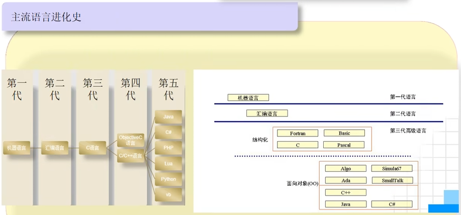
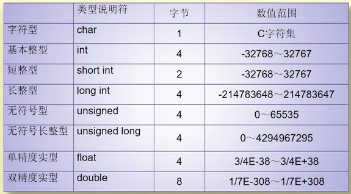

# 背景

# 安装

vscode安装：
[VS Code 配置 C/C++ 编程运行环境（保姆级教程）_vscode配置c++环境-CSDN博客](https://blog.csdn.net/qq_42417071/article/details/137438374)

## 名词解释

### MinGW-W64

MinGW-W64 是一个开源项目，旨在为 Windows 平台提供 GNU 编译器集合（GCC）的现代化版本，支持开发 32 位和 64 位的 Windows 应用程序。

### GUN编译器

GNU 编译器是 GNU 项目中的一套开源**编译器工具链**，用于**将高级编程语言代码（如 C、C++、Fortran 等）转换为可执行的机器代码**。

### GCC

GCC 是 GNU 编译器集合的简称，是 GNU 编译器的核心部分，主要用于 C 语言的编译。

- **C 编译器（`gcc`）**：用于编译 C 语言代码。
- **C++ 编译器（`g++`）**：用于编译 C++ 语言代码。
- **Objective-C 编译器（`gobjc`）**：用于编译 Objective-C 代码。
- **Fortran 编译器（`gfortran`）**：用于编译 Fortran 代码。
- **Ada 编译器（`gnatmake`）**：用于编译 Ada 语言代码。

# Day1

## 头文件

`#include <stdio.h>` 是一个预处理指令，用于引入**标准输入输出库**（Standard Input Output Library）的头文件。它的作用是让程序能够使用标准输入输出功能（如 `printf` 和 `scanf`）。

注：在编译程序之前，预处理器会处理以 `#` 开头的指令。类似python的import，不过python的import是运行时动态完成的。而#include是在编译前的预处理阶段完成的。

## 数据类型

基本类型：整型、字符型、实型/浮点型（单精度、双精度）、枚举型

构造类型：数组、结构体（struct）、共用体

指针类型

空类型

### 自增自减运算符

## 一些函数

### sizeof

计算数据类型占用的字节

