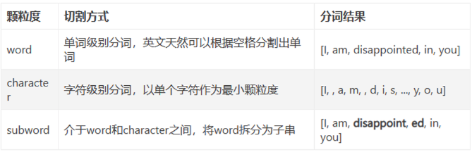
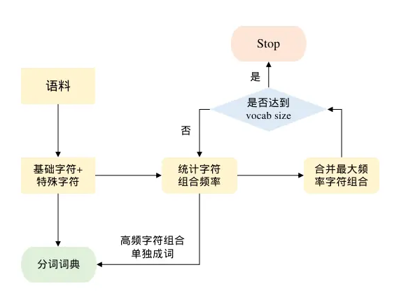

# text-generation-webui
```
cd /home/mizzle/llm/text-generation-webui
# 需要使用--listen参数来打开监听窗口
python server.py --listen --api 

# 内网穿透
ngrok http 11.11.11.101:7860
```

# 大模型参数的下载HF镜像
可能出现模型下载的大小一样，但是就是读取不了的问题
```
git clone https://github.com/LetheSec/HuggingFace-Download-Accelerator.git
cd HuggingFace-Download-Accelerator

pip install -U huggingface_hub
python hf_download.py --model lmsys/vicuna-7b-v1.5 --save_dir ./hf_hub
python hf_download.py -M baichuan-inc/Baichuan2-7B-Chat -S ./model
python .\hf_download.py -D pleisto/wikipedia-cn-20230720-filtered -S ../general_dataset/pretrain # 25w
```

# 大模型参数的下载-魔塔

```
pip install modelscope
from modelscope import snapshot_download 
model_dir = snapshot_download('baichuan-inc/Baichuan2-7B-Chat')
```
```
git lfs install
git clone https://www.modelscope.cn/baichuan-inc/Baichuan2-7B-Chat.git
```

# 大模型参数的下载-SwanHub

```
git lfs install
git clone https://swanhub.co/ZhipuAI/chatglm3-6b.git
```

# 详细显示显卡信息（fresh）
```bash
nvitop
# 这个只需要pip install nvitop即可

watch -n 2 -d nvidia-smi # 每两秒刷新一次
```
# 分词编码理论

token是大模型处理和生成语言文本的基本单位，Bert和GPT-2中，都是简单地将中文文本切分为单个汉字字符作为token，而目前LLaMA，ChatGLM等大模型采用的是基于分词工具sentencepiece实现的BBPE（Byte-level BPE）分词编码算法，这里是BBPE分词编码作为大模型系列的开篇。

## 常用分词算法简述



分词编码指的是将自然语言切割为最小的语义单元token，并且将token转化为数值id供给计算机进行模型学习的过程。常用的分词算法根据切分文本的颗粒度大小分为word，char，subword三类。

## BBPE实例

Atom是基于LLaMA架构在中文文本上进行训练得到的语言模型，它对中文采用BBPE分词，整个词表包含65000个token。

### 实例代码tokenizer

LlamaTokenizer作为分词器

```python
>>> from transformers import LlamaTokenizer
>>> tokenizer = LlamaTokenizer.from_pretrained("./Atom-7B")
>>> text = "我很开心我能和我们的团队一起工作"
>>> tokenizer.tokenize(text)
['▁我', '很开心', '我能', '和我们', '的团队', '一起', '工作']
>>> tokenizer.encode(text)
[32337, 43804, 42764, 53769, 49300, 32212, 32001]
```

BBPE类似jieba分词一样将中文字符进行了聚合成为一个一个的子串，而最终也是以子串整体映射到一个数值id，其中句子开头，或者文本中存在空格符，分词算法会将其替换为`▁`符号。

在LlamaTokenizer类中调用了`sentencepiece`来获取模型分词器，后续的分词操作也是基于sentencepiece提供的API方法。

```python
import sentencepiece as spm
...
self.sp_model = spm.SentencePieceProcessor(**self.sp_model_kwargs)
self.sp_model.Load(vocab_file)
```

tokenizer.model为BBPE分词模型，使用sentencepiece载入该分词模型可以实现LlamaTokenizer同样的效果

```python
# pip install sentencepiece
>>> import sentencepiece
>>> tokenizer = sentencepiece.SentencePieceProcessor()
>>> tokenizer.Load("./Atom-7B/tokenizer.model")
>>> tokenizer.encode_as_pieces(text)
['▁我', '很开心', '我能', '和我们', '的团队', '一起', '工作']
>>> tokenizer.encode(text)
[32337, 43804, 42764, 53769, 49300, 32212, 32001]
```

### 生成词表vocab

tokenizer.model分词模型可以通过手动安装谷歌的项目源码，使用命令行导出为tokenizer.vocab词表，从而得到每个token和token id的对应关系，sentencepiece命令工具安装方式如下

```shell
# download sentencepiece项目源码
$ unzip sentencepiece.zip
$ cd sentencepiece
$ mkdir build
$ cd build
$ cmake ..
$ make -j $(nproc)
$ make install
$ ldconfig -v

$ which spm_export_vocab
/usr/local/bin/spm_export_vocab

$ spm_export_vocab \
--model=./Atom-7B/tokenizer.model \
--output=./Atom-7B/tokenizer.vocab


$ less -N tokenizer.vocab
...
43804 骑行    0
43805 很开心  0
43806 在里面  0
...
```

### Byte-level

对于不在tokenizer.vocab中的生僻中文字符，BBPE会将他进行UTF-8编码用字节表示，使用字节去映射词表的token id，而不是使用UNK位置填充，这也是BBPE中**Byte-level**的体现

```python
# 以生僻字’龘‘为例，对’龘‘进行UTF-8编码为字节表示
>>> "龘".encode("utf-8")
b'\xe9\xbe\x98'

>>> tokenizer.encode_as_pieces("龘")
['▁', '<0xE9>', '<0xBE>', '<0x98>']
>>> tokenizer.tokenize("龘")
[29871, 236, 193, 155]
```

## Byte-Pair Encoding (BPE) 原理简述

BBPE是基于BPE在字节颗粒度上的拓展，两者在分词算法上没有本质区别，本节先介绍BPE分词算法。
 BPE的核心思想是事先给定一个最大分词数量，针对语料文本中的每个字符token，逐步合并出现频率最高的连续的两个字符组合，形成一个新词token，直到达到目标分词数量。BPE的计算流程图如下




**step 1**：设定最大分词词典数量vocab size，初始化一个词典

**step 2**：将语料中所有文本切成单个字符形式加入词典，并且将<eos>，<bos>，<unk>，空格符等特殊字符也加入词典

**step 3**：对已经切为字符的语料，全局统计一轮连续两个字符出现组合的频率

**step 4**：**取最大频率的组合，将这两个字符合并为一个整体，将这个整体添加到词典，并且在语料中将这两个字符也同步全部替换为这个新的整体，当作一个词**

**step 5**：重复step 3和step 4直到达到vocab size或者无法再合并为止

**step 6**：将最终的词典生成分词编码模型文件，比如tokenizer.model，后续的任务都以这个分词词典来切词和编码。

可以实现不同长度的分词。

## Byte-level BPE(BBPE)原理简述

**BBPE将BPE的聚合下推到字节级别**的，先**通过UTF-8的编码方式将任意字符转化为长度1到4个字节**，1个字节有256种表示，以字节为颗粒度进行聚合，其他流程和BPE是一样的。
 在BBPE训练之前，256个字节表示作为token会全部加入词典，观察Atom的tokenizer.vocab，前三个位置分别为未登录词UNK，句子开头符，句子结束符，从第四个位置开始插入了256个字节。

```shell
1 <unk>   0
2 <s>     0
3 </s>    0
4 <0x00>  0
5 <0x01>  0
...
258 <0xFE>  0
259 <0xFF>  0
...
```

随着字节的聚合形成原始的字符，进一步可以形成词组，最终输出到tokenizer.model的时候会转化为聚合后的字符。
 在模型使用的时候对于输入的字符，如果直接存在则映射为token id，如果不存在则转化为UTF-8编码之后的字节作为单位做映射，例如前文中的'龘‘会被映射为3个token id。
 **BBPE的优点**：可以跨语言共用词表，任意语种都可以被编码到字节进行表示，另外UTF-8编码可以在不同语言之间具有一定互通性，底层字节层面的共享来实可能能够带来知识迁移。针对稀有字符，BBPE不会为其分配专门的token id，而是使用字节级别来编码来解决OOV的问题，一定程度上控制了词表大小和解决了稀疏字符难以训练的问题。
 **BBPE的缺点**：会使得单个中文字符被切割为多个字节表示，导致表征的成本上升，可以通过扩大vocab size来促进字节的聚合，使得更多的字符和词组被挖掘出来作为单独的token id。

## 使用sentencepiece训练BPE，BBPE

Python安装的包sentencepiece和源码安装的spm_train命令工具都可以完成BPE和BBPE的训练，例如以小部分《天龙八部》的剧本作为语料训练分词模型，代码如下

```python
import sentencepiece as spm
spm.SentencePieceTrainer.train(
    input='天龙八部片段.txt',
    model_type="bpe",
    model_prefix='tokenizer',   
    vocab_size=3000, 
    character_coverage=1,  
    max_sentencepiece_length=6, 
    byte_fallback=False
)
```

SentencePieceTrainer的训练模式支持BPE，unigram等多种模式，当model_type为'bpe'且不开启byte_fallback，该模式为BPE，如果开启byte_fallback代表BBPE模式，byte_fallback代表是否将未知词转化为UTF-8字节表示进行编码，如果不开启则对于OOV的词会直接输出<unk>。
 训练完成后在目录下会生成tokenizer.model和tokenizer.vocab两个文件，查看BPE的分词词表tokenizer.vocab如下:

```shell
<unk>	0
<s>	0
</s>	0
摩智	-0
鸠摩智	-1
少林	-2
虚竹	-3
:“	-4
..	-5
绝技	-6
武功	-7
。”	-8
少林寺	-9
自己	-10
▁鸠摩智	-11
```

词表从上到下的顺序也蕴含了词频从高到低的关系。针对未在语料中出现过的字符分别测试下BPE和BBPE的编码结果:
```python
>>> # BPE
>>> token_model_1 = sentencepiece.SentencePieceProcessor()
>>> token_model_1.Load("./tokenizer.model")

>>> # BBPE
>>> token_model_2 = sentencepiece.SentencePieceProcessor()
>>> token_model_2.Load("./tokenizer2.model")

# 针对文本中未出现的'凰'字符分词编码结果如下
>>> token_model_1.encode("凰")
[882, 0]

>>> token_model_2.encode("凰")
[882, 232, 138, 179]

结论和前文一致，BPE方式对于未登陆词输出<unk>的token id为0，而BBPE如果映射不到该词会转化为3个字节表示，输出三个token id.
```

