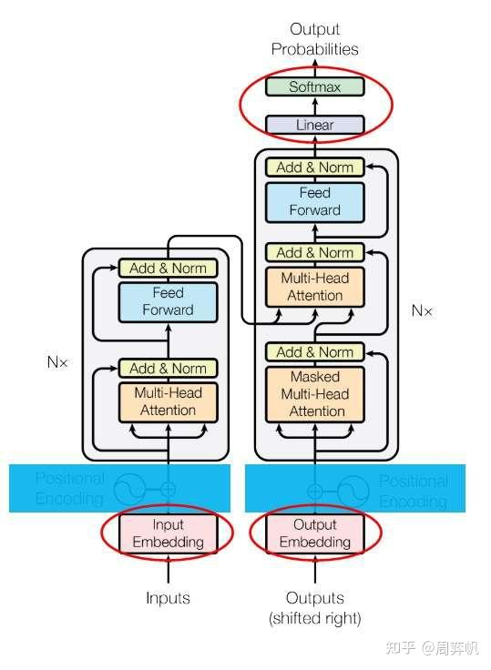
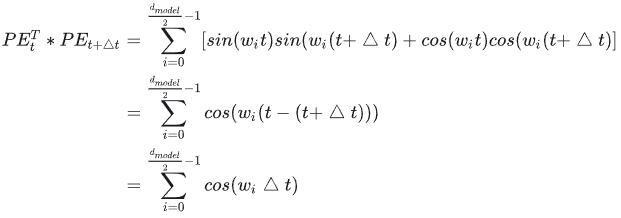
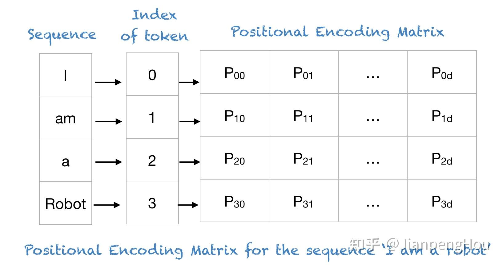

# text-generation-webui
```
cd /home/mizzle/llm/text-generation-webui
# 需要使用--listen参数来打开监听窗口
python server.py --listen --api 

# 内网穿透
ngrok http 11.11.11.101:7860
```

# 大模型参数的下载

## HF镜像

可能出现模型下载的大小一样，但是就是读取不了的问题
```
git clone https://github.com/LetheSec/HuggingFace-Download-Accelerator.git
cd HuggingFace-Download-Accelerator

pip install -U huggingface_hub
python hf_download.py --model lmsys/vicuna-7b-v1.5 --save_dir ./hf_hub
python hf_download.py -M baichuan-inc/Baichuan2-7B-Chat -S ./model
python .\hf_download.py -D pleisto/wikipedia-cn-20230720-filtered -S ../general_dataset/pretrain # 25w
```

## 魔塔

```
pip install modelscope
from modelscope import snapshot_download 
model_dir = snapshot_download('baichuan-inc/Baichuan2-7B-Chat')
```
```
git lfs install
git clone https://www.modelscope.cn/baichuan-inc/Baichuan2-7B-Chat.git
```

## SwanHub

```
git lfs install
git clone https://swanhub.co/ZhipuAI/chatglm3-6b.git
```

# 详细显示显卡信息（fresh）
```bash
nvitop
# 这个只需要pip install nvitop即可

watch -n 2 -d nvidia-smi # 每两秒刷新一次
```
# 分词编码理论

token是大模型处理和生成语言文本的基本单位，Bert和GPT-2中，都是简单地将中文文本切分为单个汉字字符作为token，而目前LLaMA，ChatGLM等大模型采用的是基于分词工具sentencepiece实现的BBPE（Byte-level BPE）分词编码算法，这里是BBPE分词编码作为大模型系列的开篇。

## 常用分词算法简述


分词编码指的是将自然语言切割为最小的语义单元token，并且将token转化为数值id供给计算机进行模型学习的过程。常用的分词算法根据切分文本的颗粒度大小分为word，char，subword三类。

## BBPE实例

Atom是基于LLaMA架构在中文文本上进行训练得到的语言模型，它对中文采用BBPE分词，整个词表包含65000个token。

### 实例代码tokenizer

LlamaTokenizer作为分词器

```python
>>> from transformers import LlamaTokenizer
>>> tokenizer = LlamaTokenizer.from_pretrained("./Atom-7B")
>>> text = "我很开心我能和我们的团队一起工作"
>>> tokenizer.tokenize(text)
['▁我', '很开心', '我能', '和我们', '的团队', '一起', '工作']
>>> tokenizer.encode(text)
[32337, 43804, 42764, 53769, 49300, 32212, 32001]
```

BBPE类似jieba分词一样将中文字符进行了聚合成为一个一个的子串，而最终也是以子串整体映射到一个数值id，其中句子开头，或者文本中存在空格符，分词算法会将其替换为`▁`符号。

在LlamaTokenizer类中调用了`sentencepiece`来获取模型分词器，后续的分词操作也是基于sentencepiece提供的API方法。

```python
import sentencepiece as spm
...
self.sp_model = spm.SentencePieceProcessor(**self.sp_model_kwargs)
self.sp_model.Load(vocab_file)
```

tokenizer.model为BBPE分词模型，使用sentencepiece载入该分词模型可以实现LlamaTokenizer同样的效果

```python
# pip install sentencepiece
>>> import sentencepiece
>>> tokenizer = sentencepiece.SentencePieceProcessor()
>>> tokenizer.Load("./Atom-7B/tokenizer.model")
>>> tokenizer.encode_as_pieces(text)
['▁我', '很开心', '我能', '和我们', '的团队', '一起', '工作']
>>> tokenizer.encode(text)
[32337, 43804, 42764, 53769, 49300, 32212, 32001]
```

### 生成词表vocab

tokenizer.model分词模型可以通过手动安装谷歌的项目源码，使用命令行导出为tokenizer.vocab词表，从而得到每个token和token id的对应关系，sentencepiece命令工具安装方式如下

```shell
# download sentencepiece项目源码
$ unzip sentencepiece.zip
$ cd sentencepiece
$ mkdir build
$ cd build
$ cmake ..
$ make -j $(nproc)
$ make install
$ ldconfig -v

$ which spm_export_vocab
/usr/local/bin/spm_export_vocab

$ spm_export_vocab \
--model=./Atom-7B/tokenizer.model \
--output=./Atom-7B/tokenizer.vocab


$ less -N tokenizer.vocab
...
43804 骑行    0
43805 很开心  0
43806 在里面  0
...
```

### Byte-level

对于不在tokenizer.vocab中的生僻中文字符，BBPE会将他进行UTF-8编码用字节表示，使用字节去映射词表的token id，而不是使用UNK位置填充，这也是BBPE中**Byte-level**的体现

```python
# 以生僻字’龘‘为例，对’龘‘进行UTF-8编码为字节表示
>>> "龘".encode("utf-8")
b'\xe9\xbe\x98'

>>> tokenizer.encode_as_pieces("龘")
['▁', '<0xE9>', '<0xBE>', '<0x98>']
>>> tokenizer.tokenize("龘")
[29871, 236, 193, 155]
```

## Byte-Pair Encoding (BPE) 原理简述

BPE的计算流程图如下：


BBPE是基于BPE在字节颗粒度上的拓展，两者在分词算法上没有本质区别，本节先介绍BPE分词算法。
 BPE的核心思想是事先给定一个最大分词数量，针对语料文本中的每个字符token，逐步合并出现频率最高的连续的两个字符组合，形成一个新词token，直到达到目标分词数量。

**step 1**：设定最大分词词典数量vocab size，初始化一个词典

**step 2**：将语料中所有文本切成单个字符形式加入词典，并且将<eos>，<bos>，<unk>，空格符等特殊字符也加入词典

**step 3**：对已经切为字符的语料，全局统计一轮连续两个字符出现组合的频率

**step 4**：**取最大频率的组合，将这两个字符合并为一个整体，将这个整体添加到词典，并且在语料中将这两个字符也同步全部替换为这个新的整体，当作一个词**

**step 5**：重复step 3和step 4直到达到vocab size或者无法再合并为止

**step 6**：将最终的词典生成分词编码模型文件，比如tokenizer.model，后续的任务都以这个分词词典来切词和编码。

可以实现不同长度的分词。

## Byte-level BPE(BBPE)原理简述

**BBPE将BPE的聚合下推到字节级别**的，先**通过UTF-8的编码方式将任意字符转化为长度1到4个字节**，1个字节有256种表示，以字节为颗粒度进行聚合，其他流程和BPE是一样的。
 在BBPE训练之前，256个字节表示作为token会全部加入词典，观察Atom的tokenizer.vocab，前三个位置分别为未登录词UNK，句子开头符，句子结束符，从第四个位置开始插入了256个字节。

```shell
1 <unk>   0
2 <s>     0
3 </s>    0
4 <0x00>  0
5 <0x01>  0
...
258 <0xFE>  0
259 <0xFF>  0
...
```

随着字节的聚合形成原始的字符，进一步可以形成词组，最终输出到tokenizer.model的时候会转化为聚合后的字符。
 在模型使用的时候对于输入的字符，如果直接存在则映射为token id，如果不存在则转化为UTF-8编码之后的字节作为单位做映射，例如前文中的'龘‘会被映射为3个token id。
 **BBPE的优点**：可以跨语言共用词表，任意语种都可以被编码到字节进行表示，另外UTF-8编码可以在不同语言之间具有一定互通性，底层字节层面的共享来实可能能够带来知识迁移。针对稀有字符，BBPE不会为其分配专门的token id，而是使用字节级别来编码来解决OOV的问题，一定程度上控制了词表大小和解决了稀疏字符难以训练的问题。
 **BBPE的缺点**：会使得单个中文字符被切割为多个字节表示，导致表征的成本上升，可以通过扩大vocab size来促进字节的聚合，使得更多的字符和词组被挖掘出来作为单独的token id。

## 使用sentencepiece训练BPE，BBPE

Python安装的包sentencepiece和源码安装的spm_train命令工具都可以完成BPE和BBPE的训练，例如以小部分《天龙八部》的剧本作为语料训练分词模型，代码如下

```python
import sentencepiece as spm
spm.SentencePieceTrainer.train(
    input='天龙八部片段.txt',
    model_type="bpe",
    model_prefix='tokenizer',   
    vocab_size=3000, 
    character_coverage=1,  
    max_sentencepiece_length=6, 
    byte_fallback=False
)
```

SentencePieceTrainer的训练模式支持BPE，unigram等多种模式，当model_type为'bpe'且不开启byte_fallback，该模式为BPE，如果开启byte_fallback代表BBPE模式，byte_fallback代表是否将未知词转化为UTF-8字节表示进行编码，如果不开启则对于OOV的词会直接输出<unk>。
 训练完成后在目录下会生成tokenizer.model和tokenizer.vocab两个文件，查看BPE的分词词表tokenizer.vocab如下:

```shell
<unk>	0
<s>	0
</s>	0
摩智	-0
鸠摩智	-1
少林	-2
虚竹	-3
:“	-4
..	-5
绝技	-6
武功	-7
。”	-8
少林寺	-9
自己	-10
▁鸠摩智	-11
```

词表从上到下的顺序也蕴含了词频从高到低的关系。针对未在语料中出现过的字符分别测试下BPE和BBPE的编码结果:
```python
>>> # BPE
>>> token_model_1 = sentencepiece.SentencePieceProcessor()
>>> token_model_1.Load("./tokenizer.model")

>>> # BBPE
>>> token_model_2 = sentencepiece.SentencePieceProcessor()
>>> token_model_2.Load("./tokenizer2.model")

# 针对文本中未出现的'凰'字符分词编码结果如下
>>> token_model_1.encode("凰")
[882, 0]

>>> token_model_2.encode("凰")
[882, 232, 138, 179]

结论和前文一致，BPE方式对于未登陆词输出<unk>的token id为0，而BBPE如果映射不到该词会转化为3个字节表示，输出三个token id.
```

# Transformer

## 机器翻译评价指标BLEU Score

>由于翻译没有唯一的正确答案，用准确率来衡量一个机器翻译算法并不合适。因此，机器翻译的数据集通常会**为每一条输入准备若干个参考输出。统计算法输出和参考输出之间的重复程度**，就能评价算法输出的好坏了。这种评价指标叫做BLEU Score。这一指标越高越好。


## 注意力机制

类似全局信息查询的效果。做一次“注意力”计算，其实就跟去数据库了做了一次查询一样。

### 例子

假设我们现在有一个数据库，以人名为key，以年龄为value。

```python
{
    张三: 18,
    张三: 20,
    李四: 22,
    张伟: 19
}
```

现在有一个query，问所有叫“张三”的人的年龄平均值是多少。让我们写程序的话，我们会把字符串“张三”和所有key做比较，找出所有“张三”的value，把这些年龄值相加，取一个平均数。这个平均数是(18+20)/2=19。

但是，很多时候，我们的查询并不是那么明确。比如，我们可能想查询一下所有姓张的人的年龄平均值。这次，我们不是去比较`key == 张三`,而是比较`key[0] == 张`。这个平均数应该是(18+20+19)/3=19。

或许，**我们的查询会更模糊一点**，**模糊到无法用简单的判断语句来完成**。因此，最通用的方法是：

1. 把query和key各建模成一个向量；
2. 对query和key之间算一个相似度（比如向量内积）；
3. 以相似度为权重，算value的加权和。

这样，不管多么抽象的查询，我们都可以把query, key建模成向量，用向量相似度代替查询的判断语句，用加权和代替直接取值再求平均值。**“注意力”，其实指的就是这里的权重。**

把这种新方法套入刚刚那个例子里。我们先把所有key建模成向量，可能可以得到这样的一个新数据库：

```python
{
    [1, 2, 0]: 18, # 张三
    [1, 2, 0]: 20, # 张三 
    [0, 0, 2]: 22, # 李四
    [1, 4, 0]: 19 # 张伟 
}
```

假设`key[0]==1`表示姓张。我们的查询“所有姓张的人的年龄平均值”就可以表示成向量`[1, 0, 0]`。用这个query和所有key算出的权重是：

```python
dot([1, 0, 0], [1, 2, 0]) = 1
dot([1, 0, 0], [1, 2, 0]) = 1
dot([1, 0, 0], [0, 0, 2]) = 0
dot([1, 0, 0], [1, 4, 0]) = 1
```

之后，我们该用这些权重算平均值了。注意，算平均值时，权重的和应该是1。因此，我们可以用softmax把这些权重归一化一下，再算value的加权和。

```python
softmax([1, 1, 0, 1]) = [1/3, 1/3, 0, 1/3] # 概念计算，实际上结果是[0.2969, 0.2969, 0.1092, 0.2969]
dot([1/3, 1/3, 0, 1/3], [18, 20, 22, 19]) = 19
```

这样，我们就用向量运算代替了判断语句，完成了数据库的全局信息查询。那三个`1/3`，就是query对每个key的注意力。

### Scaled Dot-Product Attention

缩放点积注意力

上面的例子就是Transformer中的注意力，这种计算在论文里叫做放缩点乘注意力（Scaled Dot-Product Attention）。它的公式是：

$$Attention\left( {Q,K,V} \right) = softmax\left( {{{Q{K^T}} \over {\sqrt {{d_k}} }}} \right)V$$

QKV在上面的例子是什么？

K是key向量组成的矩阵，即：

```python
K = [[1, 2, 0], [1, 2, 0], [0, 0, 2], [1, 4, 0]]
```

同样V是value向量组成的矩阵，例子中value都是实数，可以看做长度为1的向量：

```python
V = [[18], [20], [22], [19]]
```

在刚才的例子中，只做了一次查询，所以说公式其实是：

$$MyAttention\left( {q,K,V} \right) = softmax\left( {q{K^T}} \right)V$$

其中q就是`[1,0,0]`。事实上可以做多组query，把所有的q打包成矩阵Q，就得到了上面的最原始的注意力机制的公式。

其中这个$${{d_k}}$$就是query和key向量的长度，由于query和key要做点乘，所以这两个向量的长度必须一致。

这个$${{d_k}}$$的设置是因为softmax在绝对值较大的区域梯度较小，梯度下降的速度比较慢。因此，我们要让被softmax的点乘数值尽可能小。而一般情况下向量维度较大时，点乘的数值会很大。除以$${{d_k}}$$防止点乘的值过大，从而加快梯度下降的速度。

### 自注意力

自注意力模块的**目的是为每一个输入token生成一个向量表示，该表示不仅能反映token本身的性质，还能反映token在句子里特有的性质。**比如翻译“简访问非洲”这句话时，第三个字“问”在中文里有很多个意思，比如询问、慰问等。我们想为它生成一个表示，知道它在句子中的具体意思。而在例句中，“问”字组词组成了“访问”，所以它应该取“询问”这个意思，而不是“慰问”。“询问”就是“问”字在这句话里的表示。

让我们看看自注意力模块具体是怎么生成这种表示的。自注意力模块的输入是3个矩阵Q,K,V。准确来说，这些矩阵是向量的数组，也就是每一个token的query, key, value向量构成的数组。自注意力模块会为每一个token输出一个向量表示A。$${A^{\left\langle t \right\rangle }}$$是第t个token在这句话里的向量表示。

让我们还是以刚刚那个句子“简访问非洲”为例，看一下自注意力是怎么计算的。现在，我们想计算$${A^{\left\langle 3 \right\rangle }}$$。$${A^{\left\langle 3 \right\rangle }}$$表示的是“问”字在句子里的确切含义。为了获取$${A^{\left\langle 3 \right\rangle }}$$，我们可以问这样一个可以用数学表达的问题：和‘问’字组词的字的词嵌入是什么？这个问题就是第三个token的query向量$${q^{\left\langle 3 \right\rangle }}$$。

和“问”字组词的字，很可能是一个动词。恰好，每一个token的key $${k^{\left\langle t \right\rangle }}$$就表示这个token的词性；每一个token的value $${v^{\left\langle t \right\rangle }}$$，就是这个token的嵌入。


这样，我们就可以根据每个字的词性（key），尽量去找动词（和query比较相似的key），求出权重（query和key做点乘再做softmax），对所有value求一个加权平均，就差不多能回答问题$${q^{\left\langle 3 \right\rangle }}$$了。

经计算，$${q^{\left\langle 3 \right\rangle }}$$,$${k^{\left\langle 2 \right\rangle }}$$可能会比较相关，即这两个向量的内积比较大。因此，最终算出来的$${A^{\left\langle 3 \right\rangle }}$$应该约等于$${v^{\left\langle 2 \right\rangle }}$$，即问题“哪个字和‘问’字组词了？”的答案是第二个字“访”。


还留了一个问题没有解决：每个单词的query, key, value是怎么得来的？这就要看Transformer里的另一种机制了——多头注意力。

### **多头注意力** 

在自注意力中，每一个单词的query, key, value应该只和该单词本身有关。因此，这三个向量都应该由单词的词嵌入得到。另外，每个单词的query, key, value不应该是人工指定的，而应该是可学习的。因此，我们可以用可学习的参数来描述从词嵌入到query, key, value的变换过程。综上，自注意力的输入Q,K,V应该用下面这个公式计算：

$$\eqalign{
  & Q = E{W^Q}  \cr 
  & K = E{W^K}  \cr 
  & V = E{W^V} \cr} $$

其中，E是词嵌入矩阵，也就是每个单词的词嵌入的数组；$${W^Q}$$,$${W^K}$$,$${W^V}$$是可学习的参数矩阵。在Transformer中，大部分中间向量的长度都用$${d_{model}}$$表示，词嵌入的长度也是$${d_{model}}$$。因此，设输入的句子长度为n，则E的形状是$$n \times {d_{model}}$$，$${W^Q}$$,$${W^K}$$的形状是$${d_{model}} \times {d_k}$$，$${W^V}$$的形状是$${d_{model}} \times {d_v}$$。

**就像卷积层能够用多个卷积核生成多个通道的特征一样**，我们也用多组$${W^Q}$$,$${W^K}$$,$${W^V}$$生成多组自注意力结果。这样，每个单词的自注意力表示会更丰富一点。这种机制就叫做多头注意力。把多头注意力用在自注意力上的公式为：

> Transformer似乎默认所有向量都是行向量，参数矩阵都写成了右乘而不是常见的左乘。

$$\eqalign{
  & hea{d_i} = Attention\left( {EW_i^Q,EW_i^K,EW_i^V} \right)  \cr 
  & MultiHeadSelfAttention\left( E \right) = Concat\left( {hea{d_1},...,hea{d_h}} \right){W^O} \cr} $$

其中，ℎ是多头自注意力的“头”数，$${W^O}$$是另一个参数矩阵。多头注意力模块的输入输出向量的长度都是$${d_{model}}$$。因此，$${W^O}$$的形状是$$h{d_v} \times {d_{model}}$$（自注意力的输出长度是$${d_{model}}$$，有ℎ个输出）。

## **Transformer 模型架构**


[【超详细】【原理篇&实战篇】一文读懂Transformer-CSDN博客](https://blog.csdn.net/weixin_42475060/article/details/121101749)

### **残差连接**

Transformer使用了和ResNet类似的残差连接，即设模块本身的映射为�(�)，则模块输出为$$Normalization\left( {F\left( x \right) + x} \right)$$。和ResNet不同，Transformer使用的归一化方法是LayerNorm。


### **前馈网络**

架构图中的前馈网络（Feed Forward）其实**就是一个全连接网络**。具体来说，这个子网络由两个线性层组成，中间用ReLU作为激活函数。

### **整体架构与掩码多头注意力**

早期基于RNN的序列转换模型在生成序列时一般会输入前i个单词，输出 i+1个单词。


而Transformer不同。对于输入序列 $$\left( {{x_1},..,{x_s}} \right)$$ ，它会被编码器编码成中间表示 $$z = \left( {{z_1},..,{z_s}} \right)$$。给定 z 的前提下，解码器输入$$\left( {{y_1},..,{y_t}} \right)$$，输出$$\left( {{y_2},..,{y_{t+1}}} \right)$$的预测。


具体来说，输入序列x会经过N=6个结构相同的层。每层由多个子层组成。第一个子层是多头注意力层，准确来说，是**多头自注意力**。这一层可以**为每一个输入单词提取出更有意义的表示**。之后数据会经过前馈网络子层。最终，输出编码结果z。

得到了z后，要用解码器输出结果了。解码器的输入是当前已经生成的序列，该序列会经过一个掩码（masked）多头自注意力子层。我们先不管这个掩码是什么意思，暂且把它当成普通的多头自注意力层。它的作用和编码器中的一样，用于提取出更有意义的表示。

接下来，数据还会经过一个多头注意力层。这个层比较特别，它的K，V来自z，Q来自上一层的输出。为什么会有这样的设计呢？这种设计来自于早期的注意力模型。如下图所示，在早期的注意力模型中，每一个输出单词都会与每一个输入单词求一个注意力，以找到每一个输出单词最相关的某几个输入单词。用注意力公式来表达的话，Q就是输出单词，K, V就是输入单词。


经过第二个多头注意力层后，和编码器一样，数据会经过一个前馈网络。最终，网络并行输出各个时刻的下一个单词。

这种并行计算有一个要注意的地方。在输出第t+1个单词时，模型不应该提前知道t+1时刻之后的信息。因此，应该只保留t时刻之前的信息，遮住后面的输入。这可以通过添加掩码实现。添加掩码的一个不严谨的示例如下表所示：


这就是为什么解码器的多头自注意力层前面有一个masked。在论文中，mask是通过**令注意力公式的softmax的输入为−∞**来实现的（softmax的输入为−∞，注意力权重就几乎为0，被遮住的输出也几乎全部为0）。**每个mask都是一个上三角矩阵**。

### **嵌入层**



Transformer主干结构的输入输出都是词嵌入序列。词嵌入，其实就是一个把one-hot向量转换成有意义的向量的转换矩阵。

在Transformer中，**解码器的嵌入层和输出线性层是共享权重**的——输出线性层表示的线性变换是嵌入层的逆变换，其目的是把网络输出的嵌入再转换回one-hot向量。如果某任务的输入和输出是同一种语言，那么编码器的嵌入层和解码器的嵌入层也可以共享权重。

> 论文中写道：“输入输出的嵌入层和softmax前的线性层共享权重”。这个描述不够清楚。如果输入和输出的不是同一种语言，比如输入中文输出英文，那么共享一个词嵌入是没有意义的。

由于模型要预测一个单词，输出的线性层后面还有一个常规的softmax操作。

### **位置编码**

无论是RNN还是CNN，都能自然地利用到序列的先后顺序这一信息。然而，Transformer的主干网络并不能利用到序列顺序信息。因此，Transformer使用了一种叫做“位置编码”的机制，**对编码器和解码器的嵌入输入做了一些修改**，以向模型提供序列顺序信息。

嵌入层的输出是一个向量数组，即词嵌入向量的序列。设数组的位置叫pos，向量的某一维叫i。我们为每一个向量里的每一个数添加一个实数编码，这种编码方式要满足以下性质：

1. 对于同一个pos不同的i，即对于一个词嵌入向量的不同元素，它们的编码要各不相同。
2. 对于向量的同一个维度处，不同pos的编码不同。且pos间要满足相对关系，即$$f\left( {pos + 1} \right) - f\left( {pos} \right) = f\left( {pos} \right) - f\left( {pos - 1} \right)$$。

要满足这两种性质的话，我们可以轻松地设计一种编码函数:

$$Encoding\left( {pos,i} \right) = {{pos} \over {{{1000}^i}}}$$

但是，**这种编码不利于网络的学习。我们更希望所有编码都差不多大小，且都位于0~1之间。为此，Transformer使用了三角函数作为编码函数。**这种位置编码（Positional Encoding, PE）的公式如下。

$$\eqalign{
  & PE\left( {pos,2i} \right) = \sin \left( {pos/{{10000}^{2i/{d_{model}}}}} \right)  \cr 
  & PE\left( {pos,2i + 1} \right) = \cos \left( {pos/{{10000}^{2i/{d_{model}}}}} \right) \cr} $$

i不同，则三角函数的周期不同。同pos不同周期的三角函数值不重复。这满足上面的性质1。另外，根据三角函数的和角公式：


$$f\left( {pos + k} \right)$$ 是$$f\left( {pos} \right)$$的一个线性函数，即不同的pos之间有相对关系。这满足性质2。

#### 演变历程

##### 用整型值标记位置

一种自然而然的想法是，**给第一个token标记1，给第二个token标记2...，以此类推**。 
这种方法产生了以下几个主要问题： 
（1）模型可能遇见比训练时所用的序列更长的序列。不利于模型的泛化。 
（2）模型的位置表示是**无界的**。随着序列长度的增加，位置值会越来越大。

针对第一条的理解是，可能在推理时，遇到更长的句子，那么此时用这种位置编码就有没见过的位置标记，不利于泛化。

##### 用[0,1]范围标记位置

为了解决整型值带来的问题，可以考虑**将位置值的范围限制在[0, 1]之内**，其中，0表示第一个token，1表示最后一个token。**比如有3个token，那么位置信息就表示成[0, 0.5, 1]；若有四个token，位置信息就表示成[0, 0.33, 0.69, 1]**。 
但这样产生的问题是，**当序列长度不同时，token间的相对距离是不一样的。**例如在序列长度为3时，token间的相对距离为0.5；在序列长度为4时，token间的相对距离就变为0.33。 

因此，我们需要这样一种位置表示方式，满足于： 
（1）它能用来表示一个token在序列中的**绝对位置** 
（2）在序列长度不同的情况下，**不同序列中token的相对位置/距离也要保持一致** 
（3）可以用来表示模型在训练过程中从来没有看到过的句子长度。

##### 用二进制向量标记位置

考虑到位置信息作用在input embedding上，因此比起用单一的值，更好的方案是用一个和input embedding维度一样的向量来表示位置。这时我们就很容易想到二进制编码。如下图，假设d_model = 3，那么我们的位置向量可以表示成：


这下所有的值都是有界的（位于0，1之间），且transformer中的d_model本来就足够大，基本可以把我们要的每一个位置都编码出来了。

但是这种编码方式也存在问题：这样编码出来的位置向量，处在一个离散的空间中，不同位置间的变化是不连续的。假设d_model = 2，我们有4个位置需要编码，这四个位置向量可以表示成[0,0],[0,1],[1,0],[1,1]。我们把它的位置向量空间做出来：


如果我们能把离散空间（黑色的线）转换到连续空间（蓝色的线），那么我们就能解决位置距离不连续的问题。同时，我们不仅能用位置向量表示整型，我们还可以用位置向量来表示浮点型。

##### 用周期函数（sin）来表示位置

回想一下，现在我们需要一个有界又连续的函数，最简单的，正弦函数sin就可以满足这一点。我们可以考虑把位置向量当中的每一个元素都用一个sin函数来表示，则第t个token的位置向量可以表示为：


结合下图，来理解一下这样设计的含义。图中每一行表示一个 $$P{E_t}$$ ，每一列表示$$P{E_t}$$中的第i个元素。旋钮用于调整精度，越往右边的旋钮，需要调整的精度越大，因此指针移动的步伐越小。每一排的旋钮都在上一排的基础上进行调整（函数中t的作用）。通过频率来控制sin函数的波长，频率不断减小，则波长不断变大，此时sin函数对t的变动越不敏感，以此来达到越向右的旋钮，指针移动步伐越小的目的。 **这也类似于二进制编码，每一位上都是0和1的交互，越往低位走（越往左边走），交互的频率越快，越往右边走，就是去更高位了，此时频率越来越低，波长越大，即使t变大，也就是位置向后了，值也趋向于很小的值。交互频率很慢很慢。**


可以发现，每个比特位的变化率是不一样的，越低位的变化越快，红色位置0和1每个数字会变化一次，而黄色位，每8个数字才会变化一次。

**正好与这个二进制类似，只是嵌入的时候黄色这列是二进制的高位，对应的词嵌入的应该是越往右边的值。**

**为什么下面的频率是$${pos/{{10000}^{2i/{d_{model}}}}}$$，即为什么要让频率变小？**

由于sin是周期函数，因此从纵向来看，如果函数的频率偏大，引起波长偏短，则不同t下的位置向量**可能出现重合**的情况。比如在下图中(d_model = 3），图中的点表示每个token的位置向量，颜色越深，token的位置越往后，在频率偏大的情况下，位置响亮点连成了一个闭环，靠前位置（黄色）和靠后位置（棕黑色）竟然靠得非常近：


为了避免这种情况，我们尽量将函数的波长拉长。一种简单的解决办法是同一把所有的频率都设成一个非常小的值。因此在transformer的论文中，采用了 $$1/{10000^{2i/{d_{model}}}}$$这个频率。

##### 用sin和cos交替来表示位置

目前为止，我们的位置向量实现了如下功能：
（1）**每个token的向量唯一**（每个sin函数的频率足够小）
（2）位置向量的值是**有界的**，且**位于连续空间中**。模型在处理位置向量时更容易泛化，即更好处理长度和训练数据分布不一致的序列（sin函数本身的性质）

那现在我们对位置向量再提出一个要求，**不同的位置向量是可以通过线性转换得到的**。这样，我们不仅能表示一个token的绝对位置，还可以表示一个token的相对位置，即我们想要：


这里，T表示一个线性变换矩阵。观察这个目标式子，联想到在向量空间中一种常用的线形变换——旋转。在这里，我们将t想象为一个角度，那么 △t就是其旋转的角度，则上面的式子可以进一步写成：


有了这个构想，我们就可以把原来元素全都是sin函数的 $$P{E_t}$$ 做一个替换，我们让位置两两一组，分别用sin和cos的函数对来表示它们，则现在我们有：


在这样的表示下，我们可以很容易用一个线性变换，把 $$P{E_t}$$ 转变为 $$P{E_{t+△t}}$$ 。

[(1 封私信) 如何理解Transformer论文中的positional encoding，和三角函数有什么关系？ - 知乎 (zhihu.com)](https://www.zhihu.com/question/347678607)

#### Transformer中位置编码方法

##### Transformer 位置编码定义

有了上面的演变过程后，现在我们就可以正式来看transformer中的位置编码方法了。 

定义： 
       \- t是这个token在序列中的实际位置（例如第一个token为1，第二个token为2...） 
      \-  $$P{E_t} \in {R^d}$$ 是这个token的位置向量， 表$$PE_t^{\left( i \right)}$$示这个位置向量里的第i个元素 
      \-  $${{d_{model}}}$$这个token的维度（在论文中，是512)

则：


把512维的向量两两一组，每组都是一个sin和一个cos，这两个函数共享同一个频率 $${w_i}$$，一共有256组，由于我们从0开始编号，所以最后一组编号是255。sin/cos函数的波长（由$${w_i}$$ 决定）则从 2π增长到 2π×10000

##### Transformer位置编码可视化

下图是一串序列长度为50，位置编码维度为128的位置编码可视化结果：


由上图可以发现，由于sin/cos函数的性质，位置向量的每一个值都位于[-1, 1]之间。同时，纵向来看，图的右半边几乎都是蓝色和白色交替的，这是因为越往后的位置，频率越小，波长越长，所以不同的t对最终的结果影响不大。而越往左边走，颜色交替的频率越频繁。

下面这个图是单纯的sin或者cos的图像，所以可以看到在远端几乎不变，就是一种值。高位不变。


##### Transformer位置编码的重要性质

**(1) 性质一：两个[位置编码](https://www.zhihu.com/search?q=位置编码&search_source=Entity&hybrid_search_source=Entity&hybrid_search_extra={"sourceType"%3A"answer"%2C"sourceId"%3A2301693596})的点积(dot product)仅取决于偏移量** △t，也即两个位置编码的点积可以反应出两个位置编码间的距离。



**(2) 性质二：位置编码的点积是无向的**


也就是说，虽然位置向量的点积可以用于表示**距离(distance-aware)**，但是它却不能用来表示位置的**方向性(lack-of-directionality)**。

#### 实际计算

位置编码层的输出是一个矩阵，其中矩阵的每一行代表序列中一个已编码的对象，并加上其位置信息。下图示例展示了仅编码位置信息的矩阵。



以下是对正弦函数的快速回顾，你也可以用余弦函数进行类似的操作。该函数的值域为 [-1, +1]。其频率是指单位时间内完成的周期数，而波长则是指波形重复自身的距离。下图展示了不同波形的波长和频率：


为了理解上面的表达式，我们以“I am a robot”这句话为例，其中 n = 100 和 d = 4。下表展示了这个短语的位置编码矩阵。事实上，对于任何 n = 100 和 d = 4 的四字短语，其位置编码矩阵都是相同的。

$$\eqalign{
  & P\left( {k,2i} \right) = \sin \left( {{k \over {{{100}^{2i/4}}}}} \right)  \cr 
  & P\left( {k,2i + 1} \right) = \cos \left( {{k \over {{{100}^{2i/4}}}}} \right) \cr} $$


看图发现其实是交互的


##### 为什么位置嵌入与单词嵌入求和而不是拼接？


假设现在有一个one-hot的位置编码向量与原始序列拼接了。现在有一个矩阵与拼接后的向量相乘来得到embedding的结果。

可以想象一下这个W被拆成两个矩阵，利用分块矩阵乘法思想结果发现拼接和相加实质上没有太多的区别。


