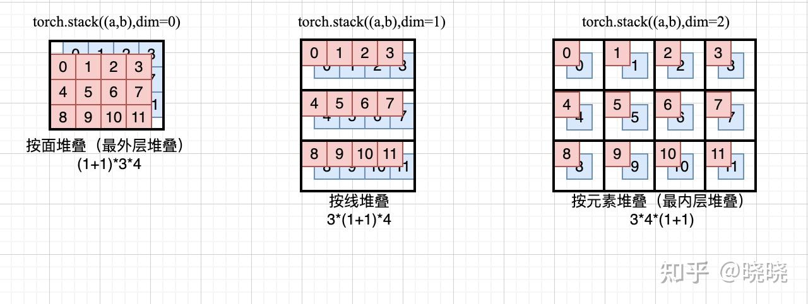
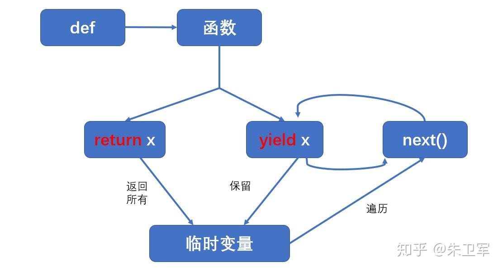

# Deep Learning

## nn.ModuleList和nn.Sequential

 - nn.Sequential内部实现了forward函数，因此可以不用写forward函数，而nn.ModuleList则没有实现内部forward函数。
 - nn.Sequential可以使用OrderedDict对每层进行命名。
 -  nn.Sequential里面的模块按照顺序进行排列的，所以必须确保前一个模块的输出大小和下一个模块的输入大小是一致的。而nn.ModuleList并没有定义一个网络，它只是将不同的模块储存在一起，这些模块之间并没有什么先后顺序可言。

### nn.ModuleList
不同于一般的list，加入到nn.ModuleList里面的module是会自动注册到整个网络上的，同时module的parameters也会自动添加到整个网络中。
### 忠告
如果确定 nn.Sequential 里面的顺序是你想要的，而且不需要再添加一些其他处理的函数 (比如 nn.functional 里面的函数 )，那么完全可以直接用 nn.Sequential。这么做的代价就是失去了**部分灵活性**，毕竟不能自己去定制 forward 函数里面的内容了。

## nn.Embedding

```python
import torch
from torch import nn
 
# 创建最大词个数为10，每个词用维度为4表示
embedding = nn.Embedding(10, 4)
 
# 将第一个句子填充0，与第二个句子长度对齐
in_vector = torch.LongTensor([[1, 2, 3, 4, 0, 0], [1, 2, 5, 6, 5, 7]])
out_emb = embedding(in_vector)
print(in_vector.shape)
print((out_emb.shape))
print(out_emb)
print(embedding.weight)
```

为什么输入向量是2乘6的矩阵，而embedding的权重是10乘4的，还可以进行embedding？

在PyTorch中，`nn.Embedding`类是用来将离散的数字（通常用来表示词语或者其它类型的标记）转换成向量的。这些数字每一个都对应于嵌入矩阵中的一行。嵌入矩阵的行数代表可嵌入的最大词汇量，而每一行的维度代表了嵌入向量的维度。

当你创建一个嵌入层 `nn.Embedding(10, 4)`时，你告诉PyTorch你想要一个能够嵌入最多10个不同的词的矩阵，每一个词被表示为一个4维的向量。这就是为什么嵌入的权重大小是10乘4的原因——你有10个可能的输入词，每个词被转换为一个4维的嵌入向量。

在这个例子中，你有两个句子，每个句子由6个词的索引组成。这些索引用来从嵌入矩阵中选取相应的向量。因此，尽管你的输入矩阵是2乘6的，每个索引都会被转换成一个4维的向量，所以输出的嵌入向量的维度将会是2乘6乘4。这里的2代表句子数量，6代表每个句子的词数，4代表每个嵌入向量的维度。

**嵌入操作实际上是在做索引操作：它查看输入的索引，并从嵌入矩阵中选取对应行的向量。这就是为什么即使输入向量的维度和嵌入矩阵的维度不直接相关，嵌入操作仍然可以工作的原因。**

**注：embeddings中的值是正态分布N(0,1)中随机取值。**

索引操作！！！！！！！！！

[PyTorch中的nn.Embedding：深入解析与实践应用-百度开发者中心 (baidu.com)](https://developer.baidu.com/article/details/3267445)

- `num_embeddings`（必需）：嵌入层中可能的嵌入向量数量。这个值应该大于或等于你的数据集中最大的整数索引加1。
- `embedding_dim`（必需）：每个嵌入向量的维度。这个值可以根据你的具体任务和数据集进行调整。
- `padding_idx`（可选）：如果提供了，则此索引的嵌入向量将全为零，并且不会进行梯度更新。这在处理变长序列时，对序列进行填充（padding）非常有用。
- `max_norm`（可选）：如果提供了，则嵌入向量将被缩放，使得它们的最大范数不会超过这个值。
- `norm_type`（可选）：用于计算嵌入向量范数的类型。默认为2，表示使用L2范数。
- `scale_grad_by_freq`（可选）：如果设置为True，则对于每个嵌入向量，其梯度将根据其在训练数据中出现的频率进行缩放。这有助于平衡稀有和常见特征的更新。
- `sparse`（可选）：如果设置为True，则嵌入层将使用稀疏梯度更新，这可能会加速训练过程并减少内存使用。


```python
torch.Size([2, 6])
torch.Size([2, 6, 4])
tensor([[[-0.6642, -0.6263,  1.2333, -0.6055],
         [ 0.9950, -0.2912,  1.0008,  0.1202],
         [ 1.2501,  0.1923,  0.5791, -1.4586],
         [-0.6935,  2.1906,  1.0595,  0.2089],
         [ 0.7359, -0.1194, -0.2195,  0.9161],
         [ 0.7359, -0.1194, -0.2195,  0.9161]],
 
        [[-0.6642, -0.6263,  1.2333, -0.6055],
         [ 0.9950, -0.2912,  1.0008,  0.1202],
         [-0.3216,  1.2407,  0.2542,  0.8630],
         [ 0.6886, -0.6119,  1.5270,  0.1228],
         [-0.3216,  1.2407,  0.2542,  0.8630],
         [ 0.0048,  1.8500,  1.4381,  0.3675]]], grad_fn=<EmbeddingBackward0>)
Parameter containing:
tensor([[ 0.7359, -0.1194, -0.2195,  0.9161],
        [-0.6642, -0.6263,  1.2333, -0.6055],
        [ 0.9950, -0.2912,  1.0008,  0.1202],
        [ 1.2501,  0.1923,  0.5791, -1.4586],
        [-0.6935,  2.1906,  1.0595,  0.2089],
        [-0.3216,  1.2407,  0.2542,  0.8630],
        [ 0.6886, -0.6119,  1.5270,  0.1228],
        [ 0.0048,  1.8500,  1.4381,  0.3675],
        [ 0.3810, -0.7594, -0.1821,  0.5859],
        [-1.4029,  1.2243,  0.0374, -1.0549]], requires_grad=True)
```

## torch.einsum

爱因斯坦求和约定

爱因斯坦求和约定（einsum）提供了一套既简洁又优雅的规则，可实现包括但不限于：向量内积，向量外积，矩阵乘法，转置和张量收缩（tensor contraction）等张量操作，熟练运用 einsum 可以很方便的实现复杂的张量操作，而且不容易出错。

```python
a = torch.rand(2,3)
b = torch.rand(3,4)
c = torch.einsum("ik,kj->ij", [a, b])
# 等价操作 torch.mm(a, b)
```

其中需要重点关注的是 einsum 的第一个参数 "ik,kj->ij"，该字符串（下文以 equation 表示）表示了输入和输出张量的维度。equation 中的箭头左边表示输入张量，以逗号分割每个输入张量，箭头右边则表示输出张量。表示维度的字符只能是26个英文字母 'a' - 'z'。

而 einsum 的第二个参数表示实际的输入张量列表，其数量要与 equation 中的输入数量对应。同时对应每个张量的 子 equation 的字符个数要与张量的真实维度对应，比如 "ik,kj->ij" 表示输入和输出张量都是两维的。

**理解重点：**

**equation 中的字符也可以理解为索引，就是输出张量的某个位置的值，是怎么从输入张量中得到的，比如上面矩阵乘法的输出 c 的某个点 c[i, j] 的值是通过 a[i, k] 和 b[k, j] 沿着 k 这个维度做内积得到的。**equation 箭头左边，在不同输入之间重复出现的索引表示，把输入张量沿着该维度做乘法操作，比如还是以上面矩阵乘法为例， "ik,kj->ij"，k 在输入中重复出现，所以就是把 a 和 b **沿着 k 这个维度作相乘操作**；


## torch.reshape

改变tensor的shape

它与Numpy中的reshape类似，**用于返回一个改变了形状但数据和数据顺序和原来一致的新Tensor对象。**注意：此时返回的新tensor中的数据对象并不一定是新的，这取决于应用此方法的Tensor是否是连续的。

```python
import torch
# 创建一个张量
x = torch.randn(3, 4)
tensor([[ 0.1961, -0.9038,  0.9196, -1.1851],
        [ 1.1321,  0.3153,  0.3485,  0.7977],
        [-0.5279,  0.2062, -0.4224, -0.3993]])
 
# 使用reshape方法将其重新塑造为2行6列的形状
y = x.reshape(2, 6) 
y = x.reshape((2,6)) #两种形式均可，y = x.reshape([2,6])也可
tensor([[ 0.1961, -0.9038,  0.9196, -1.1851,  1.1321,  0.3153],
        [ 0.3485,  0.7977, -0.5279,  0.2062, -0.4224, -0.3993]])
```

```python
import torch
# 创建一个张量
x = torch.randn(3, 4)
tensor([[ 0.1961, -0.9038,  0.9196, -1.1851],
        [ 1.1321,  0.3153,  0.3485,  0.7977],
        [-0.5279,  0.2062, -0.4224, -0.3993]])
 
# 使用reshape方法将其重新塑造为6行n列的形状，n为自动推断出的值
y = x.reshape(6, -1)
tensor([[ 0.1961, -0.9038],
        [ 0.9196, -1.1851],
        [ 1.1321,  0.3153],
        [ 0.3485,  0.7977],
        [-0.5279,  0.2062],
        [-0.4224, -0.3993]])
 
# 使用reshape方法将其重新塑造为(2,2,n)的形状，n为自动推断出的值
y = x.reshape(2, 2, -1)
tensor([[[ 0.1961, -0.9038,  0.9196],
         [-1.1851,  1.1321,  0.3153]],
 
        [[ 0.3485,  0.7977, -0.5279],
         [ 0.2062, -0.4224, -0.3993]]])
 
# 不能在两个维度都指定-1，这时无法推断出唯一结果
y = x.reshape(2, -1, -1)
Traceback (most recent call last):
  File "<stdin>", line 1, in <module>
RuntimeError: only one dimension can be inferred
```


view() 与 reshape()从功能上来看，它们的作用是相同的，都是用来重塑 Tensor 的 shape 的。view 只适合对满足连续性条件 (contiguous) 的 Tensor进行操作，而reshape 同时还可以对不满足连续性条件的 Tensor 进行操作，具有更好的鲁棒性。view 能干的 reshape都能干，如果 view 不能干就可以用 reshape 来处理。

所有情况都无脑使用 reshape。

张量存储的底层原理：


## contiguous()

本质就是深拷贝，不会影响之前的tensor


**`transpose()后改变元数据`**

```python
x = torch.randn(3, 2)
y = torch.transpose(x, 0, 1)
print("修改前：")
print("x-", x)
print("y-", y)
 
print("\n修改后：")
y[0, 0] = 11
print("x-", x)
print("y-", y)
```

```python
修改前：
x- tensor([[-0.5670, -1.0277],
           [ 0.1981, -1.2250],
           [ 0.8494, -1.4234]])
y- tensor([[-0.5670,  0.1981,  0.8494],
           [-1.0277, -1.2250, -1.4234]])
 
修改后：
x- tensor([[11.0000, -1.0277],
           [ 0.1981, -1.2250],
           [ 0.8494, -1.4234]])
y- tensor([[11.0000,  0.1981,  0.8494],
           [-1.0277, -1.2250, -1.4234]])
```

**改变了y的元素的值的同时，x的元素的值也发生了变化**。

因此可以说，**x是contiguous的**，但**y不是**，因为tensor中数据还是在内存中一块区域里，只是**布局**的问题。**y里面数据布局的方式和从头开始创建一个常规的tensor布局的方式是不一样的。**这个**可能只是python中之前常用的浅拷贝**，**y还是指向x变量所处的位置，只是说记录了transpose这个变化的布局。**

使用contiguous() 

如果想要**断开**这两个**变量之间的依赖**（x本身是contiguous的），就要**使用contiguous()针对x进行变化**，**感觉上就是我们认为的深拷贝**。

 当**调用contiguous()时**，**会强制拷贝一份tensor**，让它的布局和从头创建的一模一样，**但是两个tensor完全没有联系**。

```python
x = torch.randn(3, 2)
y = torch.transpose(x, 0, 1).contiguous()
print("修改前：")
print("x-", x)
print("y-", y)
 
print("\n修改后：")
y[0, 0] = 11
print("x-", x)
print("y-", y)

修改前：
x- tensor([[ 0.9730,  0.8559],
           [ 1.6064,  1.4375],
           [-1.0905,  1.0690]])
y- tensor([[ 0.9730,  1.6064, -1.0905],
           [ 0.8559,  1.4375,  1.0690]])
 
修改后：
x- tensor([[ 0.9730,  0.8559],
           [ 1.6064,  1.4375],
           [-1.0905,  1.0690]])
y- tensor([[11.0000,  1.6064, -1.0905],
           [ 0.8559,  1.4375,  1.0690]])
```

可以看到，当**对y使用了.contiguous()**后，**改变y的值时，x没有任何影响**！

## torch.nn.functional.conv1d

```python
torch.nn.functional.conv1d(input, weight, bias=None, stride=1, padding=0, dilation=1, groups=1) 
```

### 输出维度的计算：

输出维度可以根据一维卷积的公式计算得到：


## torch.linspace

`torch.``linspace`(*start*, *end*, *steps=100*, *out=None*, *dtype=None*, *layout=torch.strided*, *device=None*, *requires_grad=False*) → Tensor

它是linear space的缩写，中文含义为线性等分向量，线性平分矢量，**线性平分向量**。

 函数的作用是，返回一个一维的tensor（张量），这个张量包含了从start到end，分成steps个线段得到的向量。常用的几个变量:
>start：开始值
>
>end：结束值
>
>steps：分割的点数，默认是100
>
>dtype：返回值（张量）的数据类型

## torch.meshgrid

生成网格，可以用于生成坐标。

**函数输入:**
　　输入两个数据类型相同的一维tensor

**函数输出：**
输出两个tensor（tensor行数为第一个输入张量的元素个数，列数为第二个输入张量的元素个数）

注意：
　　1）当两个输入tensor数据类型不同或维度不是一维时会报错。

　　2）其中第一个输出张量填充第一个输入张量中的元素，各行元素相同；第二个输出张量填充第二个输入张量中的元素各列元素相同。

```python
import torch
x = torch.tensor([1,2,3]) #定义以为张量x，作为行输入张量
y = torch.tensor([5,6,7]) #定义以为张量y，作为行列入张量
resultx,resulty = torch.meshgrid(x,y)
print(x,y)
print(resultx)
print(resulty)

# 结果
tensor([1, 2, 3]) tensor([5, 6, 7])
tensor([[1, 1, 1],
        [2, 2, 2],
        [3, 3, 3]])
tensor([[5, 6, 7],
        [5, 6, 7],
        [5, 6, 7]])
```

## torch.stack

### `outputs = torch.stack(inputs, dim=0) → Tensor`

拼接函数

**函数的意义**：使用`stack`可以保留两个信息：[1. 序列] 和 [2. 张量矩阵] 信息，属于【**扩张**再拼接】的函数；可以认为把一个个矩阵按时间序列压紧成一个矩阵。

官方解释：沿着一个新维度对输入张量序列进行连接。 序列中所有的张量都应该为相同形状。

浅显说法：把多个2维的张量凑成一个3维的张量；多个3维的凑成一个4维的张量…以此类推，也就是在**增加新的维度进行堆叠**。

**参数**

- inputs : 待连接的张量序列。 注：`python`的序列数据只有`list`和`tuple`。
- dim : 新的维度， 必须在`0`到`len(outputs)`之间。 注：`len(outputs)`是生成数据的维度大小，也就是`outputs`的维度值。

```python
# 准备2个tensor数据，每个的shape都是[3,3]
# 假设是时间步T1
 T1 = torch.tensor([[1, 2, 3],
                 [4, 5, 6],
                 [7, 8, 9]])
 # 假设是时间步T2
 T2 = torch.tensor([[10, 20, 30],
                 [40, 50, 60],
                 [70, 80, 90]])
    
 print(torch.stack((T1,T2),dim=0).shape)
 print(torch.stack((T1,T2),dim=1).shape)
 print(torch.stack((T1,T2),dim=2).shape)
 print(torch.stack((T1,T2),dim=3).shape)
 # outputs:
 torch.Size([2, 3, 3])
 torch.Size([3, 2, 3])
 torch.Size([3, 3, 2])
 '选择的dim>len(outputs)，所以报错'
 IndexError: Dimension out of range (expected to be in range of [-3, 2], but got 3)
```

1. 函数作用： 函数`stack()`对**序列数据**内部的张量进行扩维拼接，指定维度由程序员选择、大小是生成后数据的维度区间。
2. 存在意义： 在自然语言处理和卷及神经网络中， **通常为了保留–[序列(先后)信息] 和 [张量的矩阵信息]** 才会使用`stack`。

**二维张量有三种可能的堆叠方式，分别对应dim=0,1,2。**

```python
# 值在下面的torch.cat
print(f'c1.shape:{c1.shape}\nc1={c1}')
#%%
s0=torch.stack((a,b),dim=0)
print(f's0.shape:{s0.shape}\ns0={s0}')
s1=torch.stack((a,b),dim=1)
print(f's1.shape:{s1.shape}\ns1={s1}')
s2=torch.stack((a,b),dim=2)
print(f's2.shape:{s2.shape}\ns2={s2}')
```


原始数据





## torch.cat

- torch.cat可以理解成“拼接”，可以按行拼接，也可以按列拼接。操作后得到的张量**维度不会增加。**要求用来拼接的张量形状匹配（但不要求张量形状完全一致，只要求非拼接维度一致）。
- torch.stack可以理解成“堆叠”，操作后得到的张量会增加一维。用来堆叠的张量形状必须完全一致。

```python
import torch
import numpy as np
a = torch.from_numpy(np.arange(0,12).reshape(3, 4))
b = torch.from_numpy(np.arange(0,12).reshape(3, 4))
print(f'a={a}')
print(f'b={b}')
```


```python
# torch.cat可以理解成拼接，dim=0表示按行拼接，dim=1表示按列拼接，不增加维度
c0 = torch.cat((a, b), dim=0)
print(f'c0.shape:{c0.shape}\nc0={c0}')
c1=torch.cat((a,b),dim=1)
print(f'c1.shape:{c1.shape}\nc1={c1}')
```


## register_buffer

在PyTorch中，register_buffer是Module类中的一个方法，它用于**注册一个不需要梯度的缓冲区**。这在当你有模型中需要持续跟踪但不需要计算梯度的参数时非常有用。例如，批量归一化（BatchNorm）层会跟踪运行时均值和方差的统计数据，这些统计数据在训练过程中更新但是**在反向传播中不需要计算梯度**。

使用register_buffer，你**可以确保这些张量在模型的state_dict中正确存储和加载**，且会自动地移动到设备（CPU或GPU），如同其他参数一样。这对于模型保存和加载、迁移到不同的设备等场景非常重要。

**该方法的作用是定义一组参数，该组参数的特别之处在于：模型训练时不会更新（即调用 optimizer.step() 后该组参数不会变化，只可人为地改变它们的值），但是保存模型时，该组参数又作为模型参数不可或缺的一部分被保存。**

## nn.CrossEntropyLoss


```python
citerion = nn.CrossEntropyLoss(ignore_index=PAD_ID)
```

## torch.tril

pytorch中tril函数主要用于返回一个矩阵主对角线以下的下三角矩阵，其它元素全部为0 00。当输入是一个多维张量时，返回的是同等维度的张量并且最后两个维度的下三角矩阵的。
```python
>>> import torch
>>> a = torch.randn(3, 3)
>>> a
tensor([[ 0.4925,  1.0023, -0.5190],
        [ 0.0464, -1.3224, -0.0238],
        [-0.1801, -0.6056,  1.0795]])
>>> torch.tril(a)
tensor([[ 0.4925,  0.0000,  0.0000],
        [ 0.0464, -1.3224,  0.0000],
        [-0.1801, -0.6056,  1.0795]])
>>> b = torch.randn(4, 6)
>>> b
tensor([[-0.7886, -0.2559, -0.9161,  0.2353,  0.4033, -0.0633],
        [-1.1292, -0.3209, -0.3307,  2.0719,  0.9238, -1.8576],
        [-1.1988, -1.0355, -1.2745, -1.7479,  0.3736, -0.7210],
        [-0.3380,  1.7570, -1.6608, -0.4785,  0.2950, -1.2821]])
>>> torch.tril(b)
tensor([[-0.7886,  0.0000,  0.0000,  0.0000,  0.0000,  0.0000],
        [-1.1292, -0.3209,  0.0000,  0.0000,  0.0000,  0.0000],
        [-1.1988, -1.0355, -1.2745,  0.0000,  0.0000,  0.0000],
        [-0.3380,  1.7570, -1.6608, -0.4785,  0.0000,  0.0000]])
>>> torch.tril(b, diagonal=1)
tensor([[-0.7886, -0.2559,  0.0000,  0.0000,  0.0000,  0.0000],
        [-1.1292, -0.3209, -0.3307,  0.0000,  0.0000,  0.0000],
        [-1.1988, -1.0355, -1.2745, -1.7479,  0.0000,  0.0000],
        [-0.3380,  1.7570, -1.6608, -0.4785,  0.2950,  0.0000]])
>>> torch.tril(b, diagonal=-1)
tensor([[ 0.0000,  0.0000,  0.0000,  0.0000,  0.0000,  0.0000],
        [-1.1292,  0.0000,  0.0000,  0.0000,  0.0000,  0.0000],
        [-1.1988, -1.0355,  0.0000,  0.0000,  0.0000,  0.0000],
        [-0.3380,  1.7570, -1.6608,  0.0000,  0.0000,  0.0000]])
```

## 广播机制

### 什么是广播机制？

如果一个Pytorch运算支持广播的话，那么就意味着传给这个运算的参数会被自动扩张成相同的size，在不复制数据的情况下就能行。
广播机制实际上就是在运算过程中，去处理两个形状不同向量的一种手段。


torch.Size([64, 50, 512])和torch.Size([1, 50, 512])相加，是对于64组数据都加上这组张量么？

在 PyTorch 中，当您执行形状为 `torch.Size([64, 50, 512])` 和 `torch.Size([1, 50, 512])` 的张量相加时，会发生**广播机制**（broadcasting）。

广播机制允许对形状不完全匹配的张量进行数学运算。在您的例子中：

- 第一个张量的形状是 `[64, 50, 512]`，表示有64个样本，每个样本是50×512的矩阵。
- 第二个张量的形状是 `[1, 50, 512]`，表示有1个样本，每个样本是50×512的矩阵。

当执行加法操作时，第二个张量（`[1, 50, 512]`）会沿着它的第一个维度（64次）扩展以匹配第一个张量的维度（`[64, 50, 512]`）。因此，每一个 `[50, 512]` 的矩阵（属于第二个张量）会分别加到第一个张量的每一个 `[50, 512]` 的矩阵上。简单来说，是的，对于第一个张量的每一组（64组数据），都会加上这组（第二个张量）。

这使得您可以方便地对每个样本应用相同的操作（在这种情况下是添加相同的张量），而无需显式地循环遍历所有样本。这种操作在处理批量数据时非常常见和有用，特别是在深度学习模型中。

## torch.matmul

torch.matmul是tensor的乘法，输入可以是高维的。
当输入都是二维时，就是普通的矩阵乘法，和tensor.mm函数用法相同。


当输入有多维时，把多出的一维作为batch提出来，其他部分做矩阵乘法。


下面看一个两个都是3维的例子。


将b的第0维1broadcast成2提出来，后两维做矩阵乘法即可。
再看一个复杂一点的，是官网的例子。


首先把a的第0维2作为batch提出来，则a和b都可看作三维。再把a的1broadcast成5，然后a剩下(3,4)，b剩下(4,2)，做矩阵乘法得到(3,2)。

## F.softmax

F.sofrmax(x,dim)作用：
根据不同的dim规则来做归一化操作。
x指的是输入的张量，dim指的是归一化的方式。

```python
import torch
import torch.nn.functional as F

input = torch.randn(3, 4)
print("input=",input)
b = F.softmax(input, dim=0)  # 按列SoftMax,列和为1（即0维度进行归一化）
print("b=",b)

c = F.softmax(input, dim=1)  # 按行SoftMax,行和为1（即1维度进行归一化）
print("c=",c)

input= tensor([[-0.4918,  2.5391, -0.3338, -0.4989],
        [-0.2537,  0.1675,  1.1313,  0.0916],
        [ 0.9846, -1.4170, -0.7165,  1.8283]])
b= tensor([[0.1505, 0.8989, 0.1664, 0.0766],
        [0.1909, 0.0839, 0.7201, 0.1383],
        [0.6586, 0.0172, 0.1135, 0.7851]])
c= tensor([[0.0419, 0.8675, 0.0490, 0.0416],
        [0.1261, 0.1921, 0.5037, 0.1781],
        [0.2779, 0.0252, 0.0507, 0.6462]])
```

**F.softmax()在三维张量下的例子：**

```python
import torch
import torch.nn.functional as F
aa = torch.rand(3,4,5)
print("aa=",aa)
bb = F.softmax(aa,dim=0)  # 维度为0进行归一化
print("bb=",bb)
cc = F.softmax(aa,dim=1)  # 维度为1进行归一化
print("cc=",cc)
dd = F.softmax(aa,dim=2)  # 维度为2进行归一化
print("dd=",dd)

aa= tensor([[[0.0532, 0.9631, 0.9244, 0.9132, 0.7016],
         [0.5757, 0.2128, 0.6454, 0.6925, 0.1175],
         [0.0750, 0.5791, 0.6225, 0.7012, 0.5312],
         [0.9914, 0.1633, 0.7572, 0.9257, 0.3213]],

        [[0.6944, 0.5708, 0.5255, 0.3559, 0.6915],
         [0.7808, 0.3902, 0.6919, 0.7571, 0.5835],
         [0.0716, 0.9227, 0.8213, 0.3502, 0.7966],
         [0.9457, 0.4547, 0.4147, 0.8405, 0.3674]],

        [[0.9406, 0.8854, 0.6632, 0.5422, 0.1366],
         [0.1791, 0.1090, 0.2523, 0.5594, 0.8374],
         [0.7514, 0.2770, 0.8544, 0.5708, 0.2875],
         [0.8299, 0.9569, 0.1342, 0.2009, 0.3595]]])
bb= tensor([[[0.1877, 0.3845, 0.4096, 0.4419, 0.3909],
         [0.3448, 0.3231, 0.3673, 0.3399, 0.2152],
         [0.2523, 0.3175, 0.2873, 0.3873, 0.3239],
         [0.3563, 0.2198, 0.4452, 0.4162, 0.3240]],

        [[0.3564, 0.2597, 0.2749, 0.2531, 0.3870],
         [0.4233, 0.3858, 0.3848, 0.3626, 0.3429],
         [0.2515, 0.4477, 0.3505, 0.2727, 0.4223],
         [0.3404, 0.2942, 0.3161, 0.3822, 0.3393]],

        [[0.4559, 0.3558, 0.3155, 0.3049, 0.2222],
         [0.2319, 0.2912, 0.2479, 0.2975, 0.4420],
         [0.4962, 0.2347, 0.3623, 0.3400, 0.2538],
         [0.3032, 0.4860, 0.2388, 0.2016, 0.3366]]])
cc= tensor([[[0.1596, 0.3842, 0.2992, 0.2760, 0.3242],
         [0.2692, 0.1814, 0.2264, 0.2213, 0.1808],
         [0.1632, 0.2617, 0.2212, 0.2233, 0.2734],
         [0.4080, 0.1727, 0.2531, 0.2794, 0.2216]],

        [[0.2556, 0.2411, 0.2262, 0.1956, 0.2680],
         [0.2787, 0.2013, 0.2672, 0.2922, 0.2405],
         [0.1371, 0.3429, 0.3041, 0.1945, 0.2977],
         [0.3286, 0.2147, 0.2025, 0.3176, 0.1938]],

        [[0.3135, 0.3248, 0.2888, 0.2661, 0.1842],
         [0.1464, 0.1494, 0.1915, 0.2708, 0.3713],
         [0.2595, 0.1768, 0.3496, 0.2739, 0.2142],
         [0.2807, 0.3489, 0.1701, 0.1892, 0.2302]]])
dd= tensor([[[0.0985, 0.2447, 0.2355, 0.2328, 0.1884],
         [0.2210, 0.1538, 0.2370, 0.2484, 0.1398],
         [0.1277, 0.2114, 0.2207, 0.2388, 0.2015],
         [0.2720, 0.1188, 0.2152, 0.2547, 0.1392]],

        [[0.2253, 0.1991, 0.1903, 0.1606, 0.2247],
         [0.2278, 0.1542, 0.2085, 0.2225, 0.1870],
         [0.1131, 0.2648, 0.2393, 0.1494, 0.2334],
         [0.2732, 0.1672, 0.1606, 0.2459, 0.1532]],

        [[0.2616, 0.2475, 0.1982, 0.1756, 0.1171],
         [0.1562, 0.1456, 0.1680, 0.2285, 0.3017],
         [0.2384, 0.1484, 0.2643, 0.1990, 0.1499],
         [0.2637, 0.2994, 0.1315, 0.1406, 0.1647]]])
```

对于对维度为1和维度为2进行归一化，比较好理解，本质上还是在二维矩阵上。1就是对列进行归一化，2就是对行取归一化。即1对应的维数是4，那么就是列向的4个数softmax。而维度2对应的维数是5，那么就是横向的5个数softmax。

对与维度为0来说，维数为3，那么显然就是对每三个数进行softmax归一。显然是分成三组，每个组对应位置的数正好为3个，然后进行softmax。

## torch.argmax

torch.argmax(input, dim=None, keepdim=False)

1. 返回指定维度最大值的序号
2. dim给定的定义是：the demention to reduce.也就是把dim这个维度的，变成这个维度的最大值的index。
3. dim的不同值表示不同维度。特别的在dim=0表示二维中的列，dim=1在二维矩阵中表示行。广泛的来说，我们不管一个矩阵是几维的，比如一个矩阵维度如下：(d0,d1,…,dn−1) ，那么dim=0就表示对应到d0 也就是第一个维度，dim=1表示对应到也就是第二个维度，依次类推。
   

## torch.nn.utils.clip_grad_norm_()

当**神经网络深度逐渐增加**，**网络参数量增多的时候**，反向传播过程中链式法则里的**梯度连乘项数便会增多**，更易**引起梯度消失和梯度爆炸**。对于梯度爆炸问题，解决方法之一便是进行**梯度剪裁**，即**设置一个梯度大小的上限**。本文介绍了pytorch中梯度剪裁方法的原理和使用方法。

pytorch中梯度剪裁方法为 torch.nn.utils.clip_grad_norm_(parameters, max_norm, norm_type=2)。三个参数:

>parameters: 网络参数
>max_norm: 该组网络参数梯度的范数上线
>norm_type: 范数类型

每一次迭代中，梯度处理的过程应该是：


因此，**torch.nn.utils.clip_grad_norm_()**的使用应该在**loss.backward()**之后，**optimizer.step()**之前。

## model.eval()与with torch.no_grad()

requires_grad=True 要求计算梯度；
requires_grad=False 不要求计算梯度；
model.eval()中的数据不会进行反向传播，但是仍然需要计算梯度；
with torch.no_grad()或者@torch.no_grad()中的数据不需要计算梯度，也不会进行反向传播。（torch.no_grad()是新版本pytorch中volatile的替代）


# 日常使用

## tqdm
tqdm模块是python进度条库

```python
class tqdm(object):
  """
  Decorate an iterable object, returning an iterator which acts exactly
  like the original iterable, but prints a dynamically updating
  progressbar every time a value is requested.
  """

  def __init__(self, iterable=None, desc=None, total=None, leave=False,
               file=sys.stderr, ncols=None, mininterval=0.1,
               maxinterval=10.0, miniters=None, ascii=None,
               disable=False, unit='it', unit_scale=False,
               dynamic_ncols=False, smoothing=0.3, nested=False,
               bar_format=None, initial=0, gui=False):
```

- iterable: 可迭代的对象, 在手动更新时不需要进行设置
- **desc: 字符串, 左边进度条描述文字(前缀)**
- total: 总的项目数
- **leave: bool值, 迭代完成后是否保留进度条**
- ncols（int）：整个输出信息的宽度
- **dynamic_ncols(bool):会在环境中持续改变ncols和nrows**
- file: 输出指向位置, 默认是终端, 一般不需要设置
- ncols: 调整进度条宽度, 默认是根据环境自动调节长度, 如果设置为0, 就没有进度条, 只有输出的信息
- unit: 描述处理项目的文字, 默认是'it', 例如: 100 it/s, 处理照片的话设置为'img' ,则为 100 img/s
- unit_scale: 自动根据国际标准进行项目处理速度单位的换算, 例如 100000 it/s >> 100k it/s

## getattr

**getattr()** 函数用于返回一个对象属性值。

```python
getattr(object, name[, default])
# object -- 对象。
# name -- 字符串，对象属性。
# default -- 默认返回值，如果不提供该参数，在没有对应属性时，将触发 AttributeError。
```

直接访问属性值的例子

```python
>>>class A(object):
...     bar = 1
... 
>>> a = A()
>>> getattr(a, 'bar')        # 获取属性 bar 值
1
>>> getattr(a, 'bar2')       # 属性 bar2 不存在，触发异常
Traceback (most recent call last):
  File "<stdin>", line 1, in <module>
AttributeError: 'A' object has no attribute 'bar2'
>>> getattr(a, 'bar2', 3)    # 属性 bar2 不存在，但设置了默认值
3
```

获取对象属性后的返回值可以直接使用那个属性

```python
>>> class A(object):        
...     def set(self, a, b):
...         x = a        
...         a = b        
...         b = x        
...         print a, b   
... 
>>> a = A()                 
>>> c = getattr(a, 'set')
>>> c(a='1', b='2')
2 1
```

## yield

如果不太好理解`yield`，可以先把`yield`当作`return`的同胞兄弟来看，他们都在函数中使用，并履行着返回某种结果的职责。

这两者的区别是：

有`return`的函数直接返回所有结果，程序终止不再运行，并销毁局部变量；

而有`yield`的函数则返回一个可迭代的 generator（生成器）对象，你可以使用for循环或者调用next()方法遍历生成器对象来提取结果。




# 优美的code

## argpaser

```python
import argparse

def get_parse():
    parser = argparse.ArgumentParser()
    parser.add_argument("--file_path", default=None, type=str,required=True, help="The path of the data file to process")
    parser.add_argument("--output_dir", default=None, type=str,required=True, help="The path of the output file")
    
    # Other parameters
    parser.add_argument("--is_count", default=None, type=str,help="Whether to calculate the sample size")
    parser.add_argument("--overwrite_output_dir", action="store_true",help="Overwrite the content of the output directory") 
    parser.add_argument('-n', '--name', default=None, type=str,help="give me a name of the program")
    return parser

if __name__ == "__main__":
    args = get_parse().parse_args()
```

default：默认值

缩写："-","--"

action：用于指定当命令行参数被解析时所采取的动作。它定义了参数的行为方式，包括存储值、统计参数、打印帮助信息等。action 参数的取值可以是一些预定义的动作，也可以是自定义的动作。

required：是否必要

help：帮助信息

dest：变量名，如果你使用了长参数名（以`--`开头），你应该能够通过`args.<参数名>`的方式访问这些参数的值，其中`<参数名>`是长参数名去掉`--`的部分。对于短参数名（以`-`开头），通常你也需要使用长参数名的方式访问它们的值，除非你显式设置了`dest`属性。

## json文件解析参数

```python
config.json:
{
  "file_name": "DISC-Med-SFT_covert.json",
  "input_dir": "./program_data/old",
  "output_dir": "./program_data/new",

  "shuffle": false,
  "shuffle_source_data": true,

  "log_file": "",
  "disease": "copd",
    ···
}

from types import SimpleNamespace
def get_config(config_path):
    with open(config_path, "r", encoding="utf-8") as f:
        config_dict = json.load(f)
    config = SimpleNamespace(**config_dict)
    return config

config = get_config(args.config)
```

## 日志记录器

```python
import logging
from pathlib import Path

logger = logging.getLogger()

def init_logger(log_file=None, log_file_level=logging.NOTSET):
    """
    Example:
        >>> init_logger(log_file)
        >>> logger.info("abc'")
    """
    if isinstance(log_file, Path):
        log_file = str(log_file)
    log_format = logging.Formatter(
        fmt="%(asctime)s - %(levelname)s - %(name)s -   %(message)s",
        datefmt="%m/%d/%Y %H:%M:%S",
    )

    logger = logging.getLogger()
    logger.setLevel(logging.INFO)
    console_handler = logging.StreamHandler()
    console_handler.setFormatter(log_format)
    logger.handlers = [console_handler]
    if log_file and log_file != "":
        file_handler = logging.FileHandler(log_file)
        file_handler.setLevel(log_file_level)
        # file_handler.setFormatter(log_format)
        logger.addHandler(file_handler)
    return logger
```


# Python细节

## 正则表达式

### 脱机符和任意非单词字符

```python
pattern = r"{0}\W*=\W*\"([^\"]+)\"".format("__version__")
(version,) = re.findall(pattern, file_content)
```

任意非单词字符（`\W*`）

**`\"`**: 匹配一个双引号字符。在正则表达式中，双引号需要被转义（使用`\`），因此写作`\"`。

**`([^\"]+)`**: 这是一个捕获组，用于匹配并捕获一对双引号之间的内容。`[^\"]`表示匹配任意字符，除了双引号。`+`表示“1次或多次”匹配。这意味着这个组会匹配一个或多个非双引号字符。

在正则表达式中，**方括号`[]`用于定义一个字符集合**，用来匹配集合内的任意一个字符。如果字符集合的开头是一个**脱字符`^`**，则表示匹配不在该集合内的任何一个字符，即这个字符集合是被否定或排除的。

### 方括号

方括号 `[...]` 用于指定一个字符集合，它表示匹配其中任何一个字符。

### ^

在方括号内部的开头位置使用 `^` 表示取反的意思，即匹配不在指定字符集合内的字符。

### \s

这是一个转义字符，表示匹配任意空白字符，包括空格、制表符、换行符等。

### \p{L}

Unicode 属性的一种表示形式。`\p{L}` 匹配任何 Unicode 字母字符，包括中文、英文、日文等。它表示任何被认为是“字母”的 Unicode 字符。

### '

这只是一个普通的单引号字符，表示匹配单引号本身。

所以 `"[^\s\p{L}']"` 表示匹配除了空白字符、Unicode 字母和单引号之外的所有字符。

## json

### json.load

操作的是文件流

```python
with open('s.json', 'r') as f:
    s1 = json.load(f)
```


### json.loads

操作的是字符串

```python
s = '{"name": "wade", "age": 54, "gender": "man"}'
json.loads(s)
```

# 常见设置

## vscode调试当前文件

```shell
"cwd":"${fileDirname}"
```

