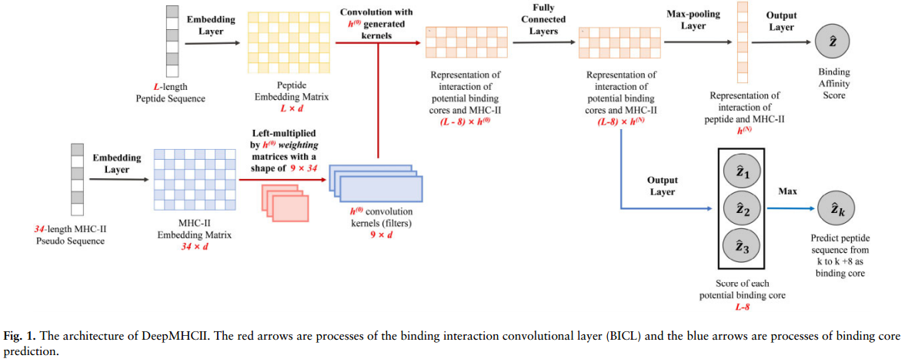
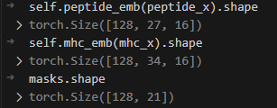
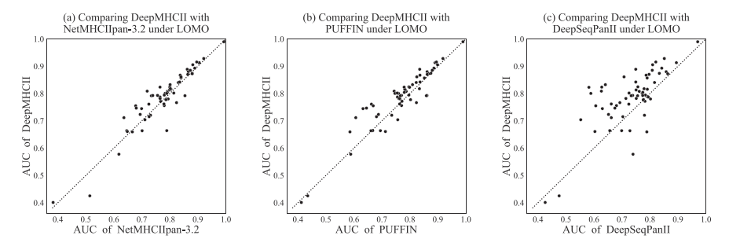

# MHC背景

主要组织相容性复合体（MHC），也称为人类白细胞抗原（HLA），是一组在哺乳动物细胞膜上表达的蛋白质，MHC本身并不是抗原，而是一种重要的免疫系统分子。在人类中，MHC被称为人类白细胞抗原（HLA）。MHC的主要功能是呈递**抗原片段**给免疫系统的**T细胞**，以便T细胞识别和攻击感染的细胞或异常细胞。

>抗原片段是一种抗原分子的部分结构，通常是蛋白质或多肽链的一部分。抗原片段可以被免疫系统的特定细胞（如T细胞和B细胞）识别，并引发免疫应答。
>
>当免疫系统检测到抗原片段时，它会启动一系列的**免疫应答**，包括产生抗体、激活T细胞、吞噬病原体的巨噬细胞等，以清除病原体或异常细胞并保护机体免受感染或疾病的侵害。
>
>T细胞是一种免疫系统中的一类**淋巴细胞**，它们主要负责调节和执行细胞免疫应答。
>
>**如何识别和攻击感染的细胞或异常细胞的呢？**
>
>T细胞受体（TCR）：T细胞表面有一种叫做**T细胞受体（TCR）**的蛋白质，它能够识别和结合抗原片段。每个T细胞都有成千上万个不同的TCR，**每个TCR都能够识别一种特定的抗原片段**。
>
>- 当T细胞的**TCR**与MHC分子上呈递的**抗原片段结合**时，**T细胞**就会被**激活**。
>- 激活的T细胞会**释放细胞因子**，并开始**增殖和分化成各种效应细胞**。
>- **CD8+ T细胞**被激活后，会分化成**细胞毒性T细胞（CTLs）**，它们能够识别并杀死感染的细胞或异常细胞。
>- **CD4+ T细胞**则可以分化成各种类型的辅助T细胞，包括促进CTLs杀伤活性的Th1细胞，促进B细胞产生抗体的Th2细胞，以及调节免疫反应的调节性T细胞（Tregs）等。

## MHC分类

### MHC-I

在几乎所有的细胞表面都能找到。它主要呈递**内源性抗原**（如细胞内产生的病毒蛋白）给CD8+ T细胞，这些细胞会杀死感染的细胞或癌细胞。

#### CD8+

CD8+是一种**T细胞亚群**，也称为CD8+ T细胞或细胞毒性T细胞（CTLs）。这些细胞在免疫系统中起着重要的作用，主要负责直接**识别和杀伤**感染的细胞、异常细胞以及肿瘤细胞。

CD8+ T细胞的特点包括：

1. 表面表达CD8蛋白：CD8蛋白是一种**受体**，能够**与MHC-I分子结合**。这使得CD8+ T细胞能够识别由感染的细胞或异常细胞表面呈递的抗原片段-MHC-I复合物。
2. 细胞毒性：一旦CD8+ T细胞**识别**到感染的细胞或异常细胞，它们会**释放细胞毒素**，如**穿孔素**或干扰素，直接杀死这些细胞。这种能力使得CD8+ T细胞成为免疫系统中的重要防御力量，可以清除感染的细胞或异常细胞，保护机体免受病原体或异常细胞的侵害。
3. 参与细胞免疫应答：CD8+ T细胞是细胞免疫应答的重要组成部分。它们能够识别并杀伤感染的细胞，从而限制病原体的传播，并促进感染的清除。

### MHC-II

主要在专门的**抗原提呈细胞**（如树突状细胞、B细胞和巨噬细胞）上表达。它主要呈递**外源性抗原**给CD4+ T细胞，这些细胞会激活和调节其他免疫细胞的活动，如B细胞和CD8+ T细胞。

#### CD4+

CD4+是一种T细胞亚群，也称为CD4+ T细胞。这些细胞在免疫系统中起着重要的作用，主要负责**调节和协调免疫应答**的过程，并提供免疫记忆。

CD4+ T细胞的特点包括：

1. 表面表达CD4蛋白：CD4蛋白是一种受体，能够**与MHC-II分子结合**。这使得CD4+ T细胞能够识别由**抗原提呈细胞**（如树突状细胞、B细胞和巨噬细胞）表面呈递的抗原片段-MHC-II复合物。

2. 分化成各种类型的辅助T细胞：CD4+ T细胞在活化后可以分化成多种类型的辅助T细胞，包括：
   - Th1细胞：促进细胞免疫应答，特别是促进CD8+ T细胞和巨噬细胞的活化和增殖，有助于清除细胞内感染。
   - Th2细胞：促进体液免疫应答，特别是促进B细胞的活化、增殖和分化成抗体产生细胞，有助于清除体液内的病原体。
   - Th17细胞：参与调节炎症和自身免疫反应。
   - Treg细胞：调节免疫应答的平衡，抑制过度免疫反应和自身免疫反应，维持免疫耐受性。

3. 提供免疫记忆：CD4+ T细胞在免疫应答中起到了关键的作用，它们能够识别抗原，并激活和调节其他免疫细胞的活动，从而帮助机体清除感染。此外，CD4+ T细胞还能够形成免疫记忆，使得免疫系统能够更快、更有效地应对再次遭遇相同抗原的情况。

#### DQ、DP、DR分子

MHC-II中的DQ、DP、DR分子是什么？ 

在 MHC-II 类别中，DQ、DP 和 DR 分子是**特定类型的 MHC-II 分子**，它们在不同的物种中发挥着重要的免疫调节作用。它们分别代表**不同的亚类。**

#### B细胞

B细胞是免疫系统中的一类白细胞，它们在机体抵御病原体和维持免疫平衡中发挥着重要作用。**产生抗体**：B细胞是免疫系统中产生抗体的主要细胞。当B细胞受到外源性抗原的刺激时，它们会被激活并分化成浆细胞，进而产生大量抗体（免疫球蛋白）。这些抗体能够识别和结合特定的抗原，从而中和病原体、促进其清除和灭活。**记忆反应**：一旦B细胞被激活并分化成浆细胞产生抗体，其中一部分B细胞会转化为记忆B细胞。这些记忆B细胞具有长期记忆，当再次遇到同一种抗原时，它们能够迅速重新激活并产生大量抗体，从而加速免疫反应，形成二次免疫应答。**抗原递呈**：B细胞也可以充当抗原递呈细胞，通过呈递抗原给T细胞来激活T细胞介导的免疫应答。这种抗原递呈过程通常发生在辅助性B细胞（B-helper 细胞）上，它们在体内调节和协调免疫应答。

#### 氨基酸残基

在生物学和生物化学中，氨基酸残基通常指的是一个氨基酸分子中**除去羧基（COOH）和氨基（NH2）之外的部分**。换句话说，氨基酸残基是指氨基酸的侧链或侧基部分，也称为氨基酸的侧链残基。氨基酸残基决定了氨基酸的化学性质、功能和结构特征。

每种氨基酸都有不同的侧链结构，侧链的不同导致了氨基酸在蛋白质中的不同作用和功能。一般来说，氨基酸残基包括氨基酸中的所有原子，除了羧基和氨基以外的部分，例如甲基、羟基、酰基等。

在讨论氨基酸残基时，通常会去除氨基酸分子中的羧基（COOH）和氨基（NH2）。这是因为在**蛋白质结构和功能**的描述中，主要关注的是氨基酸的侧链部分，即**氨基酸的化学特性和功能通常由其侧链决定。**去除羧基和氨基可以使氨基酸残基的描述更加简洁和清晰，集中于氨基酸的侧链结构，而不涉及羧基和氨基的反应或功能。

## MHC性质

MHC是**高度多态**的，即**存在大量的MHC等位基因**，使得不同个体之间的MHC分子在结构上有所**差异**。这种多态性对于免疫系统的功能至关重要，因为它增加了免疫系统识别和应对多样性病原体的能力。然而，MHC的多态性也导致了**移植排斥**和**自身免疫疾病**等问题，因为个体之间的MHC差异可能导致免疫系统错误地攻击同种MHC的组织或细胞。

# MHC和肽亲和力预测

## 重要性

这里的肽就是**抗原片段**，即能够被免疫系统识别并与MHC分子结合的抗原的一部分。抗原片段可以来自**外源性抗原**（如细菌、病毒等的蛋白质）或**内源性抗原**（如肿瘤细胞的异常蛋白质）。MHC分子的主要功能之一是呈递抗原片段给免疫系统的T细胞，从而激活免疫应答。当抗原片段与MHC分子结合时，形成了**肽-MHC复合物**，这种**结合亲和力（即肽与MHC分子之间的结合强度）**对于免疫系统的正常功能和免疫应答的调节至关重要。

帮助理解免疫系统如何识别和应对外来病原体以及癌细胞等异常细胞。

以下是预测MHC和肽结合亲和力的重要性：

1. 免疫应答的理解：MHC分子是免疫系统中的重要分子，它们负责呈递抗原片段给T细胞，从而激活T细胞并引发免疫应答。预测MHC和肽结合亲和力可以帮助我们理解免疫系统是如何识别和处理抗原的，从而更好地了解免疫应答的机制。

2. 疫苗设计和免疫治疗：预测MHC和肽结合亲和力可以帮助我们设计更有效的疫苗和免疫治疗策略。通过预测抗原片段与MHC分子的结合亲和力，可以选择最优的抗原片段用于疫苗设计，从而提高疫苗的免疫原性和保护效果。此外，预测肽-MHC结合亲和力还可以用于设计针对肿瘤特异性抗原的免疫治疗策略，如肿瘤特异性T细胞疗法（CAR-T细胞疗法）和肿瘤疫苗。

3. 个体化医学：预测MHC和肽结合亲和力还可以用于个体化医学的研究和治疗。由于不同个体的MHC分子具有多样性，因此预测MHC和肽结合亲和力可以帮助确定特定个体对特定抗原的免疫应答情况，从而实现个体化的免疫治疗和药物设计。

## 亲和力

**一种MHC分子通常能够结合多种不同的抗原肽。**MHC分子的结合槽具有一定的灵活性，可以适应不同长度和序列的抗原肽。这种多样性和适应性使得MHC分子能够与多种不同的抗原肽结合。

MHC分子对抗原肽的结合偏好主要受到以下因素的影响：

1. MHC的多态性：**MHC分子在不同个体中具有高度多态性**，即存在大量的MHC等位基因，导致不同MHC分子对抗原肽的结合偏好不同。
2. MHC分子的结合槽：MHC分子表面有一个或多个结合槽，抗原肽必须与这些结合槽中的氨基酸相互作用才能结合。不同MHC分子的结合槽结构不同，因此它们对抗原肽的结合偏好也不同。
3. 抗原肽的氨基酸序列：抗原肽的氨基酸序列对于其与MHC分子的结合偏好至关重要。不同MHC分子对抗原肽的结合偏好通常与抗原肽的氨基酸序列有关，例如某些MHC分子更倾向于结合含有特定氨基酸的抗原肽。

> **肽与mhc的结合亲和力主要由MHC-II分子与肽结合核心的相互作用决定。位于结合核心外的肽侧翼区(PFRs)也会影响结合亲和力**

## 已有方法

针对MHC-II（主要组织相容性复合体II型）肽结合预测的计算方法，将其分为两大类：等位基因特异性（allele-specific）方法和泛特异性（pan-specific）方法。

### 等位基因特异性方法

这类方法只能预测训练集中MHC-II分子的结合偏好。这意味着，如果一个MHC-II分子的数据被包含在模型的训练集中，这种方法可以用来预测该分子与不同肽段的结合倾向。这种方法的限制在于它依赖于已有的、特定的MHC-II分子数据，对于训练集之外的MHC-II分子则无法进行预测。

### 泛特异性方法

与等位基因特异性方法不同，泛特异性方法即使在没有某些MHC-II分子的训练数据的情况下，也能预测这些MHC-II分子的结合偏好。这意味着，泛特异性方法能够对那些未在训练集中出现的MHC-II分子进行预测，提供更广泛的应用范围。因此，泛特异性方法更具通用性和适用性，可以覆盖更多种类的MHC-II分子。

**Example**：特定位置评分矩阵、ANN、基于核，最成熟的是NetMHCIIpan（基于神经网络）

深度学习方法：基于CNN、LSTM、Transformer：DeepSeqPanII、PUFFIN 、MHCAttnNet 、BERTMHC 

**问题：将MHC-II分子和肽的序列编码连接起来作为输入，没有利用重要的领域知识，缺乏性能改进和可解释性。**

# 痛点

## Peptides

1. 灵活的长度
2. 结合核心的位置

## MHC-II

1. 数千个MHC-II分子具有不同的结合特异性
2. 长并且灵活可变的序列
3. 数据稀缺，没有label

# 文章算法DeepMHCII

将生物学知识结合到设计模型架构中来准确预测MHC-II肽结合亲和力。

**三个特征：**

- **肽的结合核心与PFRs（Peptide Flanking Regions，肽侧翼区域）**：结合核心是肽段中直接参与与MHC-II分子结合的一小部分氨基酸序列。PFRs是位于结合核心两侧的区域，虽然它们不直接参与结合，但可能影响肽段的整体构象和MHC-II分子的结合亲和力。
- **伪序列**：这是指MHC-II分子中仅包含对于与肽段结合核心直接相互作用的关键残基的序列。这些残基在肽段与MHC-II分子的互作中扮演核心角色，因而被特别关注。
- **肽段与MHC-II分子之间的互作**：通过所有潜在结合核心与伪序列之间的相互作用来建模。这意味着，模型不仅考虑了单一的结合位点，而是尝试捕捉肽段可能的多个结合核心与MHC-II分子伪序列之间的整体相互作用。

## 算法对比

NetMHCIIpan-3.2、PUFFIN、DeepSeqPanII、MHCAttnNet

## 方法

肽序列、MHC-II序列，都是由20种氨基酸组成。任务是预测结合亲和力的回归问题。

结合亲和力主要由肽的九长结合核心（未知）和MHC-II分子中具有九个口袋的结合凹槽决定。此外，已经发现结合核心的肽侧翼区（PFRs）影响结合亲和力。

**预处理：**

使用从Q中提取的34长度的伪序列Q'作为MHC-II分子的代表（MHC-II的伪序列被认为是对肽结合至关重要的重要MHC残基）。

> 34是来自NetMHCIIpan-3.0提出的，是由来自MHC-II的a和b链的15和19个氨基酸残基组成。残基是从PDB的MHC-II肽复合物中提取的，在MHC分子中具有多态性，并在至少一个MHC-II肽复合物中与肽结合核心紧密接触（<4Å）[4埃（angstrom），是一种长度单位，用符号Å表示。1埃等于10⁻¹⁰米（或者100皮米，100 pm），常用于表示原子尺度的距离。]

### 输入

- L长度的肽序列P
- 34长度的伪序列Q‘（从MHC-II类分子的序列Q中提取得到）

### Overview

基本四步：

1. 分别使用两个embedding层将两个序列进行嵌入表示（深度语义密集表示）
2. 使用结合相互作用卷积层（BICL）来获得潜在结合核心和MHC-II分子之间的结合相互作用的表示
3. 使用全连接层和max-pooling层来提取肽和MHC-II分子的相互作用
4. 输出层获得结合亲和力

### 输入层

肽序列P：X：L*d（d是氨基酸嵌入的维数）

MHC-II的伪序列Q‘：Y：34*d

肽序列的L是由前三个pad，后三个pad，并且中间由21个位置pad，即一共长度是21+3*2=27。肽序列不足21长度的，进行pad补全。

### BICL

binding interaction convolutional layer：结合相互作用卷积层。通过考虑肽X的所有可能的结合核心，获得肽X与MHC-II分子Y之间相互作用的表示。传统的基于序列的CNN中，输入序列共享相同的核（过滤器）。但是在这个问题中，每个MHC-II类分子具有不同的结合偏好。

BICL为每个MHC-II生成不同的核，M为结合核的大小（文中=9），使用一个权重矩阵$${W_k}$$（维度是M×34）去生成第k个核$$f\left( {{W_k}Y} \right)$$，其中$$f$$是激活函数。把从第i个残基开始的X的潜在结合核心记为$${X_{i:i + M - 1}}$$，所以，肽的潜在结合核心和MHC-II分子的相互作用为：

$$C_{i,k}^{\left( 0 \right)} = f\left( {f\left( {{W_k}Y} \right){X_{i:i + M - 1}} + {b_k}} \right)$$

### 最大池化和输出层

使用N个全连接层和一个max-pooling层获取肽X和MHC-II类分子Y之间的相互作用的表示$g\in {{R}^{b\left( N \right)}}$：

$$C_i^{\left( n \right)} = f\left( {C_{_i}^{\left( {n - 1} \right)}{W^{\left( n \right)}} + {b^n}} \right)$$

$${{g}_{j}}=max\left\{ C_{i,j}^{\left( N \right)},C_{2,j}^{\left( N \right)},...,C_{L-M+1,j}^{\left( N \right)} \right\}$$

使用输出层来预测结合亲和力：

$$\hat z = \sigma \left( {{w^{\left( o \right)}}g + {b^{\left( o \right)}}} \right)$$

### 结合核心预测

去掉最大池化层，直接在后面加输出层就可以获得每9个潜在结合核心的预测分数：

$${{\hat z}_i} = \sigma \left( {{w^{\left( o \right)}}C_i^{\left( N \right)} + {b^{\left( o \right)}}} \right)$$

最高分数的地方就认为是结合核心。

## 实验

### 数据集

基本来自IEDB数据库：免疫表位数据库。免疫表位数据库(IEDB)是由美国国立过敏与感染性疾病研究院(NIAID)资助的免费资源。 它记录了在传染病，过敏，自身免疫和移植背景下在人类，非人灵长类动物和其他动物物种中研究的抗体和T细胞表位的实验数据。

四个公开可用的基准数据集(BD2016, ID2017, BD2020和BC2015)。BD2016和ID2017用于MHC-肽结合亲和力，BD2020用于MHC-肽结合分类，BC2015用于预测结合核心。

BD2016：[NetMHCIIpan 3.2 - DTU Health Tech - Bioinformatic Services](https://services.healthtech.dtu.dk/services/NetMHCIIpan-3.2/)

## 结果

分析任务：结合亲和力（具体值）、分类（以IC50结合值和500nM比较，转换后的亲和为0.426判断肽是否为结合物还是非结合物）、结合核心预测。

### 评估指标

AUC、PCC

不错的算法比较的展示方式
