# 创新模型

1.糖尿病分类文章，写一个深度学习用于早期诊断的文章，并且用注意力机制找关键因素，然后+大语言模型进行管理

2.可以用孪生网络的思想啊！！！！！！然后按医院不同来分，因为处理可能会存在一些差距。！！！！Siamese network
这个网络主要的优点是淡化了标签，使得网络具有很好的扩展性，可以对那些没有训练过的类别进行分类，这点是优于很多算法的。而且这个算法对一些小数据量的数据集也适用，变相的增加了整个数据集的大小，使得数据量相对较小的数据集也能用深度网络训练出不错的效果。
而且这样可以说，医生也是这么作为的，他们有一个判断的基准线，然后如果两个患者各项指标一直，那么他们的结果也应该是一样的。所以孪生网络之间取差值，就可以知道是否真实存在差距。而且还可以扩充数据集不是么！！！！！如果在加上注意力机制，还能发现哪些特征最能影响两个患者之间的差距！！！！

孪生网络（两个患者）+元学习（多个医院测定）+对比学习（成对的0和1这样的数据，生成判别）+（交叉）注意力机制（找生物特征或重要指标）+不平衡损失+防止过拟合的损失+ProCo

3.https://mp.weixin.qq.com/s/U6vziwdzdfYIjrXKm1Cwag

proco


2.1 GCN中聚合特征的时候MPNN尽可能依据相似度聚合同一类PPDM的特征，这类的权重加大。

可以做个小实验观察GCN聚合的各个其他样本的权重，观察PPDM=0以及PPDM=1的情况


4.接着使用大语言模型生成管理建议，和判别agent判断状态或者预后？找临产做数据标注

Nature Medicine的文章《Integrated image-based deep learning and language models for primary diabetes care》

https://mp.weixin.qq.com/s/Pccyn5rRaME-1BW9Cs7Jmw

语言大模型具备较佳的糖尿病护理建议生成能力


5.https://mp.weixin.qq.com/s/rrkNjO9GBOpKKYZ7zUeixw

这篇文章Nature Medicine（IF=58.7）上的一篇文章《Machine learning for ECG diagnosis and risk stratification of occlusion myocardial infarction》使用的纯机器学习方法，只不过做了很多分析实验，数据也是新的。我可以沿用他的分析过程

https://mp.weixin.qq.com/s/cVTQiFfeLbCIVKFSBtBS0w

这篇文章8.5分 更简单  参考分析过程

https://mp.weixin.qq.com/s/wFdlhXEUhJVz_gwo7rE2eQ

学习画图和分析维度


可以问他们医院要新增数据

投稿的期刊也可以参考


6.Weights and Biases

Weights and bias是一个开发者工具，它可以跟踪机器学习模型，并创建模型和训练的可视化。它是一个Python库，可以作为*import wandb*导入。它工作在Tensorflow, Keras, Pytorch, Scikit，Hugging Face，和XGBoost上。使用*wandb.config*配置输入和超参数，跟踪指标并为输入、超参数、模型和训练创建可视化，使它更容易看到可以和需要更改的地方来改进模型。


7.参考样本的选择方式/交叉熵损失+对比损失


## 元学习

few-shot learning就是一种meta learning

meta learning：learn to learn 自己学会学习

有点像对比学习的感觉

外循环、内循环

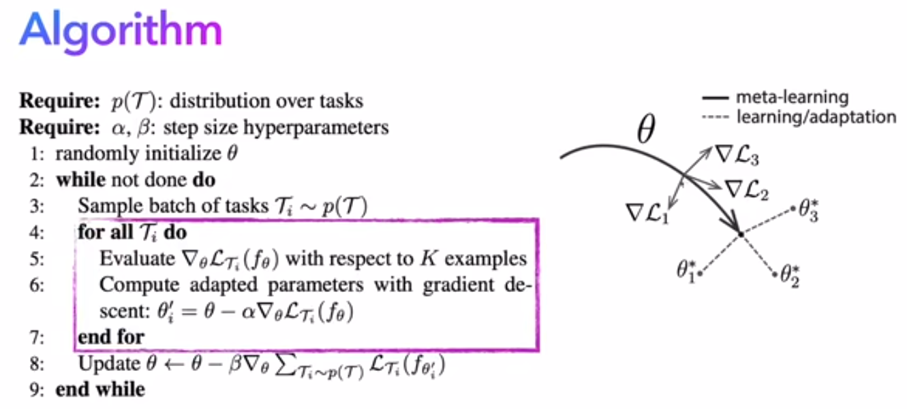

紫色框就是inner loop

李宏毅元学习

MAML & Reptile

Model-Agnostic Meta-Learning for Fast Adaptation of Deep Networks, ICML, 2017

https://arxiv.org/abs/1803.02999

How to train your MAML, ICLR, 2019

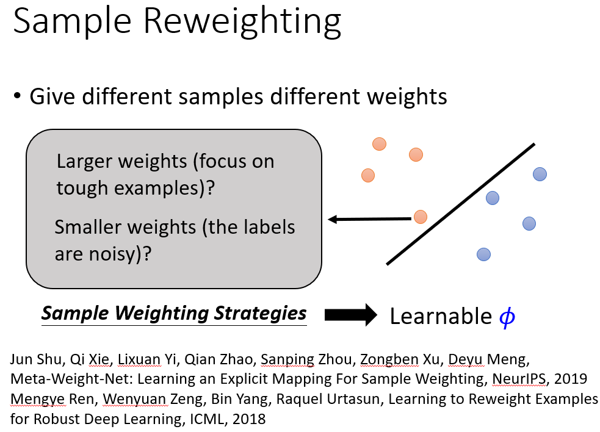

自动学习sample的权重


learning to initialize

learning to compare

other


## 损失函数

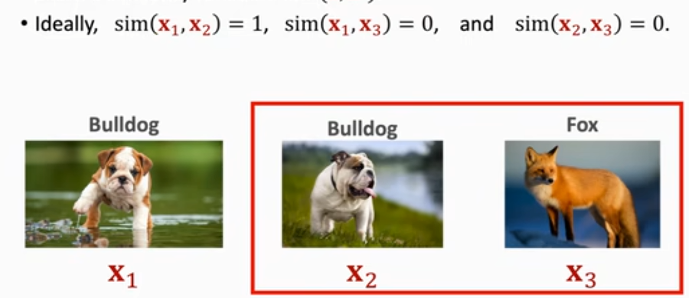

训练一种相似性函数，即PPDM_1=0，PPDM_2=0，PPDM_3=1

此时，sim(PPDM_1,PPDM_2)=1，即同一种类型的人相似度是1

sim(PPDM_1,PPDM_3)=0，不同PPDM状态的人相似度是0


sigmoid的结果和target之间的交叉熵损失


损失函数加上entropy regularization，防止过拟合。

使用余弦相似度+softmax（将二范数变为一，即归一化），而不是内积+softmax。

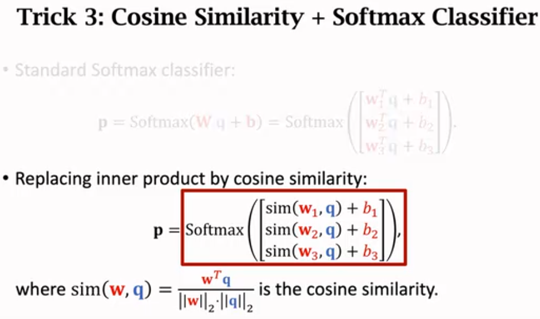

## 孪生网络

Siamese Network

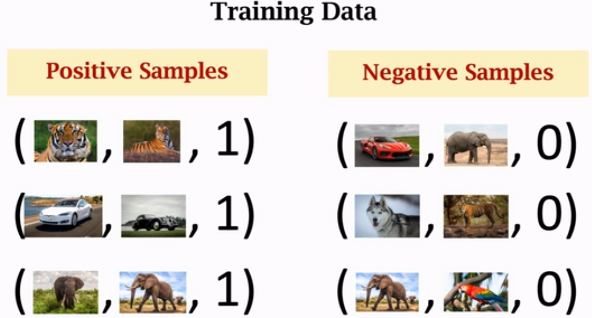

随机抽样，构建正负样本（同样数量的正样本和负样本？？）

孪生网络是实现对比学习的方法之一

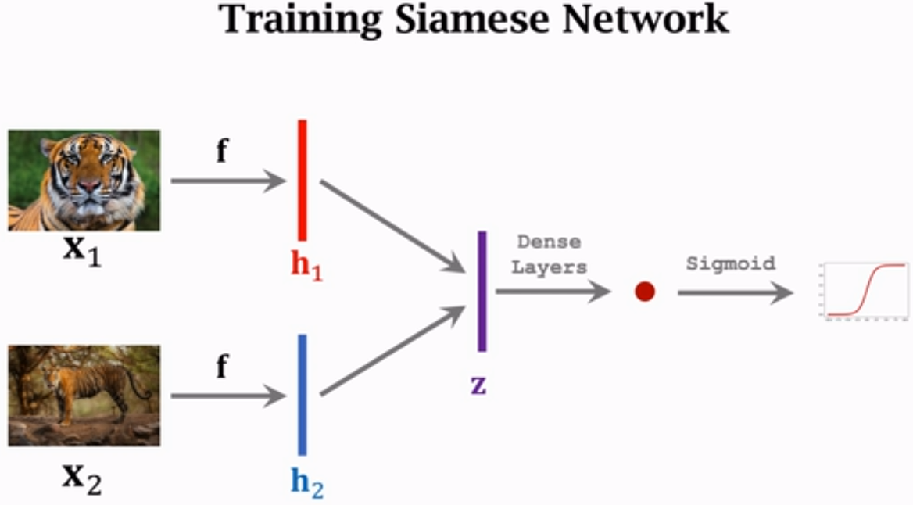

共享了特征提取的f的部分，f可能是卷积神经网络提取的特征

算相似度可以使用向量相减的绝对值，也可以使用内积，也可以使用余弦相似度

Triplet Loss

（锚点，正样本，负样本）

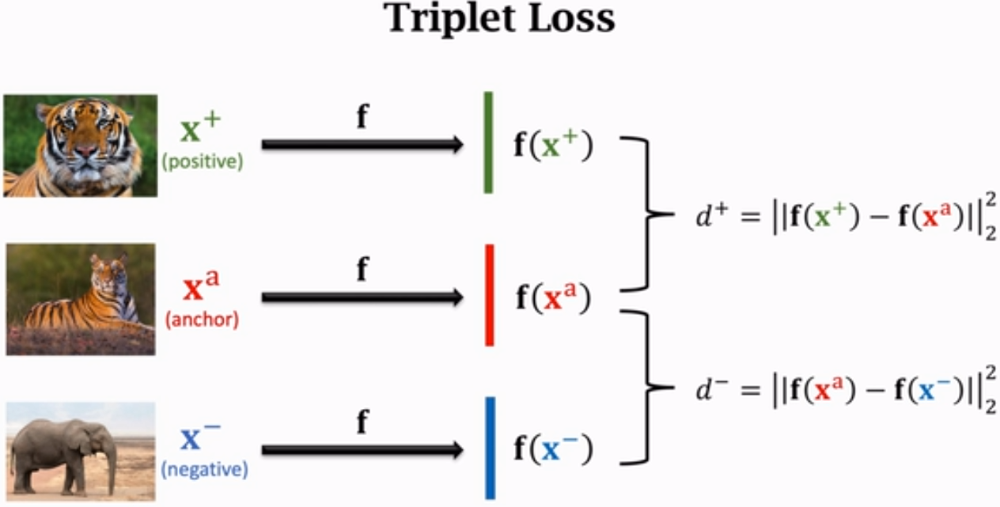

算特征向量的差距。可以可视化这个特征向量空间。

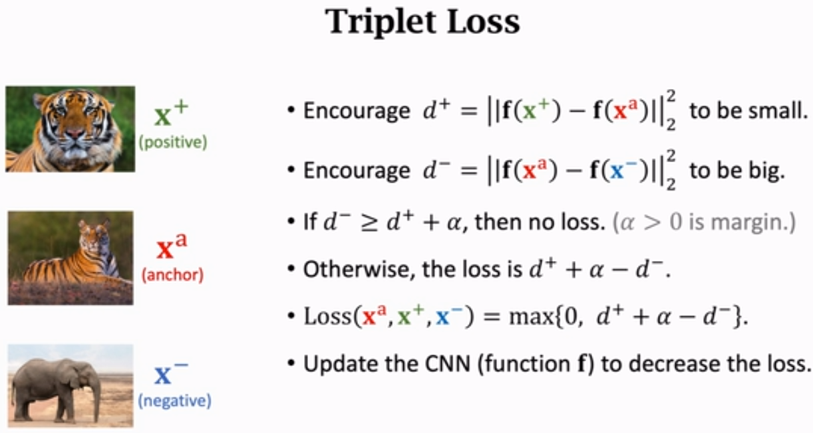

可以单独做实验比较两种方式

## 对比学习

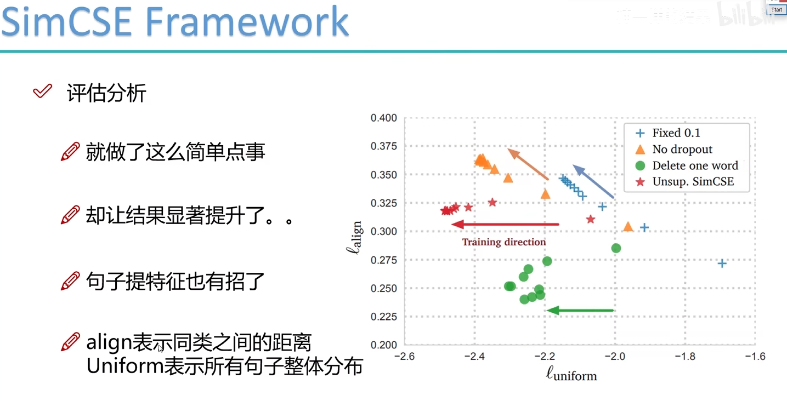

## 特征重要性

### 1. **逐特征注意力**

对于你的数据，可以将每个特征视为序列的一个“位置”，用注意力机制计算特征的重要性分布。此方法的核心思想是：虽然特征是标量，但我们可以为每个特征学习一个嵌入向量，用于捕捉特征间的交互。

```
python复制代码import torch
import torch.nn as nn

class FeatureAttentionEncoder(nn.Module):
    def __init__(self, input_dim, hidden_dim, output_dim):
        super(FeatureAttentionEncoder, self).__init__()
        self.feature_embeddings = nn.Linear(1, hidden_dim)  # 每个特征映射为一个嵌入向量
        self.attention = nn.MultiheadAttention(embed_dim=hidden_dim, num_heads=4)
        self.fc = nn.Sequential(
            nn.Linear(hidden_dim, hidden_dim),
            nn.ReLU(),
            nn.Linear(hidden_dim, output_dim)
        )
    
    def forward(self, x):
        x = x.unsqueeze(-1)  # 将标量特征变成 [batch, feature, 1]
        x = self.feature_embeddings(x)  # 特征嵌入 [batch, feature, hidden_dim]
        x = x.permute(1, 0, 2)  # 调整为 [feature, batch, hidden_dim]，适配 MultiheadAttention
        x, _ = self.attention(x, x, x)  # Self-attention 计算
        x = x.mean(dim=0)  # 对特征位置取平均 [batch, hidden_dim]
        return self.fc(x)
```

**核心思路：**

1. **为每个特征分配一个嵌入向量**：通过 `nn.Linear` 将标量特征变为高维表示。
2. **使用注意力捕捉特征间关系**：对特征嵌入使用 `MultiheadAttention` 计算权重。
3. **全连接层输出编码结果**：将注意力后的特征通过 `MLP` 生成最终的特征编码。

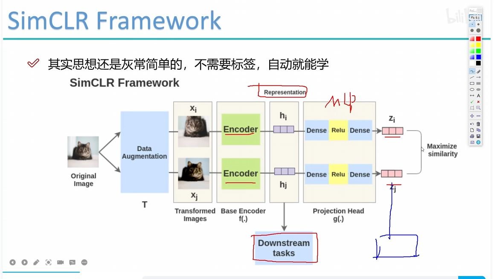

刚开始的特征泛化能力更强

# 后续实验

tsne嵌入降维可视化，看0和1的区别，看医院之间的区别
对比算法
消融实验
案例研究
超参数敏感性分析
成对损失和三个组合的损失（带anchor）比较
带不平衡和不带不平衡的区别
注意力机制下的特征重要性

构建正负样本对的方式是否会有区别

过采样、上采样等方式的影响

只用其中4个医院训练，用一家医院验证试试


k-neighbor可做鲁棒性测试，8,9,10结果都还行

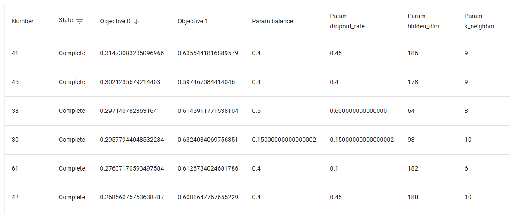

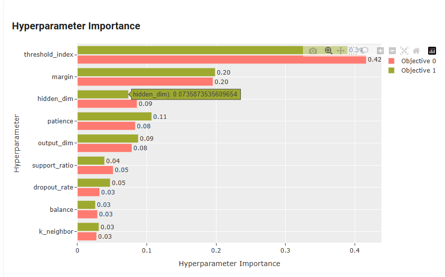

# 创新点

1. 删除掉所有带空值的行，还剩945个样本，其中患病不患病的比例是与原数据一样的。可以模拟缺失值的情况，然后使用填补缺失值的方法验证在这种数据上那种缺失值填补的方式更有效。KNN填补，0，均值，中位数，众数，随机森林，AE，GAN

# 投稿期刊

nature medicine 
nature machine intelligence 
nature methods 
nature communications 
bib

npj digital medicine

npj precision oncology

其他

\nabla_\text{meta_batch_loss} = \frac{1}{N} \sum_{i=1}^N \nabla_\text{loss}_i

# 结果

## raw_10fold

```cmd
Training Completed.
Best F1: 0.3030 at Epoch 60
Corresponding Metrics: Acc: 0.8715, F1: 0.3030, AUC: 0.7286, AUPR: 0.1672
Best ACC: 0.9441 at Epoch 23
Corresponding Metrics: Acc: 0.9441, F1: 0.1667, AUC: 0.6066, AUPR: 0.1772
Best ROC_AUC: 0.7662 at Epoch 79
Corresponding Metrics: Acc: 0.8492, F1: 0.2286, AUC: 0.7662, AUPR: 0.1436
Best AUPR: 0.3406 at Epoch 183
Corresponding Metrics: Acc: 0.8101, F1: 0.1905, AUC: 0.6136, AUPR: 0.3406
```

