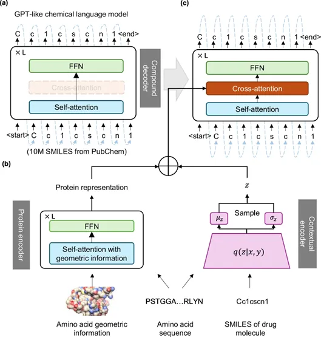

> 以天然产物作为来源。以AI作为技术手段。以器官芯片作为验证平台，实现从干到湿的全流程的药物研发的研究范式。
>
> 一个中心，两个基本点
>
> 博士 论文

# 基于天然产物的分子生成

## 文献阅读

[Nat. Commun. | 靶标感知分子生成模型TamGen](https://mp.weixin.qq.com/s/pfe8NJ3gcVoEDU99hfIqPw?poc_token=HHYy92ejyhuTm62JAanguzr7sS0YVcHooXZu711r)

### 核心算法

TamGen 主要包含三个模块（图-1）：（1）化合物解码器：作为TamGen 的核心模块，该模块使用从 PubChem 数据库中随机选取的 1000 万个 SMILES 字符串进行预训练。预训练策略模仿 GPT 生成文本的方式，基于已生成的 SMILES 字符串预测下一个字符。通过这一策略，TamGen可以学习大量化合物的普遍性和多样性知识，确保生成符合化学规律的化合物。（2）蛋白质编码器：该模块采用 Transformer 架构，通过对氨基酸进行one-hot编码和三维坐标的线性映射，同时结合旋转、平移变换等数据增强方法来有效地捕捉蛋白质的空间信息。该模块的输出将通过交叉注意力模块传递给化合物解码器，以确保生成的化合物与靶蛋白的三维构象相匹配。（3）上下文编码器：该模块采用变分自编码器（VAE）架构，通过利用先前生成的化合物或文献中报道的候选分子与靶蛋白之间的相互作用信息来优化或生成新的化合物。它将输入的配体-靶蛋白口袋配对信息映射到潜在空间（一个低维向量空间，代表蛋白质-配体交互的潜在特征），然后将从潜在空间中采样得到的潜在向量输入到化合物解码器模块，同时结合可合成性等评分对化合物结构进行调整以生成优化后的化合物。

### 思考

1. 设计多个模块,分别处理SMILES和蛋白质序列，需要进行预训练
2. 分子生成预训练基于天然产物的smiles结构，而另一类对比是做小分子药物的的smiles结构的预训练，然后对比两个在生成分子上的各种性质，比如可合成性等等。这是第一个实验。
3. 这篇文章提供了五种前人工作（作者将其与五种近期推出的分子生成方法进行了比较）
4. 使用了与前人工作相同的数据进行比较（使用与这些方法相同的训练和测试数据对 TamGen 进行微调）
5. 评价指标（对接分数、药物相似性QED、Lipinski五原则、可合成性评分SAS、脂水分配系数logP和分子多样性）
6. 做了比较多湿实验。
7. 存在于其他生成器的生成分子的空间分布比较。
8. 一些基本理论：在现有基于结构的分子生成方法中，为获得具有较好结合亲合力的分子，大多数模型倾向于生成具有较多融合环的结构，以尽量填满整个靶蛋白口袋。然而，这种结构通常伴随着较差的可合成性和潜在的毒性。相比之下，TamGen生成的分子在融合环数量上低于目前性能较优的其他几种模型，且与目前FDA批准化合物所含融合环数量基本相当（图-2c）。
