# 参考期刊

https://mp.weixin.qq.com/s/rrkNjO9GBOpKKYZ7zUeixw

这篇文章Nature Medicine（IF=58.7）上的一篇文章《Machine learning for ECG diagnosis and risk stratification of occlusion myocardial infarction》使用的纯机器学习方法，只不过做了很多分析实验，数据也是新的。我可以沿用他的分析过程

https://mp.weixin.qq.com/s/cVTQiFfeLbCIVKFSBtBS0w

这篇文章8.5分 更简单  参考分析过程

https://mp.weixin.qq.com/s/wFdlhXEUhJVz_gwo7rE2eQ

学习画图和分析维度

# 绘图

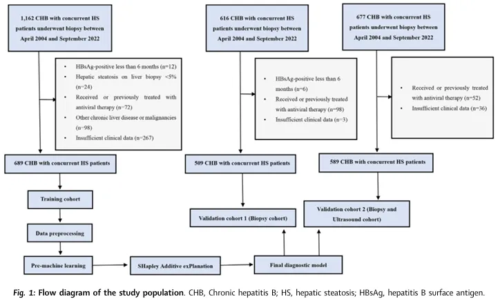

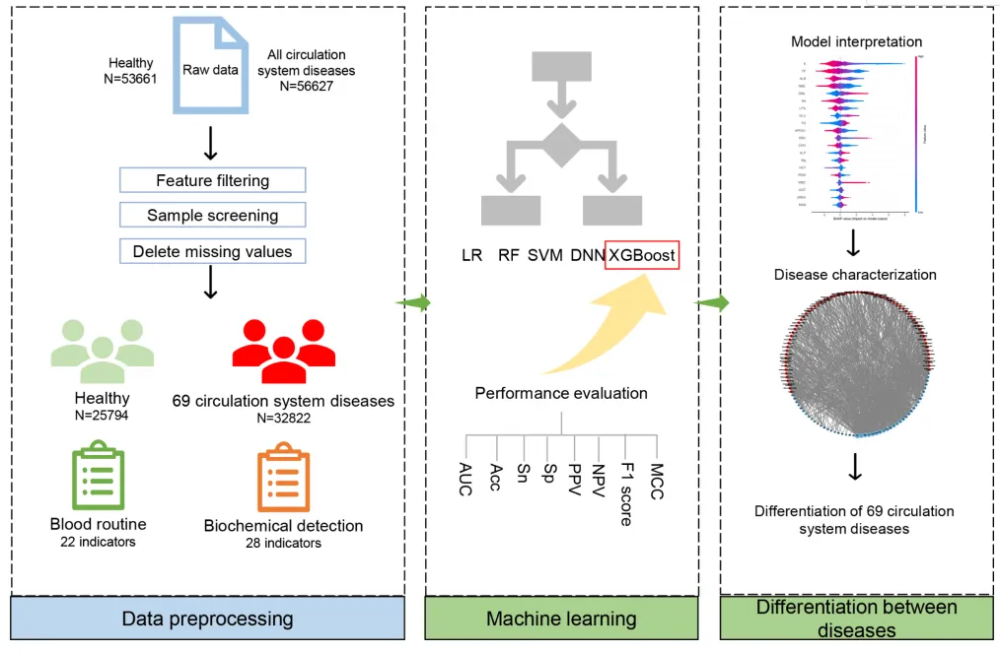

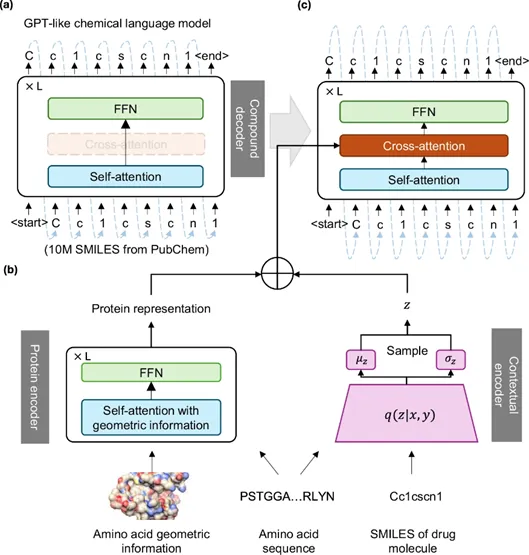

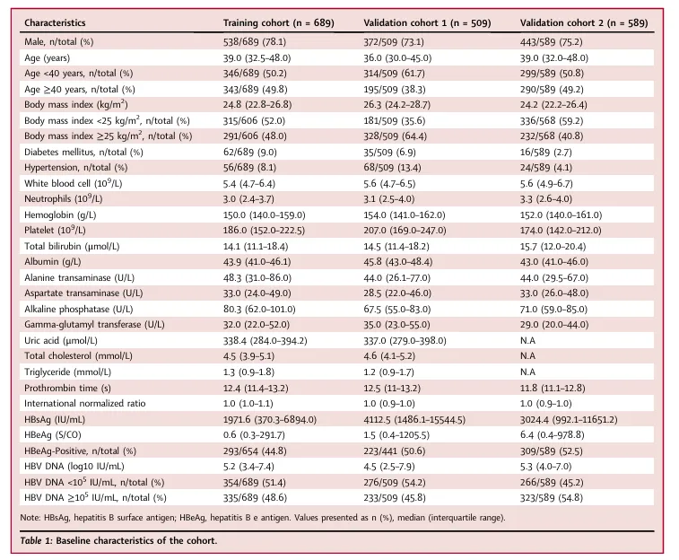

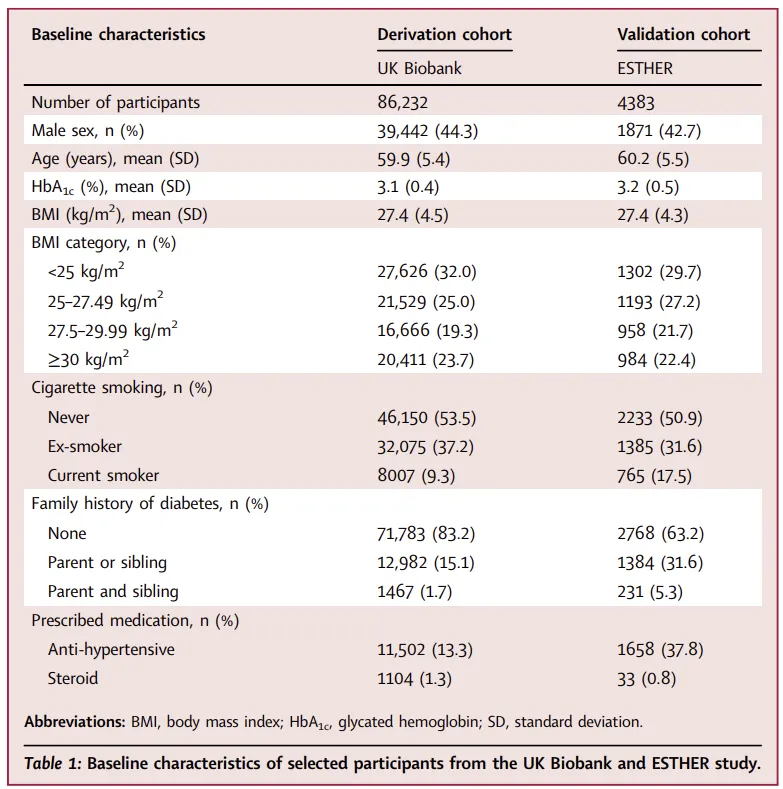

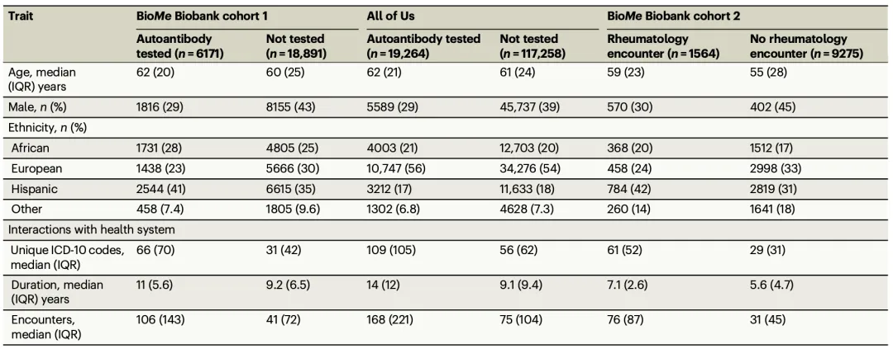

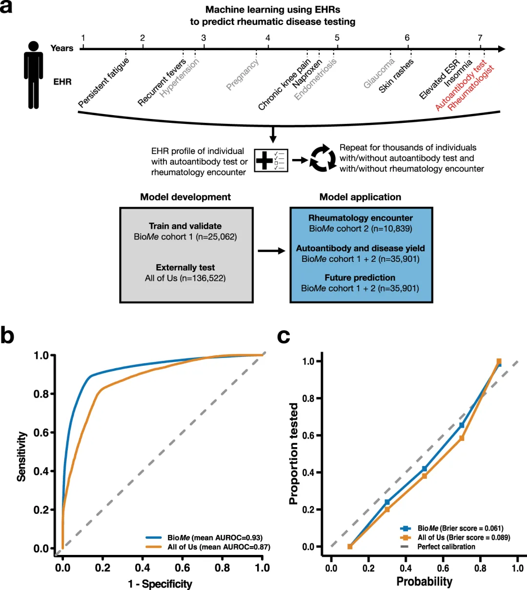

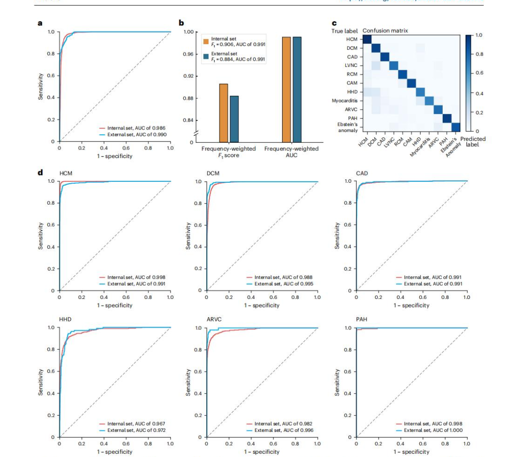

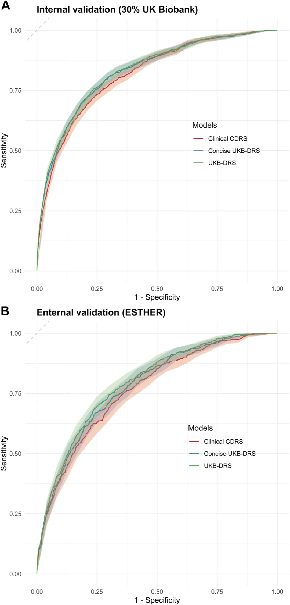

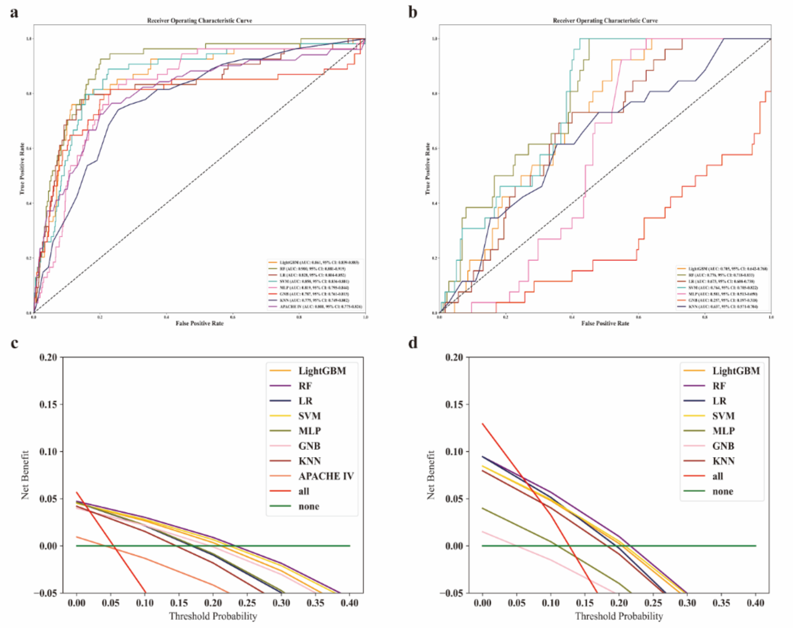

**04通过 DCA 和校准曲线评估 GNB 模型对中度至重度肝脏炎症诊断的性能**

GBC 模型的 DCA 表明，在一系列阈值概率上，训练队列和两个验证队列的净收益一致。在所有三个队列中，GBC 模型都优于“不治疗”策略，表明它在决策中具有实际效用（图4）。校准曲线显示，GBC 模型在训练队列中取得了良好的诊断性能，但在验证队列1中低估了中度至重度肝脏炎症的风险。

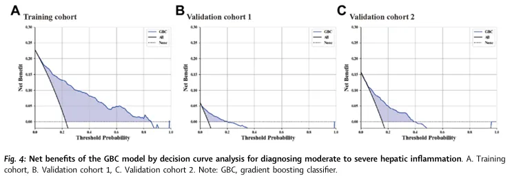

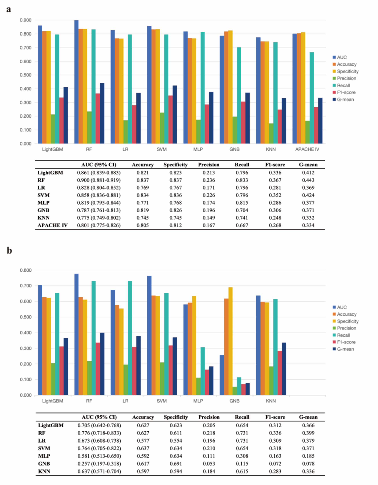

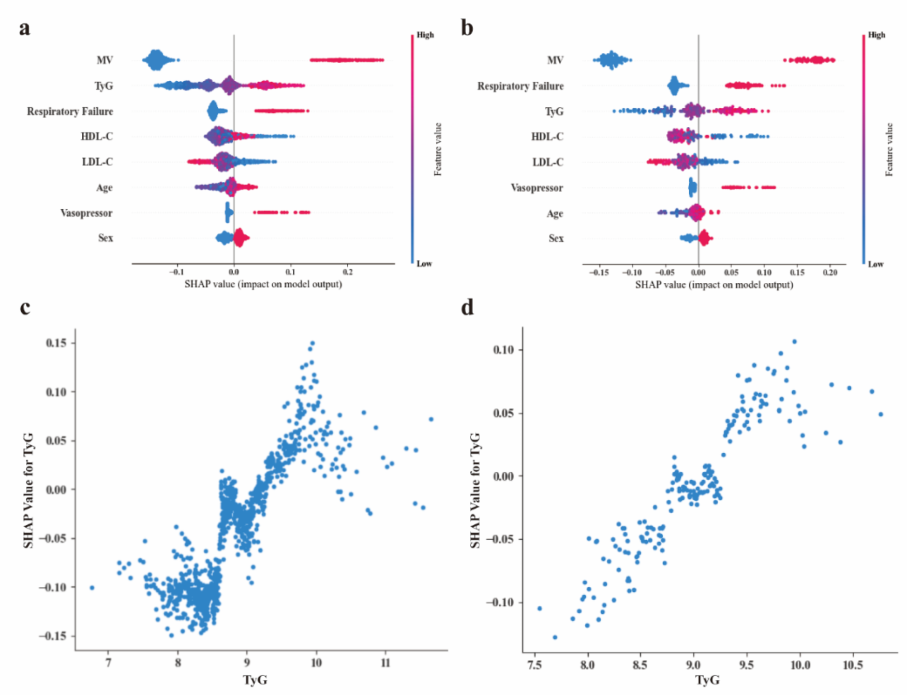

评估特征贡献（通过平均降低精度（MDA）评估）

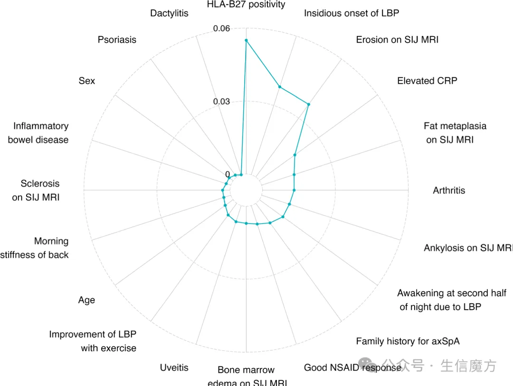

# 投稿期刊

eClinicalMedicine 9分

lancet digital health 23.8分
