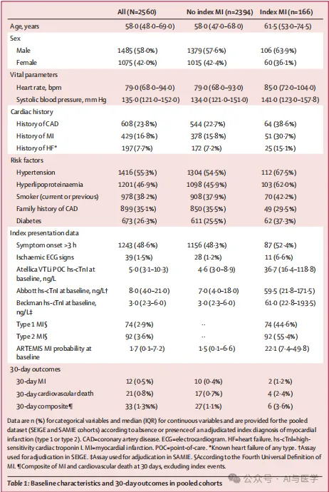

# 参考期刊

https://mp.weixin.qq.com/s/rrkNjO9GBOpKKYZ7zUeixw

这篇文章Nature Medicine（IF=58.7）上的一篇文章《Machine learning for ECG diagnosis and risk stratification of occlusion myocardial infarction》使用的纯机器学习方法，只不过做了很多分析实验，数据也是新的。我可以沿用他的分析过程

https://mp.weixin.qq.com/s/cVTQiFfeLbCIVKFSBtBS0w

这篇文章8.5分 更简单  参考分析过程

https://mp.weixin.qq.com/s/wFdlhXEUhJVz_gwo7rE2eQ

学习画图和分析维度

# 绘图





**04通过 DCA 和校准曲线评估 GNB 模型对中度至重度肝脏炎症诊断的性能**

GBC 模型的 DCA 表明，在一系列阈值概率上，训练队列和两个验证队列的净收益一致。在所有三个队列中，GBC 模型都优于“不治疗”策略，表明它在决策中具有实际效用（图4）。校准曲线显示，GBC 模型在训练队列中取得了良好的诊断性能，但在验证队列1中低估了中度至重度肝脏炎症的风险。


评估特征贡献（通过平均降低精度（MDA）评估）


# 投稿期刊

eClinicalMedicine 9分

lancet digital health 23.8分

# 网页部署

## 安装包

```
pip install streamlit pandas lightgbm scikit-learn
```

## 使用Nginx实现https支持

```shell
sudo apt update
sudo apt install nginx

# 修改配置文件
less /etc/nginx/nginx.conf

# 下载阿里云域名证书，个人证书绑定SSL，每年可以免费领取20张，一次3个月。

# 增加系统用户nginx
sudo useradd -r -s /sbin/nologin nginx
-r：创建系统用户。
-s /sbin/nologin：禁止该用户登录。
```

config配置如下：
```shell
# For more information on configuration, see:
#   * Official English Documentation: http://nginx.org/en/docs/
#   * Official Russian Documentation: http://nginx.org/ru/docs/

user nginx;
worker_processes auto;
error_log /var/log/nginx/error.log;
pid /run/nginx.pid;

# Load dynamic modules. See /usr/share/doc/nginx/README.dynamic.
include /usr/share/nginx/modules/*.conf;

events {}

http {
        server {
            listen 443 ssl http2;
            server_name heppre.icu;
            # ssl证书相关信息
            ssl_certificate /etc/nginx/ssl/heppre.icu.pem;
            ssl_certificate_key /etc/nginx/ssl/heppre.icu.key;
            ssl_protocols TLSv1.2 TLSv1.3;
            
            location / {
                    proxy_set_header Host $host;
                    proxy_set_header X-Real-IP $remote_addr;
                    proxy_set_header X-Forwarded-For $proxy_add_x_forwarded_for;
                    proxy_set_header X-Forwarded-Proto $scheme;
                    proxy_http_version 1.1;
                    proxy_set_header Upgrade $http_upgrade;
                    proxy_set_header Connection "upgrade";
                    proxy_pass http://localhost:8501;
                }
}
        server {
            listen 80;
            server_name heppre.icu;
            return 301 https://$host$request_uri;
}
}
```

查看nginx状态

```shell
sudo systemctl status nginx
```

配置好文件后重启nginx

```shell
sudo systemctl restart nginx
```

注意：

1.域名解析需要一定的时间

2.带streamlit的8501的端口被nginx忽略了，转发到本地80即http的端口了。所以访问方式应该是：公网ip就行，而不是公网ip:8501。

3.不能两个服务器都使用一份nginx配置文件，包括ssl，这样也会解析失败，应该停止一个服务器上的nginx服务。】


# 投稿

柳叶刀旗下子刊

```shell
Note: The following publications are part of the same portal group as the current publication.

Registration with one publication will normally give access to other publications in this group (there may be a short delay while registration information is propagated).

EBIOM	eBioMedicine
ECLINM	eClinicalMedicine
LANGLH	The Lancet Global Health
THELANCET	The Lancet
THELANCETCHILDADOL	The Lancet Child & Adolescent Health
THELANCETDE	The Lancet Diabetes & Endocrinology
THELANCETGASTROHEP	The Lancet Gastroenterology & Hepatology
THELANCETHAEMATOLOGY	The Lancet Haematology
THELANCETHEALTHYLONGEVITY	The Lancet Healthy Longevity
THELANCETHIV	The Lancet HIV
THELANCETID	The Lancet Infectious Diseases
THELANCETMICROBE	The Lancet Microbe
THELANCETNEUROLOGY	The Lancet Neurology
THELANCETOBGYNWH	The Lancet Obstetrics, Gynaecology, & Women’s Health
THELANCETONCOLOGY	The Lancet Oncology
THELANCETPRIMARYCARE	The Lancet Primary Care
THELANCETPSYCH	The Lancet Psychiatry
THELANCETPUBLICHEALTH	The Lancet Public Health
THELANCETRM	The Lancet Respiratory Medicine
TLDIGITALHEALTH	The Lancet Digital Health
TLPLANETARYHEALTH	The Lancet Planetary Health
TLRHAMERICAS	The Lancet Regional Health - Americas
TLRHEU	The Lancet Rheumatology
TLRHEUROPE	The Lancet Regional Health - Europe
TLRHSOUTHEASTASIA	The Lancet Regional Health – Southeast Asia
TLRHWESTERNPACIFIC	The Lancet Regional Health - Western Pacific
```

