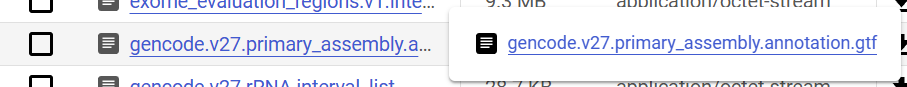
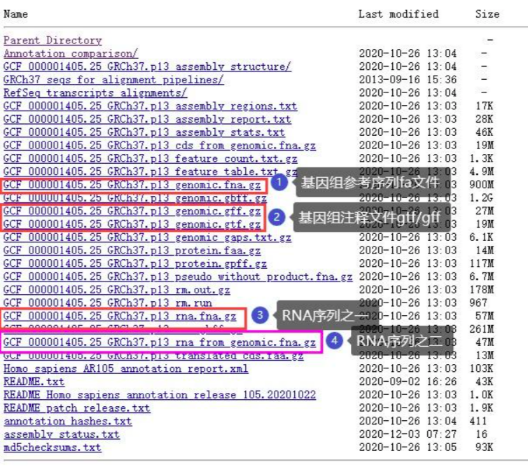
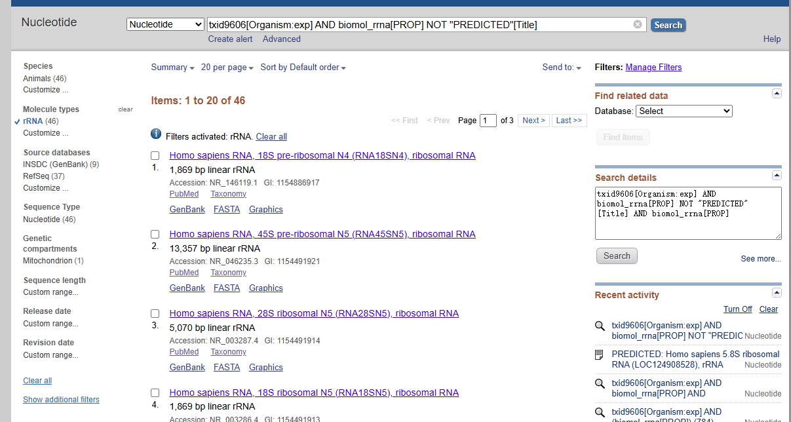
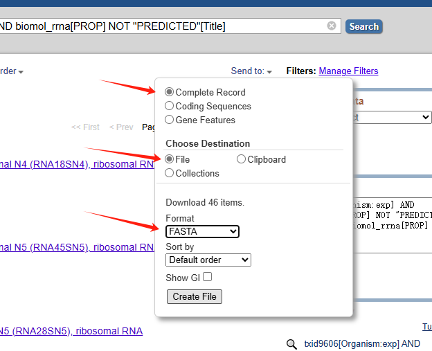
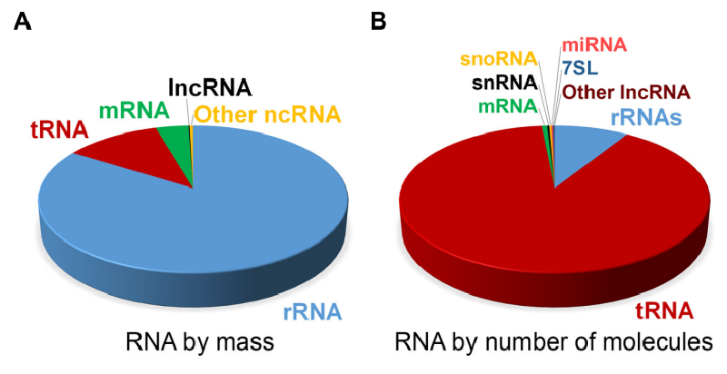

使用方法

航天医学研究中数据集缺少是一个主要问题，所以一个好的解决办法是使用迁移学习。

# 目前痛点

在地外环境中，许多**外生和内生过程**可能以几种方式影响人类健康。外生过程的例子包括在轨道上暴露于空间辐射和微重力。太空辐射通过多种潜在机制(如改变肠道微生物群生物合成、加速动脉粥样硬化、骨骼重塑和造血作用)对人类健康构成风险，而长期暴露在微重力环境中会带来额外的潜在健康风险(如病毒再激活、太空晕车、肌肉/骨骼萎缩和直立性不耐受)。可能受到太空旅行影响的内源性过程的例子包括，由于禁闭、隔离、固定和缺乏社会互动而改变人类的自然昼夜节律(如睡眠障碍)和精神健康障碍(如抑郁、焦虑)。最后，未知暴露的风险，例如尚未发现的病原体，仍然是需要考虑的持续威胁。因此，在长距离、长时间空间旅行出现之前，预测这些不同环境因素的影响并确定潜在的缓解战略至关重要。

# 人工智能在太空中的潜在应用


# 视网膜

基于人工智能预测是否患有SAN（和太空飞行相关的神经-眼病spaceflight associate neuron-eye？）

据报道，太空飞行也会显著增加溶血水平[6]。由于这种贫血，宇航员可能会出现疲劳和直立症，因此监测贫血对于长时间的航天飞行至关重要[6]。陆源性贫血也与特定的神经-眼部体征(如乳头水肿)有关，类似于SANS[7]。在太空中监测贫血状态可能为SANS的病理生理提供独特的见解，目前尚未完全阐明。我们的团队之前提出了一种使用深度学习的方法，利用视网膜眼底照片对航天飞行期间的贫血进行无创监测[8]。随着人工智能的使用，这种方法有可能取代在太空中进行侵入性抽血的需要，同时为宇航员提供更频繁的贫血监测。

# 智能心理情绪干预

**健康状况评估系统**以**非侵入性方式**纳入人工智能/机器学习的方法

AI/ML语音分析可以监测压力或疲劳，通过避免对对话进行语义分析来减轻隐私方面的考虑


# 第二届航天医学前沿论文

论文有感

## 音乐在载人航天飞行航天员情绪调节中的研究

情绪分析和识别以及干预

## 长期模拟失重人体健康状态的中医辨证研究

航天人员训练中心，90天头低位卧床模拟数据（396人，舌和面图像）

卧床前中后各测了11次

# RNA editing

## 方法

DEMINING、RNA-SSNV、RNA-Mutect、RF-RNAmut、REDItools、GIREMI、RES-Scanner

## 数据库

数据库为研究者提供了数以百万计的已知RNA编辑位点

REDIportal (http://srv00.recas.ba.infn.it/atlas/index.html)

DARNED (https://darned.ucc.ie/)

RADAR (http://rnaedit.com/)

CLAIRE (http://srv00.recas.ba.infn.it/atlas/claire.html)

## 综述

Wang H, Chen S, Wei J, Song G, Zhao Y. A-to-I RNA Editing in Cancer: From Evaluating the Editing Level to Exploring the Editing Effects. Front Oncol. 2021 Feb 11;10:632187. doi: 10.3389/fonc.2020.632187. PMID: 33643923; PMCID: PMC7905090.

文章概述了识别A-to-I RNA编辑位点的几种主流方法，尤其是针对癌症相关数据的分析步骤。这些方法包括：

直接比较RNA-seq和DNA-seq数据：通过比较RNA测序和匹配的DNA测序数据，能够更准确地识别A-to-I编辑位点。这种方法能够减少误报，因为它排除了SNP（单核苷酸多态性）的影响。
仅通过RNA-seq数据识别编辑事件：在缺乏配对DNA-seq数据的情况下，可以通过RNA-seq数据单独进行编辑位点的识别。虽然这种方法更经济，但识别精度会相对降低。
特定编辑识别工具和流程：文章总结了许多识别RNA编辑的生物信息学工具和方法，如REDItools、GIREMI、RES-Scanner等，这些工具通过不同的计算策略和过滤步骤来提高编辑识别的准确性。此外，还提出了使用Alu编辑指数（AEI）来测量样本中的全局编辑水平。


文章引用了大量的RNA-seq和DNA-seq数据集，特别是来自癌症样本的数据，包括TCGA等数据库中的数据。这些数据用于识别RNA编辑位点，并结合癌症患者的临床信息来分析RNA编辑与癌症发展、预后之间的关联。以下是文章中使用的一些数据类型：

1. **癌症样本的RNA-seq数据**：通过TCGA数据库中的癌症样本进行A-to-I RNA编辑位点的全面检测。研究发现，编辑水平的变化与多种癌症类型的发生、发展相关。
2. **公共RNA编辑数据库**：文章提到了几个主要的RNA编辑数据库，如**REDIportal**、**DARNED**和**RADAR**，这些数据库为研究者提供了数以百万计的已知RNA编辑位点。
3. **非编码RNA的编辑检测**：文章详细讨论了非编码RNA，特别是miRNA和lncRNA中的编辑现象，并指出这些编辑在调控癌症相关基因表达中发挥着重要作用。

## DEMINING

Fu ZC, Gao BQ, Nan F, Ma XK, Yang L. DEMINING: A deep learning model embedded framework to distinguish RNA editing from DNA mutations in RNA sequencing data. Genome Biol. 2024 Oct 8;25(1):258. doi: 10.1186/s13059-024-03397-2. PMID: 39380061; PMCID: PMC11463134.

年份：2024

提出了一个名为DEMINING的深度学习模型框架，旨在从RNA测序数据中区分RNA编辑（RE）和DNA突变（DM）。

### 方法

DEMINING框架：
该框架由两个主要步骤组成：
第一步：RNA测序数据预处理，包括质量控制、reads比对、去除噪声和低置信度突变。通过严格的阈值设定筛选出高置信度的突变位点，包括RE和DM。
第二步：DeepDDR模型分类，使用嵌入式的深度学习模型DeepDDR对突变进行分类。模型使用卷积神经网络（CNN）处理特征矩阵，最后将突变分类为RNA编辑位点（RE）或DNA突变（DM）。DeepDDR主要通过突变与其上下游碱基的共现频率矩阵（CMC）来训练模型并进行预测。

### 数据

训练数据：
DeepDDR模型的训练数据来自403个人类样本的配对全基因组测序（WGS）和RNA-seq数据。使用这些数据，模型学习了DNA突变和RNA编辑的特征模式。特别是从1000基因组计划和Geuvadis联盟中获取了高质量的突变集，用于模型的训练和验证。

验证与测试数据：
验证数据包括一个独立的样本（HG00145），该样本也提供了配对的WGS和RNA-seq数据，用于验证模型性能。模型还应用于来自急性髓性白血病（AML）患者的RNA-seq数据，识别出了特定疾病相关的突变和RNA编辑事件。

跨物种测试：
通过迁移学习，模型也在小鼠和线虫的RNA-seq数据中成功分类了RE和DM，展现了其跨物种的适应性。

### 创新点

直接从RNA-seq数据中区分RE和DM：以往的RNA编辑位点识别工具大多需要配对的WGS数据，DEMINING通过嵌入深度学习模型的方式，无需依赖WGS数据，仅通过RNA-seq数据就能有效地区分RNA编辑和DNA突变。

嵌入式深度学习模型DeepDDR：相较于传统的机器学习方法，DeepDDR结合卷积神经网络，能更高效且精准地识别突变模式。模型通过学习突变上下游的碱基环境，显著提高了识别的准确性，尤其是对于A-to-I RNA编辑的识别。

迁移学习的应用：通过对非灵长类物种数据的迁移和微调，使得该模型能够扩展到人类以外的物种，这是RNA编辑和突变研究中的一大突破，尤其在过去因为物种间基因组差异导致的挑战得到了有效解决。


**突变与其上下游碱基的共现频率矩阵是什么？**
共现频率矩阵（CMC）用于表示突变位点与其上下游碱基的关系和分布情况。每个CMC矩阵反映了51个碱基长的片段中碱基对（双核苷酸）的分布频率。通过这种方式，模型可以捕获碱基序列的局部模式，这对于RNA编辑和DNA突变的识别至关重要。

具体过程如下：

上下游碱基对的选择：以突变位点为中心，向上下游各取25个碱基。然后，将这个长度为51个碱基的序列转换为二核苷酸（即两个碱基的组合，比如“AT”、“GC”等）的共现频率。
共现频率矩阵的构建：对于每一个突变，模型会生成一个16×50的矩阵，其中16行代表16种可能的二核苷酸组合（A、T、C、G的组合），而50列表示上下游的50个碱基位置（25个上游和25个下游）。每个矩阵的元素代表某个二核苷酸在特定位置的出现频率。
举例来说，假设某个片段的上下游序列是“AGTCC...”，模型会计算该突变位点上下游的二核苷酸（比如“AG”、“GT”等）出现的频率，并填入相应的矩阵位置。

**为什么要使用CMC矩阵？**
使用共现频率矩阵的原因是RNA编辑和DNA突变的模式并不仅仅取决于突变位点本身，还与该突变位点周围的序列上下文密切相关。不同的序列上下文可能导致相同的碱基变化在RNA编辑和DNA突变中具有不同的生物学意义。通过CMC矩阵，模型可以更好地捕捉这些序列特征，区分RNA编辑事件和DNA突变。

### 用法

[YangLab/DEMINING: DEMINING: a stepwise computational framework to directly detect expressed DNA and RNA mutations in RNA deep sequencing data (DEMINING).](https://github.com/YangLab/DEMINING)

Distinguish DNA and RNA mutations directly from RNA-seq fastq files

  ./DEMINING -f "All_steps" -1 Test_data/HG00145_chr22_R1.fastq.gz -2 Test_data/HG00145_chr22_R2.fastq.gz -o DEMINING_test -c Test_data/DEMINING_test.conf -n HG00145_chr22 -t 2 -g hg38

## RNA-SSNV

Long Q, Yuan Y, Li M. RNA-SSNV: A Reliable Somatic Single Nucleotide Variant Identification Framework for Bulk RNA-Seq Data. Front Genet. 2022 Jun 30;13:865313. doi: 10.3389/fgene.2022.865313. PMID: 35846154; PMCID: PMC9279659.

年份：2022

提出了一个名为RNA-SSNV的框架，用于从肿瘤RNA-seq数据中识别体细胞单核苷酸变异（SSNV），其设计目的是解决RNA测序数据中准确识别变异的挑战。

### 方法

RNA-SSNV包括三个主要部分：

RNA体细胞突变识别：使用Mutect2从配对的肿瘤RNA-seq和正常WES数据中调用体细胞突变。这一步确保只保留目标编码区域的突变。
多重过滤策略：该策略通过删除已知的伪阳性信号，如多等位基因突变、RNA编辑位点、免疫球蛋白和HLA区域的突变，来过滤掉噪音数据。
机器学习模型预测：训练一个监督学习模型来识别体细胞突变和伪影。该模型使用提取的特征来做出突变是否为真实的判断，并进一步分析RNA和DNA变异的交叉验证情况。
机器学习： RNA-SSNV使用随机森林分类器进行预测。通过特征选择（递归特征消除交叉验证）来优化模型的输入特征，使用网格搜索（GridSearchCV）调优模型参数，最终构建了一个能够高精度识别体细胞突变的模型。

### 数据

训练和测试数据：使用来自TCGA（癌症基因组图谱）的肺腺癌（LUAD）数据集作为训练数据，该数据集包含511例患者的配对肿瘤RNA-seq和WES数据。RNA-SSNV还在肺鳞癌（LUSC）、膀胱尿路上皮癌（BLCA）和胶质母细胞瘤（GBM）的独立验证数据集上进行了测试，以评估模型的泛化性能。

验证数据集：三个验证数据集包括498例LUSC患者、441例BLCA患者和198例GBM患者的RNA-seq和WES数据。通过在这些数据集上的验证，RNA-SSNV在所有三个癌症类型中的AUC均达到了0.94，显示出强大的跨数据集适应性。

过滤和特征选择：过滤步骤删除了约70%的伪阳性突变，几乎没有损失真实突变（<0.1%）。模型共提取了37个特征，用于训练随机森林分类器，最终达到了88%的精度和88.4%的召回率。

### 创新点

RNA特异性变异识别：RNA-SSNV不仅依赖传统的DNA数据，还专门开发了一种策略来识别RNA特异的突变事件，这比传统的DNA突变识别方法更加细致和全面。

多层次的过滤策略：RNA-SSNV提出的多重过滤策略显著减少了伪阳性调用。通过结合RNA编辑数据库（如REDIportal和DARNED），该框架有效地去除了RNA编辑事件导致的伪影，增强了突变识别的准确性。

机器学习模型的应用：该研究不仅引入了随机森林分类器，还通过使用特征选择和优化参数来提升模型性能。在与现有的RNA突变检测工具（如RNA-Mutect和RF-RNAmut）对比时，RNA-SSNV在精度和召回率方面表现更为优异。

跨癌症类型的广泛验证：RNA-SSNV不仅在肺腺癌中表现出色，还在其他癌症类型中得到了验证，显示了模型的广泛适应性和可靠性。特别是对于癌症驱动基因突变的识别，RNA-SSNV展现了更高的精度和临床价值。

### 用法

[pmglab/RNA-SSNV: RNA-SSNV: A reliable Somatic Single Nucleotide Variants identification framework for RNA-seq data.](https://github.com/pmglab/RNA-SSNV)

## SVASE

**ISVASE**（Identification of Sequence Variant Associated with Splicing Event），一个用于识别RNA测序（RNA-seq）数据中与剪接事件相关的序列变异（SVASE）的工具。ISVASE主要通过RNA-seq数据来识别与异常剪接事件相关的DNA突变或RNA编辑，并解决了之前工具（如PVAAS）的一些缺陷。

### 方法

**SVASE识别流程**：

- ISVASE主要通过RNA-seq数据进行操作，使用**split-reads（分裂读段）**来识别发生在剪接事件中的序列变异。具体流程包括三个步骤：
  - **识别剪接事件**：通过分析RNA-seq的split-reads，识别潜在的剪接事件，过滤掉低质量的测序数据和低表达剪接事件。
  - **识别剪接事件中的序列变异**：在识别的剪接事件中查找DNA突变或RNA编辑等序列变异。
  - **评估剪接事件与序列变异的关联**：通过Fisher精确检验等统计方法来评估这些变异与剪接事件之间的关联性。

**多重过滤和统计检验**：

- ISVASE引入了多重严格的规则依赖过滤器和统计过滤器，以减少假阳性。仅保留支持剪接事件的split-reads，并根据不同的阈值过滤掉低质量的数据，如低于30bp的读段和低于Q30的碱基质量。
- 使用了**Fisher's精确检验**来评估剪接事件与序列变异的关联显著性，过滤掉不显著的变异。
- ISVASE还结合了已知的剪接事件注释（GTF、GFF或BED格式），以检测剪接位点偏移事件。

# 网络药理学


# 原始数据

RNA rawdata for 12：/home/haoyynew/Data/MajorProgram/Data/Experiment_01/RNASeq 


RNA rawdata for 13：/home/haoyynew/Data/MajorProgram/Data/Experiment_02/RNASeq 


RNA rawdata for 14：/home/haoyynew/Data/MajorProgram/14/exp_data/rawdata （L2是RNAseq）


网址：https://www.spacelifescience.cn/

## 数据处理

复制原始数据

```shell
ls /home/haoyynew/Data/MajorProgram/14/exp_data/rawdata > file_list.txt


find /home/haoyynew/Data/MajorProgram/14/exp_data/rawdata -type f | parallel -j 4 cp {} ./

# -j 并行数量
# --bar 显示进度条
# -u 仅在源文件更新时复制
# -n 跳过已有文件

find /home/mizzle/space/RNA-seq/16/LncRNA数据 -type f -name "*.fastq.gz" | parallel -j 4 cp {} /home/mizzle/space/raw/16

```

# **Start**

## 安装转录组分析相关软件

fastqc

```shell
conda install fastqc
```

## 数据库下载

### 参考基因组

存在两种下载方式：gencode数据库、ensembl数据库、NCBI的UCSC数据库

[GENCODE - Human Release 47](https://www.gencodegenes.org/human/)

#### 参考基因组fasta

使用Gencode下载fasta和GTF，其实GATK的Homo_sapiens_assembly38.fasta就来自这个数据库，只不过用的版本很老。

https://console.cloud.google.com/storage/browser/genomics-public-data/references这是GATK的仓库，使用GTF文件是v27版本的



现在下载FASTA和GTF：[GENCODE - Human Release 47](https://www.gencodegenes.org/human/)

```shell
具体方法：
直接下载Comprehensive gene annotation的PRI。主要组装，除了染色体外还包含一些scaffolds
内容包含量：ALL > PRI > CHR

直接下载Genome sequence, primary assembly (GRCh38)的PRI。
```


NCBI官网上直接搜**Homo sapiens**并且查看其基因组信息。这上面的序列标识不是Chr 1等等。

```shell
ftp站点：
https://ftp.ncbi.nlm.nih.gov/genomes/all/GCF/000/001/405/GCF_000001405.40_GRCh38.p14/
```



参考网站：[【生信】【转录组】如何去除核糖体RNA（rRNA）序列？ - 知乎](https://zhuanlan.zhihu.com/p/329967121)

注释信息 gtf/gff


## 数据处理

### 数据预处理

#### 原始数据误差的来源

#### 质量控制FastQC结果解读

[20160405 illumina 测序原理介绍 - 知乎](https://zhuanlan.zhihu.com/p/20702684)

[20160410 测序分析——使用 FastQC 做质控 - 知乎](https://zhuanlan.zhihu.com/p/20731723)

[小L生信学习日记-3丨原始数据质量如何判断？-上](https://mp.weixin.qq.com/s?__biz=MzU3ODgxMDYyNw==&mid=2247483687&idx=1&sn=8689b12a0d30f90ae9ebe72182ee2899&chksm=fd6ee74bca196e5de8c17e762fb423c7e0cd24b8e8edb5fe4cf94ab061d166a10257447d3eb5&scene=21#wechat_redirect)

[小L生信学习日记-4丨原始数据质量如何判断？-下 - 知乎](https://zhuanlan.zhihu.com/p/57628300)

解释的特别好，注意！注意！注意！

数据过滤Trimmomatic原理和使用方法

### 去除rDNA序列

#### 生成rDNA.fa文件

打开NCBI，设置数据库是Nucleotide，检索条件为txid9606[Organism:exp] AND biomol_rrna[PROP] NOT "PREDICTED"[Title] 

一共有46条



下载FASTA格式文件



#### 建立索引

```shell
bwa index rRNA.fasta
```

参考文献：[RNA-seq数据分析完全指北-03：去除奇怪的RNA-腾讯云开发者社区-腾讯云](https://cloud.tencent.com/developer/article/1805475)

去除rRNA可以去除GC双峰的右峰

### 构建剪切位点的BED文件

[Manual | HISAT2](https://daehwankimlab.github.io/hisat2/manual/)

> - `--known-splicesite-infile <path>`
>   With this mode, you can provide a list of known splice sites, which HISAT2 makes use of to align reads with small anchors.
>   You can create such a list using `python hisat2_extract_splice_sites.py genes.gtf > splicesites.txt`, where `hisat2_extract_splice_sites.py` is included in the HISAT2 package, `genes.gtf` is a gene annotation file, and `splicesites.txt` is a list of splice sites with which you provide HISAT2 in this mode. Note that it is better to use indexes built using annotated transcripts (such as *genome_tran* or *genome_snp_tran*), which works better than using this option. It has no effect to provide splice sites that are already included in the indexes.

说明需要基因组注释文件即GTF文件

hisat2_extract_splice_sites.py


### 有参考转录组序列比对

#### 不同比对软件的比较

#### 常用的序列比对算法

#### 基因组

STAR

hisat2

#### 转录本

RSEM

#### 实例结果结果

#### 序列比对常见问题

### 表达定量

#### RNA-seq常用统计定量单位

#### 基因组比对

Htseq-Count

FeatureCount

#### 转录本比对

RSEM

#### 无比对快速定量

kallisto

## 

# 问题解答

## GC为什么存在双峰？

[m6A图文复现03-测序数据去除rRNA序列并且比对到参考基因组-腾讯云开发者社区-腾讯云](https://cloud.tencent.com/developer/article/1854017)

首先，看rRNA在整个细胞中的组成比例：从mass指标来看，一个哺乳动物的细胞中rRNA占比最多，能达到80-90%



既然右峰是rRNA，那么左峰有没有可能是tRNA呢？或者其他RNA，也都可以去掉，毕竟只关注mRNA

[RNA-seq数据分析完全指北-03：去除奇怪的RNA-腾讯云开发者社区-腾讯云](https://cloud.tencent.com/developer/article/1805475)

[【生信】【转录组】如何去除核糖体RNA（rRNA）序列？ - 知乎](https://zhuanlan.zhihu.com/p/329967121)

[NGS 工作流程 | rRNA 去除 | QIAGEN](https://www.qiagen.com/zh-cn/applications/molecular-biology-research/rna-resource-center/ngs-workflows)


# GATK RNAseq short variant discovery (SNPs + Indels)

## RNAseq germline mutation

Mapping to the Reference (STAR) ——> Data Cleanup (MergeBamAlignment MarkDuplicates) ——> SplitNCigarReads (SplitNCigarReads) ——> Base Quality Recalibration (BaseRecalibrator, Apply Recalibration, AnalyzeCovariates) ——> Variant Calling (HaplotypeCaller) ——> Variant Filtering (VariantFiltration)

