# 致病性判断

## 胚系突变-B站

基于**ACMG-AMP**来构建模型来判断胚系突变的致病性

CharGer

https://www.bilibili.com/video/BV1dC4y1p7u7/?share_source=copy_web&vd_source=137828ff4d70873f378595bddaf510fe

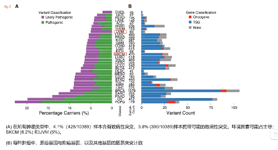

绘制所有样本的突变景观，看看每一个样本包含多少致病性突变和可能性突变

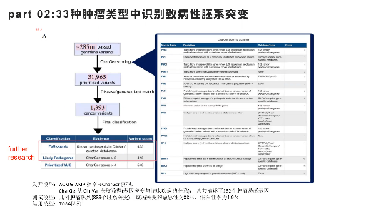

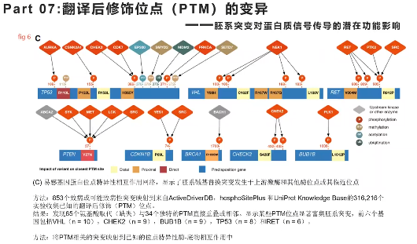

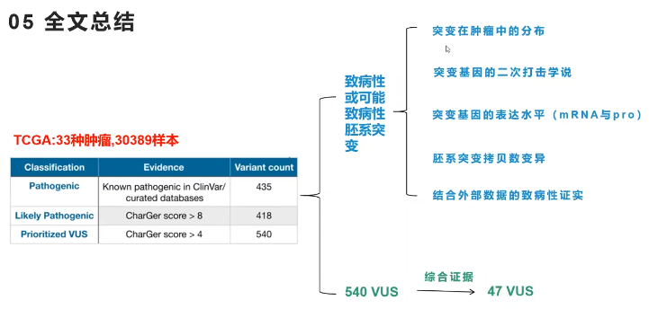

## WES实战课-B站

WES实战课2

https://www.bilibili.com/video/BV1794y1A7g9/?spm_id_from=pageDriver&vd_source=093b5934f585e790c43b825d2ac02cbf

根据2015年出的ACMG指南，将所有的变异分为5类：
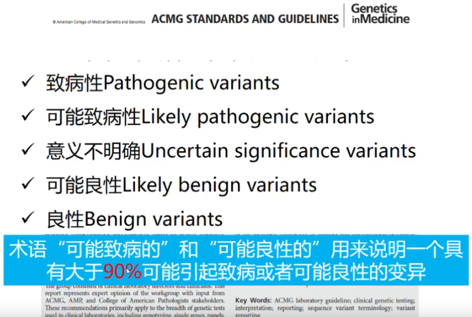

### 数据库的使用

#### HGMD

变异信息全部来自专业文献。是遗传病变异位点金标准数据库。

有公共版和专业版。

可以看到突变具体信息。

可以与annovar联合使用

### 预测软件

### 过滤流程

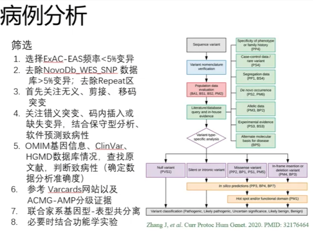

### 人群数据过滤之Varcards

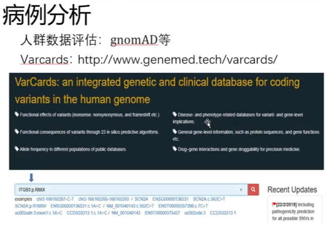

example：

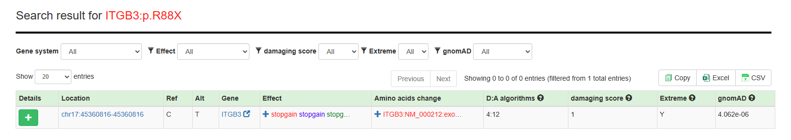

按照这种固定的格式：ITGB3:p.R88X

这是PM2的证据

### ACMG现成工具wintervar

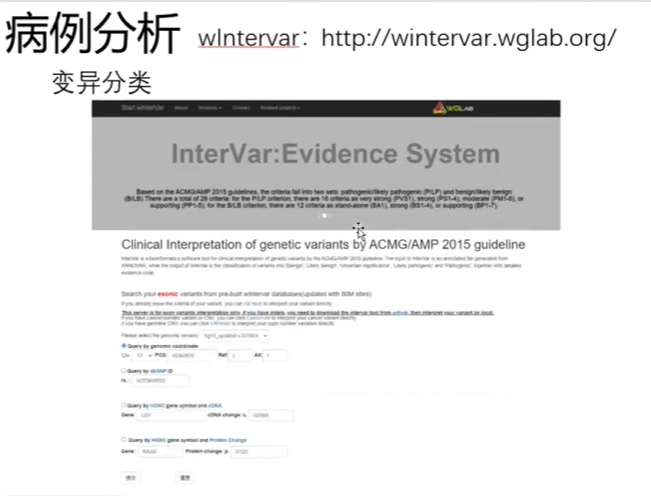

[ACMG/AMP 2015 指南的 InterVar-Genetic 变异解释 (wglab.org)](https://wintervar.wglab.org/)

### ACMG现成工具Franklin

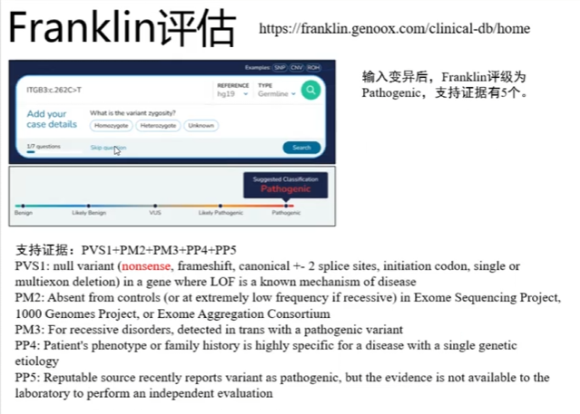

### 同义突变

找隐形的纯合突变没有，可以关注两点：
1.Bam文件看探针是否捕获了所有外显子区域
2.同义突变是否有可能影响表型或者说非编码区的变异。

### OMIM

观察具体某个疾病

# 专业术语

## 基因结构

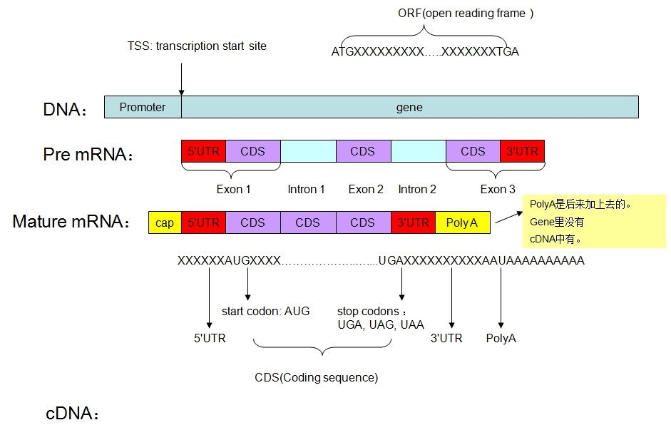

**基因（遗传因子）** 是产生一条多肽链或功能RNA所需的全部核苷酸序列。**带有遗传信息的DNA片段称为基因**。

基因包含编码区和非编码区

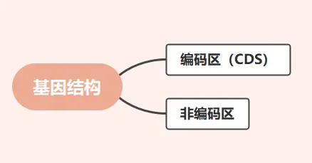

- **编码区**：真核生物基因的编码区是不连续的，分为外显子和内含子，它们交替出现。在原核生物中，基因是连续的，也就是说无外显子和内含子之分。

- **非编码区**：不能编码蛋白质的区段叫做非编码区。非编码区位于编码区前后，同属于一个基因，控制基因的表达和强弱 。

  

### 编码区(Coding region)

#### **CDS**

Coding sequence

与蛋白序列一一对应的DNA序列，并且序列中间不存在其他与蛋白无关的序列，和真实情况最接近。

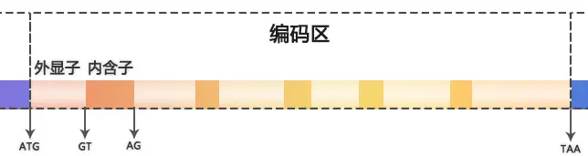

#### 外显子 Exon

外显子(expressed region)是真核生物基因的一部分。**外显子是最后出现在成熟RNA中的基因序列，又称表达序列。** 编码区中不连续的具有蛋白编码功能的DNA序列。

#### 内含子 Intron

内含子（Intron）又称间隔顺序，指一个基因或mRNA分子中无编码作用的片段。就是**编码区中外显子之间间隔的非编码序列**。

- 外显子的尾部与下一个内含子的头部大多是**GT**

- 内含子的尾部与下一个外显子的头部大多是**AG**

- **记做GT-AG法则，作为RNA剪切的识别信号。**

- 起始密码子(ATG),终止密码子(TAA、TGA、TAG)

#### 开放阅读框(ORF)

  从起始密码子到终止密码子的碱基序列，且不包含终止密码子

### 非编码区(Non-Coding region)

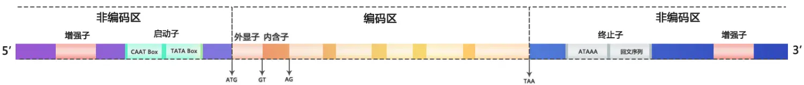

#### 增强子 Enhancer

增强子是DNA上一小段可**与蛋白质结合**的区域，**与蛋白质结合之后，基因的转录作用将会加强**。增强子可能位于基因上游，也可能位于下游。一般位于转录起始位点上游大约100个碱基以外。

#### 启动子 Promoter

启动子是特定基因转录的DNA区域，启动子一般位于基因的转录起始位点5‘端上游，启动子长约100-1000bp。与RNA聚合酶特异性结合。**启动子区的变异或突变可能导致基因表达的增强或减弱**，进而影响细胞功能和疾病的发展。

##### CAAT box

第一个外显子的5'转录起始位点(TSS)**上游**大约**70-80**个碱基的位置，具有`GGCCAATCT` 共有序列的核苷酸序列。是RNA聚合酶的结合位点，其作用是**控制转录起始频率**。

##### GC box

位于CAAT box两侧，包含的碱基是`GGCGGG` ，它有转录调节、激活转录的功能。

##### TATA box

第一个外显子的5'转录起始位点(TSS)**上游**大约**20-30**个碱基的位置。包含的碱基信息是`TATAATAAT`，其作用保证RNA聚合酶可以准确识别转录起始位点并开始转录过程。它**影响转录的起始**。

#### 终止子 Terminator

终止子处于基因或操纵子的末端，给RNA聚合酶提供转录终止信号的DNA序列。

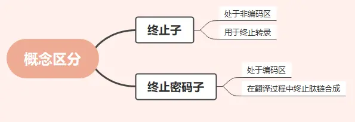

##### ATAAA

ATAAA 是 preRNA 在通过修剪后形成成熟mRNA 时在3'UTR产生ployA 是的加尾信号。这段序列再往下到转录终止位点（TTS）之前，是一个反向重复序列(7-20个碱基对)，转录后形成一个**发卡结构**，可以阻碍RNA聚合酶移动，**终止转录**。

##### 回文序列 palindrome sequence

回文序列是双链DNA中的一段倒置重复序列，这段序列有个特点，**它的碱基序列与其互补链之间正读和反读都相同**。当该序列的双链被打开后，如果这段序列较短，有可能是限制性内切酶的识别序列，如果比较长，有可能形成发卡结构，这种结构的形成**有助于DNA与特异性DNA与蛋白质的结合**。

### preRNA

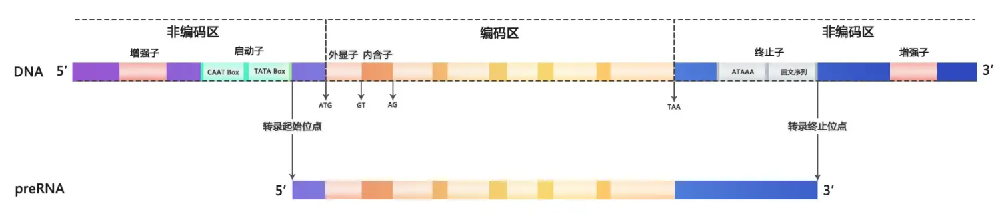

- **转录起始位点 Transcription start sites (TSS)**

TSS在启动子区下游和起始密码子上游

- **转录终止位点 Transcription termination sites (TTS)**

TTS在终止子区下游和终止密码子下游

### mRNA

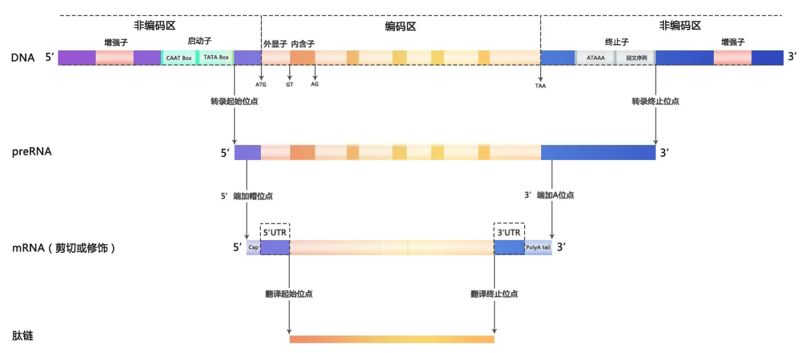

#### UTR

UTR的全称是“Untranslated Region”，中文翻译为“非翻译区”。**mRNA两端的非编码序列**。

在信使RNA（mRNA）中，UTR指的是不编码蛋白质的序列区域，通常存在于编码区域的两端，即5' UTR和3' UTR。这些区域虽然不直接编码蛋白质，但在调控基因的表达、mRNA的稳定性、翻译效率以及细胞内的定位等方面发挥重要作用。

#### 5'UTR

上游非编码区，位于5'帽子与起始密码子（ATG）之间

#### 3'UTR

下游非编码区，位于编码区末端的终止密码子到3’尾巴之间

#### 5'帽子

作用就是帮助mRNA跨过核膜，进入胞质，并且此过程中保护5‘不被降解；翻译时保证IFiii和核糖体识别

#### 3’poly-A尾巴

作用也是帮助mRNA跨过核膜，进入胞质，并且增加了mRNA在胞质中存在的稳定性。因为mRNA的降解过程是随着时间延长，A尾逐渐变短；

## 突变相关

### 复合杂合突变

复合杂合突变，就是双等位突变。

每条染色体都突变了，都不是野生性染色体，但是两条染色体突变产生的[等位基因](https://www.zhihu.com/search?q=等位基因&search_source=Entity&hybrid_search_source=Entity&hybrid_search_extra={"sourceType"%3A"answer"%2C"sourceId"%3A424944267})类型又不一样。

举例如下图，这里只以碱基替换为例，其实换成其他的突变比如InDel，概念同样适用。

**野生型**WT中，两条染色体都是正常染色体，基因型AA；
突变体MT1就是**杂合**突变，两条染色体一条正常A，一条突变为a1，基因型为Aa1；
突变体MT2就是**纯合**突变，两条染色体都突变为a2，基因型为a2a2；
突变体MT3就是**双等位突变**，也就是你说的**复合杂合突变**，两条染色体都有突变，但突变得到了不同的等位基因，两个又不一样，一个突变成了为a1，另一个突变成了a3，基因型为a1a3.
一个基因突变掉后可以产生很多等位基因，突变是随机的，突变类型是多样的，所以就会有不同的等位基因形式，形成一系列的复等位基因集合。基因突变的多方向性是复等位基因存在的基础。

### 疾病(家系)共分离

在家系的胚系突变研究中，**疾病共分离指的是一个遗传突变与特定疾病表型在家族中的共同传递模式**。这意味着在家系中，**如果某个遗传突变与一种疾病有关联，那么携带这种突变的家族成员也更有可能表现出这种疾病的特征**。

具体来说，当研究遗传性疾病时，科学家会观察**一个特定的突变是否在所有或多数表现病状的家族成员中出现，而不出现在健康的家族成员中**。如果一个突变与疾病表型在多代家族成员中一致地共分离，这通常强烈表明该突变是导致疾病的致病因子。这种模式有助于确认突变的致病性，是遗传研究中一个重要的工具。通过这种方法，研究者可以更准确地识别和确认哪些遗传变异与特定的遗传疾病相关。

### 嵌合体变异

加深WES测序可以检测出嵌合体变异

200X-300X的WES测序深度，可以检测到10%丰度的嵌合体变异

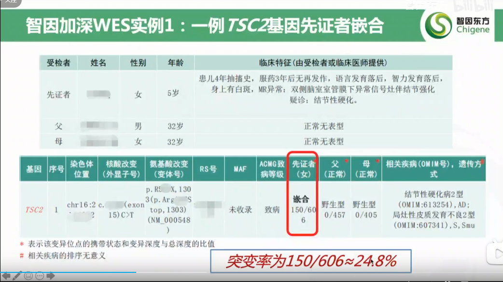

杂合突变的突变率是50%

这里是606X是测序深度，150是检测到突变深度。所以是一个嵌合。

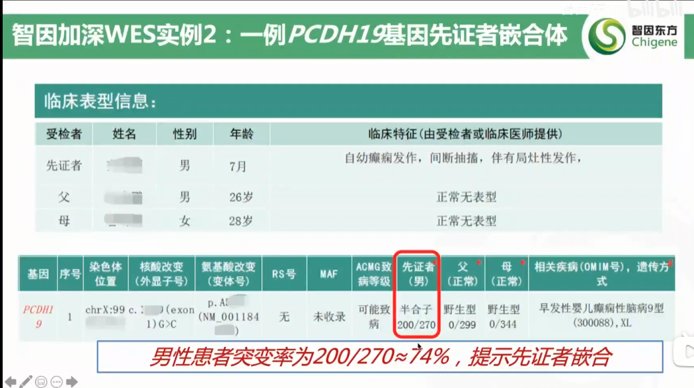

这是半合子，因为先证者是男，只有一条X染色体，没有与之对应的，没有相应的等位基因。如果是突变，那应该是全部突变。也就是100%的突变率。但是根据结果发现只有200突变深度，而总测序深度是270X。也就说只有74%的X染色体（细胞内）是突变的。

### 半合子

不同基因发病情况是不一样的，有的是其中一个发生问题就会发病，有的是两个都发生问题才会发病。其中，只有一个基因发生问题，另一个好好地，那就叫**杂合变异**，如果两个基因都发生变化，那就是**纯合变异**。

因为DMD在X染色体上，在男性体内只有一个X染色体，没有跟它搭伙的，所以发生问题的话，不叫杂合也不叫纯合，叫做**半合子变异**。

### Merlin—连锁不平衡遗传分析

家系样本，严重怀疑不符合孟德尔遗传定律。是多个不同的因素的导致的。

# 生物学问题

## DNA 中的 3' 端、 5' 端是什么意思？

DNA的结构由磷酸集团、五碳糖和碱基构成。

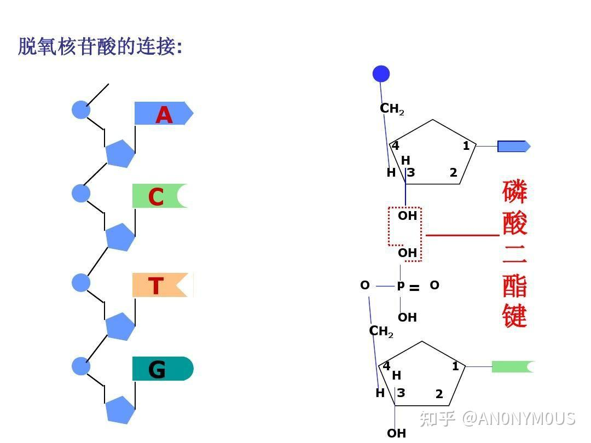

五边形代表五碳糖（含5个碳原子的单糖）；圆形代表磷酸；矩形代表含氮的碱基。五碳糖通过磷酸二酯键（3′,5′-磷酸二酯键）与磷酸相连，通过糖苷键与碱基相连，由此，一分子的以上三者组成一个核苷酸。（严谨的，核苷酸以一个含氮碱基为核心，加上一个五碳糖和一个或者多个磷酸基团组成。）

像这样很多个核苷酸通过磷酸二酯键连接，形成的长链就是核酸。

橙色的数字代表五碳糖的碳位序号。显然，五碳糖共有5个碳位。化学上规定，氧原子右侧的第1个碳原子为1号碳位，顺时针方向依次计数标号。

## 如果疾病是AR(常染色体隐性遗传)，应该先找哪些突变？

AR的话，杂合子不致病。所以应该首先找纯合突变，其次看看有没有出现复合杂合突变的。

## 同义突变如何改变一个基因的功能呢？

氨基酸没变，可能的机制是影响RNA剪接。

可以用预测软件，最好做实验验证（体外的迷你基因实验[mRNA异常剪接体外验证实验—Minigene splicing assay - 知乎 (zhihu.com)](https://zhuanlan.zhihu.com/p/361370572)）。可能发生了移码。（改变剪接，最后提前终止）

如下图，步骤为：

1. 首先在表达载体（pCAS2）上有两个外显子A和B，将突变的和邻近的几个外显子都放在这个表达载体上。
2. 突变正好是3号外显子最末端的一个位置，这个位置确实是可能影响剪切的位置。
3. 转染细胞做PCR等等，可以看到WT（野生型）的转录本的条带和MU（突变型）的转录本的条带。
4. 测序后发现，WT将23456外显子都连接起来了，但是在MU中发现外显子3消失了，变成了内含子2。相当于发生了移码突变，提前终止了。

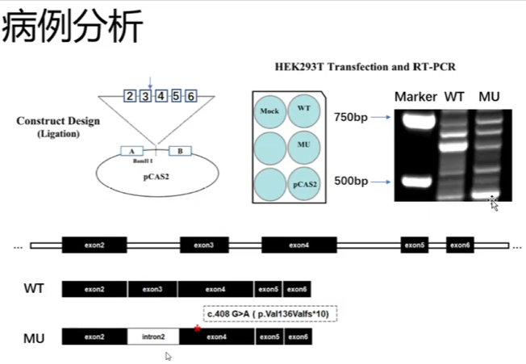

## 生物观？

### 大局观

人体-器官-组织-细胞-细胞核-核基因组-23对染色体

染色体-染色单体-超级螺线体-螺线管体-核小体-DNA和蛋白质

基因是具有遗传效应的DNA片段，DNA可以指挥蛋白质的合成

### DNA

**DNA基本单位是脱氧核糖核苷酸：磷酸、脱氧核糖、碱基（ATCG）**

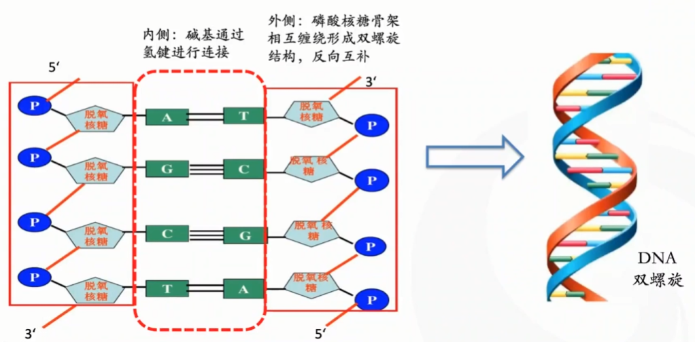

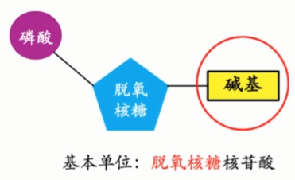

[DNA是怎么变成蛋白质的，从DNA到蛋白质的3D动画来了！|蛋白质|DNA|基因|-健康界 (cn-healthcare.com)](https://www.cn-healthcare.com/articlewm/20210625/content-1236077.html)

### 基因

**基因是具有遗传效应的DNA片段，是决定生物性状的基本单位。基因是DNA，DNA不一定是基因。**

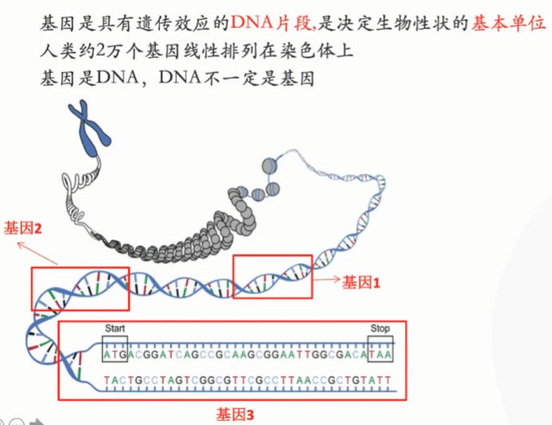

### 蛋白质

基因或者说DNA是生命活动的司令部，起到居中指挥的作用。而外部实际上行使功能，承担生命活动的是蛋白质。

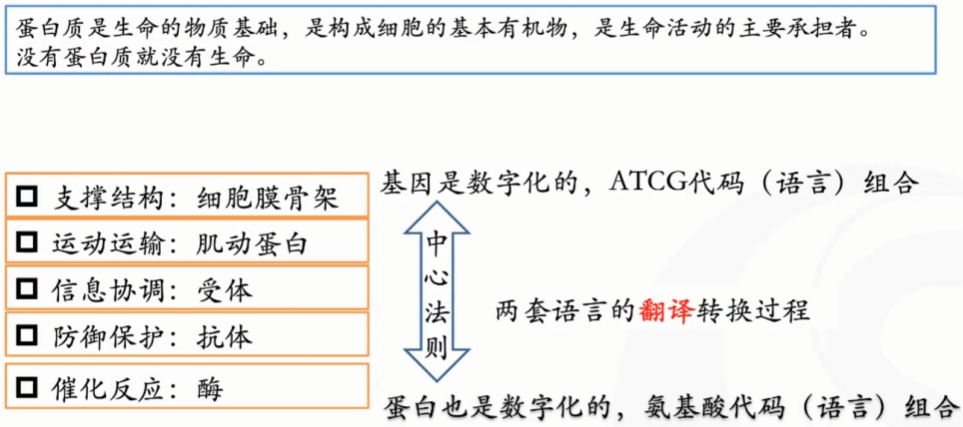

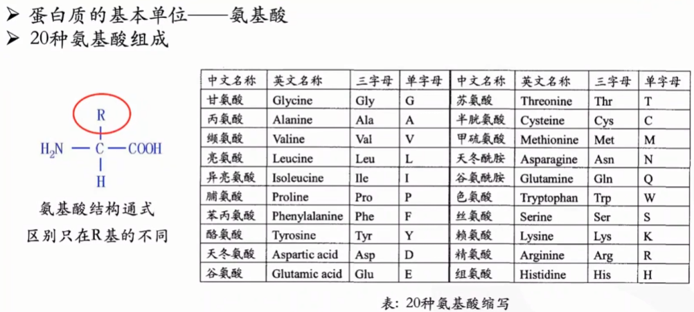

# 细胞与分子遗传学基础

## 基因与蛋白质

遗传病由遗传物质改变所导致。

### **什么是遗传物质？**

细胞核内的结构：染色体，代表核基因组

细胞质上的线粒体，代表线粒体基因组。两者组成了遗传物质

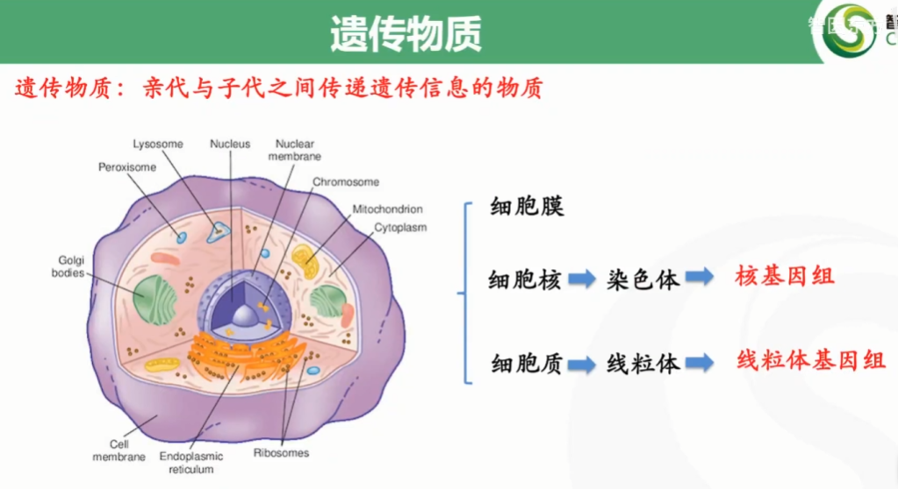

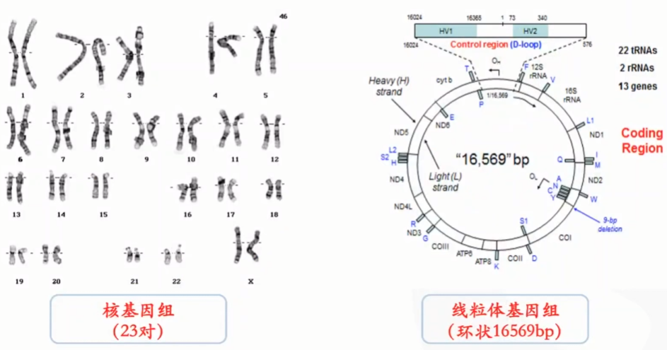

核基因组上的基因的遗传**符合孟德尔遗传方式**。

### 同源染色体和等位基因

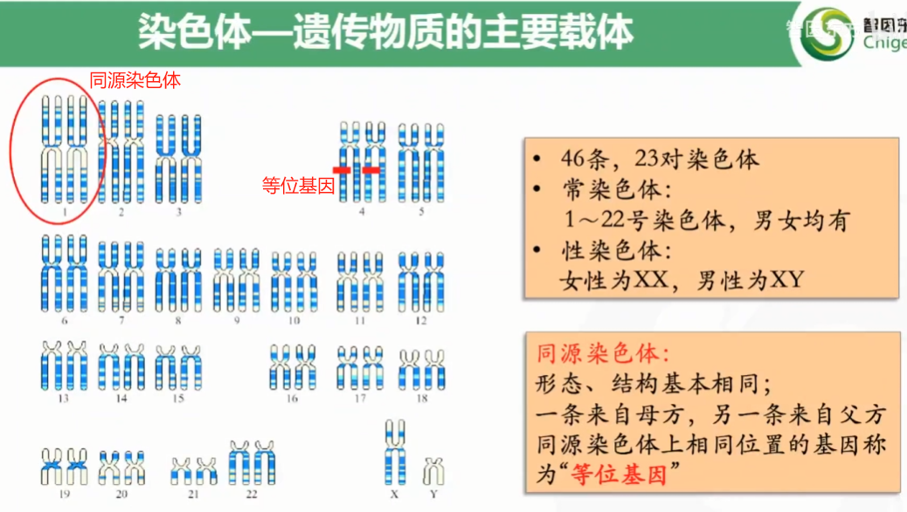

### 染色体结构

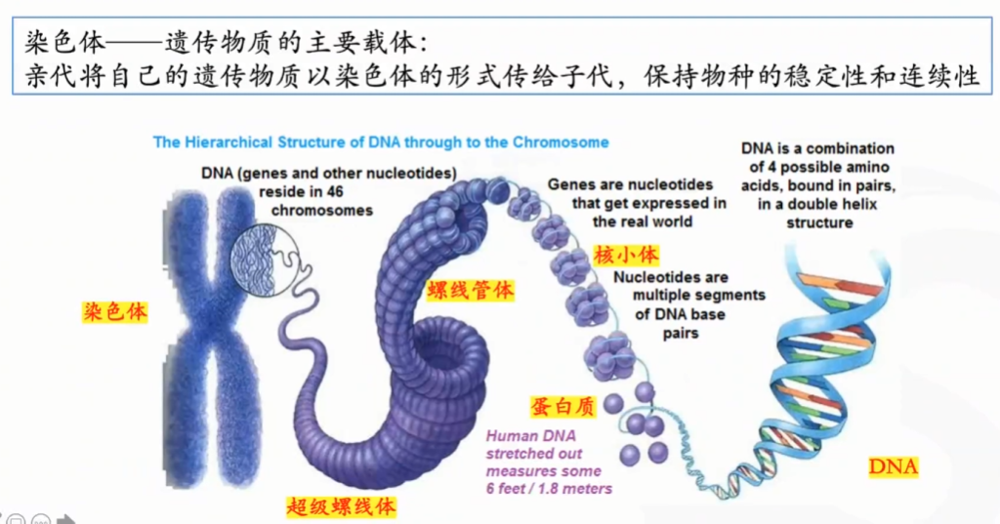

高度致密化的螺旋化的结构

1. DNA和蛋白质螺旋化形成染色体**一级结构核小体**；
2. 核小体进行螺旋后形成**二级结构螺线管体**；
3. 螺线管体再进行螺线形成超级螺线体；
4. 再进一步压缩形成染色体；

1-4级结构的基本情况如上所述。

染色体的本质是DNA和蛋白质组成的结构。**哪一种是遗传物质呢？DNA！**

## 中心法则

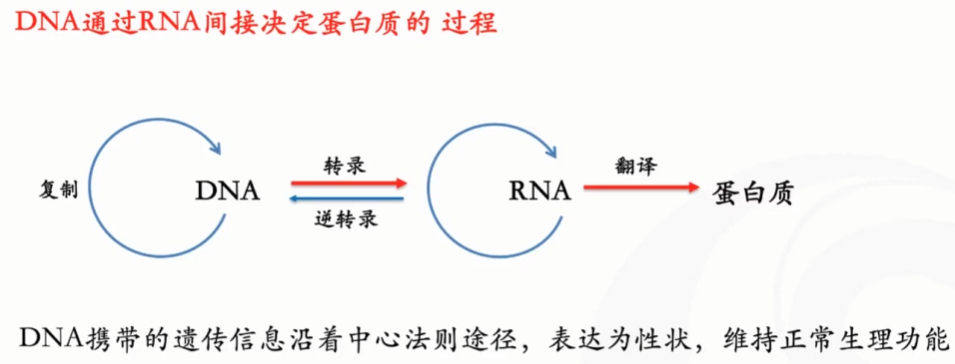

### 复制

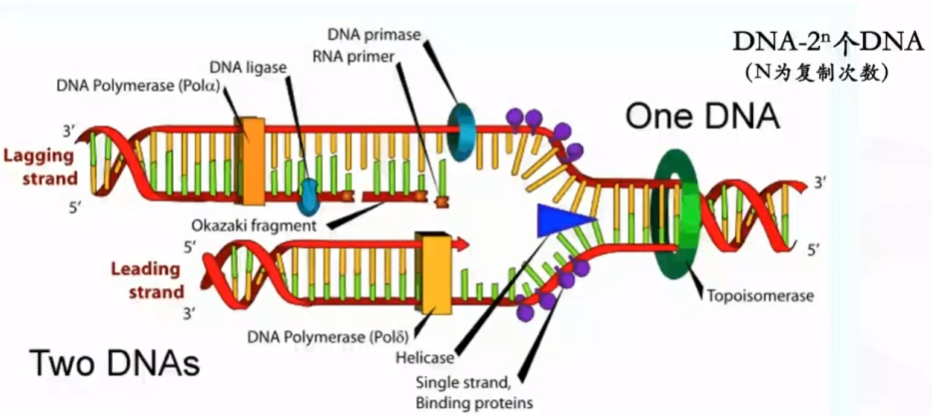

1. 双链解螺旋成单链
2. 根据碱基互补配对原则形成另外一条链

所以一个DNA分子会变成两个，第二轮复制，两个会变成四个。

### 转录

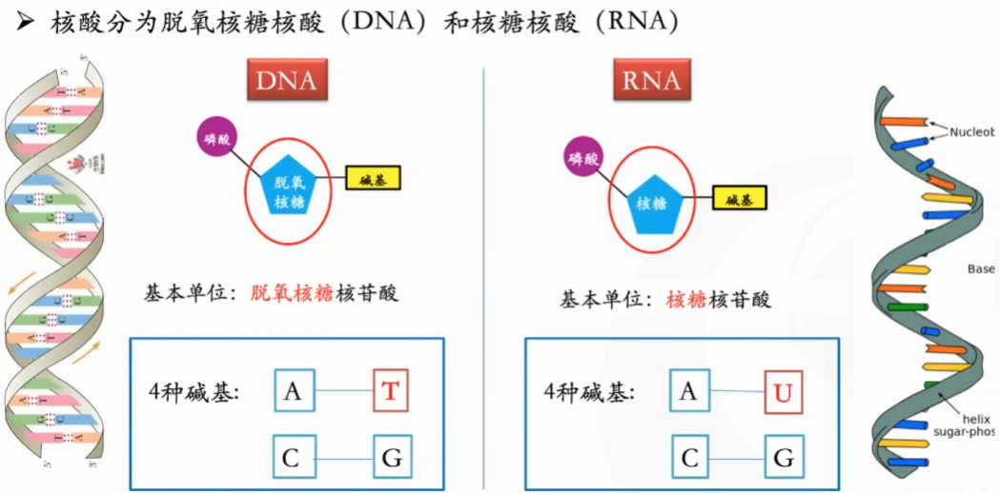

DNA和RNA的三个区别：

1. 脱氧核糖和核糖
2. 碱基不同
3. DNA是双链，而RNA是单链

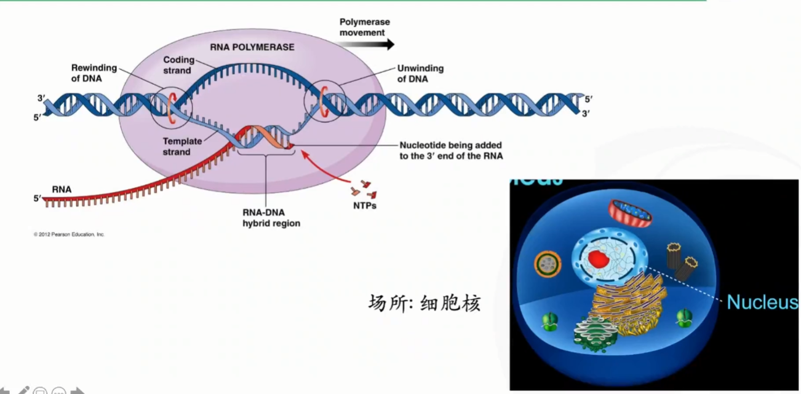

转录在细胞核内进行。双链的DNA，转录的时候也是解螺旋形成单链。跟复制不同的是**以其中的一条链为模板**进行RNA的转录。形成**单链的RNA**。

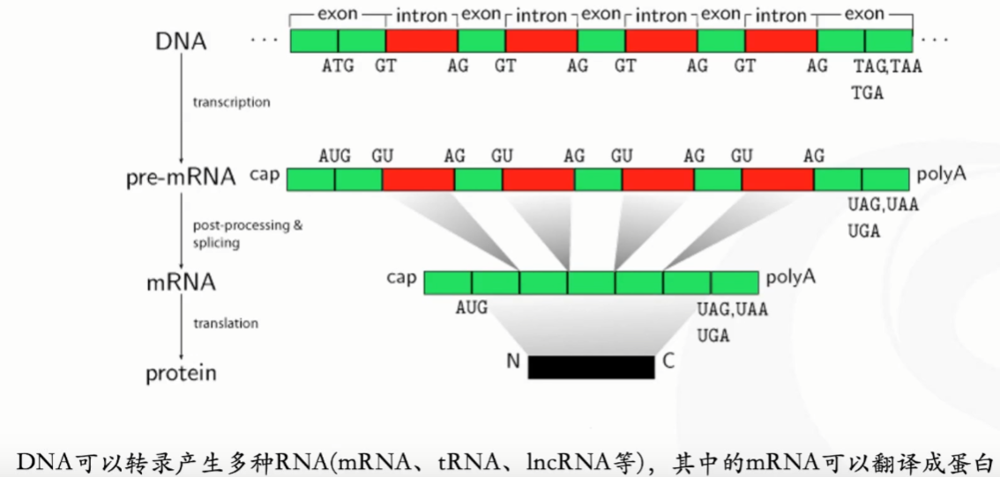

注意：DNA最终剪切成mRNA的时候并**不只有一种剪切方式**，不是将所有的外显子连接起来完事。

#### 可变剪切

有颜色的是外显子，中间空着的是内含子。这就是为什么一个基因有很多转录本的原因，**根据剪切的方式不同，可能会得到不同的成熟mRNA和蛋白质产物**。突变也有可能在同一基因的不同转录本上发生。

### 翻译

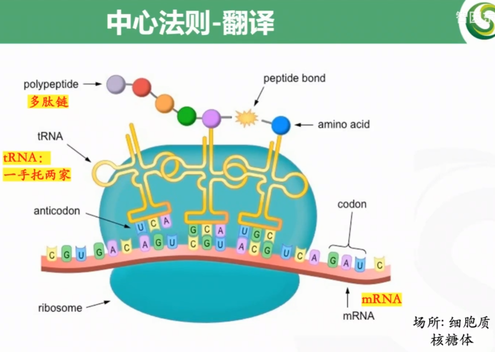

RNA——>蛋白质

翻译是在细胞质核糖体上进行

tRNA连接mRNA和氨基酸多肽链，tRNA一端有反义密码子，另一端接有氨基酸。氨基酸连接，然后通过折叠形成蛋白质。

#### 简并性

简并性：一般来说有64种组合形式，但是决定了20种acid。也就说有很多不同的密码子决定同一种氨基酸，这种就被称为简并性。这其实是基因的一种自我保护机制。防止密码子的突变，比如密码子突变了，但是氨基酸没变，蛋白质功能可能也没有发生变化。