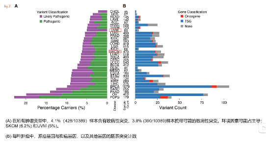
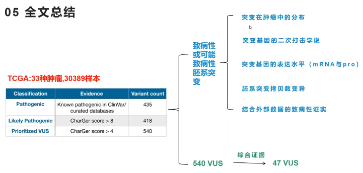
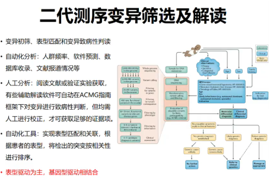

# 致病性判断

## 胚系突变-B站

基于**ACMG-AMP**来构建模型来判断胚系突变的致病性

CharGer

https://www.bilibili.com/video/BV1dC4y1p7u7/?share_source=copy_web&vd_source=137828ff4d70873f378595bddaf510fe

绘制所有样本的突变景观，看看每一个样本包含多少致病性突变和可能性突变

## WES实战课-B站

WES实战课2

https://www.bilibili.com/video/BV1794y1A7g9/?spm_id_from=pageDriver&vd_source=093b5934f585e790c43b825d2ac02cbf

