# 致病性判断

## 胚系突变-B站

基于**ACMG-AMP**来构建模型来判断胚系突变的致病性

CharGer

https://www.bilibili.com/video/BV1dC4y1p7u7/?share_source=copy_web&vd_source=137828ff4d70873f378595bddaf510fe

绘制所有样本的突变景观，看看每一个样本包含多少致病性突变和可能性突变

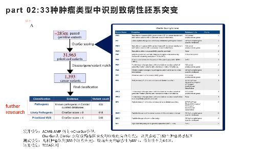

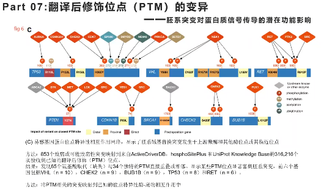

## WES实战课-B站

WES实战课2

https://www.bilibili.com/video/BV1794y1A7g9/?spm_id_from=pageDriver&vd_source=093b5934f585e790c43b825d2ac02cbf

根据2015年出的ACMG指南，将所有的变异分为5类：
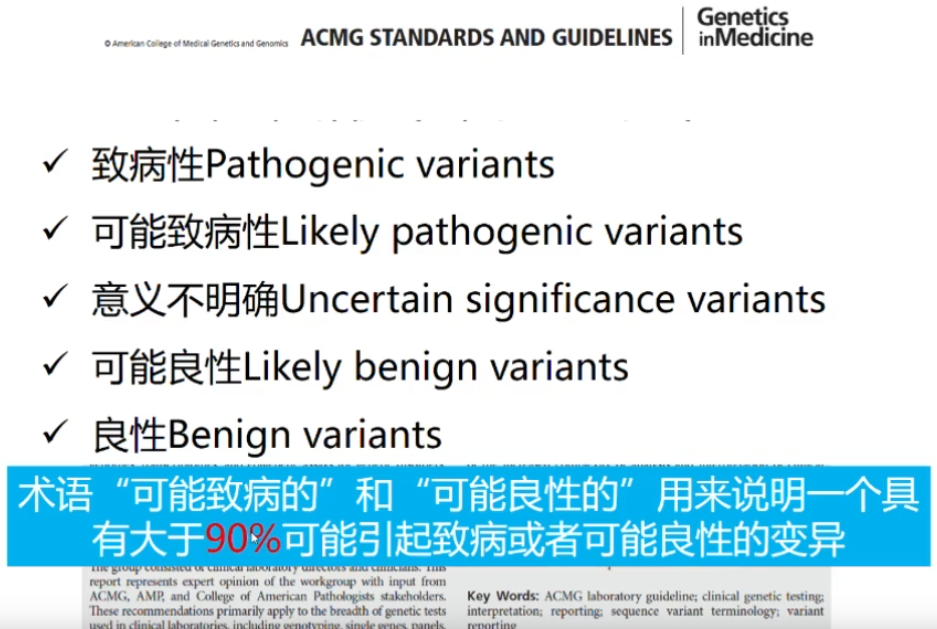

# 专业术语

## 基因结构

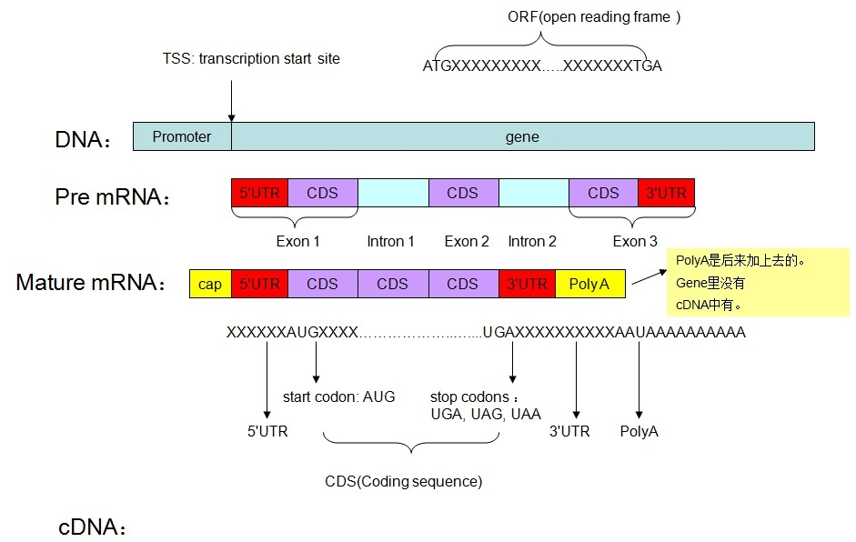

**基因（遗传因子）** 是产生一条多肽链或功能RNA所需的全部核苷酸序列。**带有遗传信息的DNA片段称为基因**。

基因包含编码区和非编码区

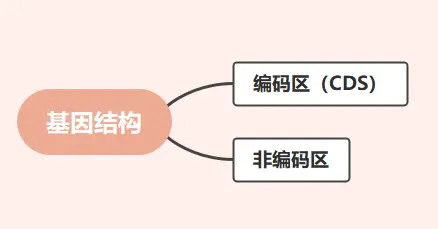

- **编码区**：真核生物基因的编码区是不连续的，分为外显子和内含子，它们交替出现。在原核生物中，基因是连续的，也就是说无外显子和内含子之分。

- **非编码区**：不能编码蛋白质的区段叫做非编码区。非编码区位于编码区前后，同属于一个基因，控制基因的表达和强弱 。

  

### 编码区(Coding region)

#### **CDS**

Coding sequence

与蛋白序列一一对应的DNA序列，并且序列中间不存在其他与蛋白无关的序列，和真实情况最接近。

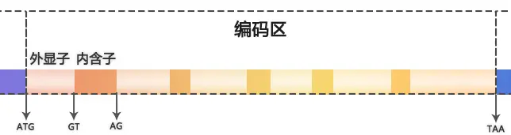

#### 外显子 Exon

外显子(expressed region)是真核生物基因的一部分。**外显子是最后出现在成熟RNA中的基因序列，又称表达序列。** 编码区中不连续的具有蛋白编码功能的DNA序列。

#### 内含子 Intron

内含子（Intron）又称间隔顺序，指一个基因或mRNA分子中无编码作用的片段。就是**编码区中外显子之间间隔的非编码序列**。

- 外显子的尾部与下一个内含子的头部大多是**GT**

- 内含子的尾部与下一个外显子的头部大多是**AG**

- **记做GT-AG法则，作为RNA剪切的识别信号。**

- 起始密码子(ATG),终止密码子(TAA、TGA、TAG)

#### 开放阅读框(ORF)

  从起始密码子到终止密码子的碱基序列，且不包含终止密码子

### 非编码区(Non-Coding region)

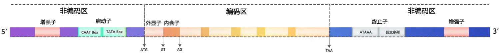

#### 增强子 Enhancer

增强子是DNA上一小段可**与蛋白质结合**的区域，**与蛋白质结合之后，基因的转录作用将会加强**。增强子可能位于基因上游，也可能位于下游。一般位于转录起始位点上游大约100个碱基以外。

#### 启动子 Promoter

启动子是特定基因转录的DNA区域，启动子一般位于基因的转录起始位点5‘端上游，启动子长约100-1000bp。与RNA聚合酶特异性结合。**启动子区的变异或突变可能导致基因表达的增强或减弱**，进而影响细胞功能和疾病的发展。

##### CAAT box

第一个外显子的5'转录起始位点(TSS)**上游**大约**70-80**个碱基的位置，具有`GGCCAATCT` 共有序列的核苷酸序列。是RNA聚合酶的结合位点，其作用是**控制转录起始频率**。

##### GC box

位于CAAT box两侧，包含的碱基是`GGCGGG` ，它有转录调节、激活转录的功能。

##### TATA box

第一个外显子的5'转录起始位点(TSS)**上游**大约**20-30**个碱基的位置。包含的碱基信息是`TATAATAAT`，其作用保证RNA聚合酶可以准确识别转录起始位点并开始转录过程。它**影响转录的起始**。

#### 终止子 Terminator

终止子处于基因或操纵子的末端，给RNA聚合酶提供转录终止信号的DNA序列。

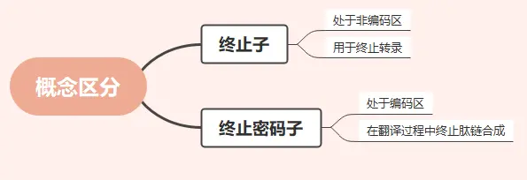

##### ATAAA

ATAAA 是 preRNA 在通过修剪后形成成熟mRNA 时在3'UTR产生ployA 是的加尾信号。这段序列再往下到转录终止位点（TTS）之前，是一个反向重复序列(7-20个碱基对)，转录后形成一个**发卡结构**，可以阻碍RNA聚合酶移动，**终止转录**。

##### 回文序列 palindrome sequence

回文序列是双链DNA中的一段倒置重复序列，这段序列有个特点，**它的碱基序列与其互补链之间正读和反读都相同**。当该序列的双链被打开后，如果这段序列较短，有可能是限制性内切酶的识别序列，如果比较长，有可能形成发卡结构，这种结构的形成**有助于DNA与特异性DNA与蛋白质的结合**。

### preRNA

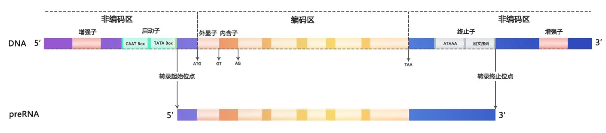

- **转录起始位点 Transcription start sites (TSS)**

TSS在启动子区下游和起始密码子上游

- **转录终止位点 Transcription termination sites (TTS)**

TTS在终止子区下游和终止密码子下游

### mRNA

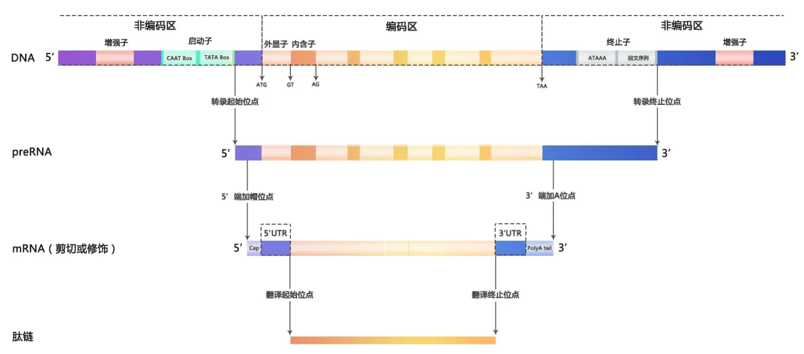

#### UTR

UTR的全称是“Untranslated Region”，中文翻译为“非翻译区”。**mRNA两端的非编码序列**。

在信使RNA（mRNA）中，UTR指的是不编码蛋白质的序列区域，通常存在于编码区域的两端，即5' UTR和3' UTR。这些区域虽然不直接编码蛋白质，但在调控基因的表达、mRNA的稳定性、翻译效率以及细胞内的定位等方面发挥重要作用。

#### 5'UTR

上游非编码区，位于5'帽子与起始密码子（ATG）之间

#### 3'UTR

下游非编码区，位于编码区末端的终止密码子到3’尾巴之间

#### 5'帽子

作用就是帮助mRNA跨过核膜，进入胞质，并且此过程中保护5‘不被降解；翻译时保证IFiii和核糖体识别

#### 3’poly-A尾巴

作用也是帮助mRNA跨过核膜，进入胞质，并且增加了mRNA在胞质中存在的稳定性。因为mRNA的降解过程是随着时间延长，A尾逐渐变短；

# 生物学问题

## DNA 中的 3' 端、 5' 端是什么意思？

DNA的结构由磷酸集团、五碳糖和碱基构成。

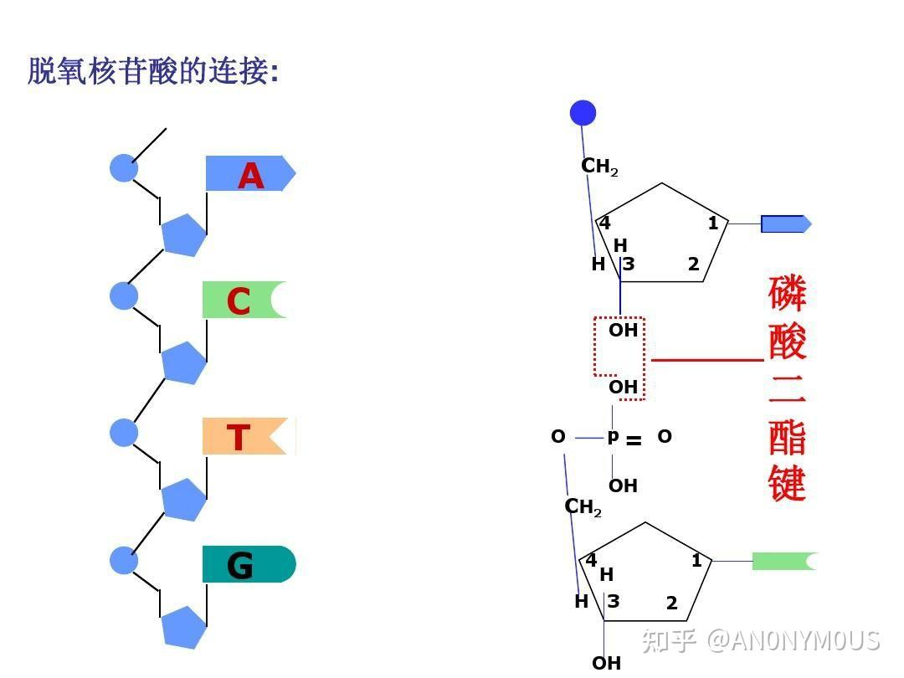

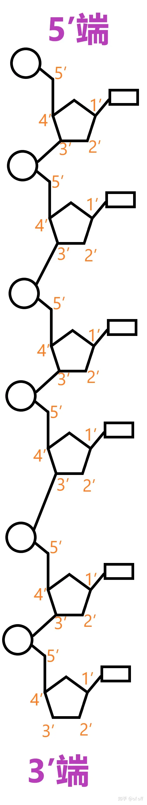

五边形代表五碳糖（含5个碳原子的单糖）；圆形代表磷酸；矩形代表含氮的碱基。五碳糖通过磷酸二酯键（3′,5′-磷酸二酯键）与磷酸相连，通过糖苷键与碱基相连，由此，一分子的以上三者组成一个核苷酸。（严谨的，核苷酸以一个含氮碱基为核心，加上一个五碳糖和一个或者多个磷酸基团组成。）

像这样很多个核苷酸通过磷酸二酯键连接，形成的长链就是核酸。

橙色的数字代表五碳糖的碳位序号。显然，五碳糖共有5个碳位。化学上规定，氧原子右侧的第1个碳原子为1号碳位，顺时针方向依次计数标号。