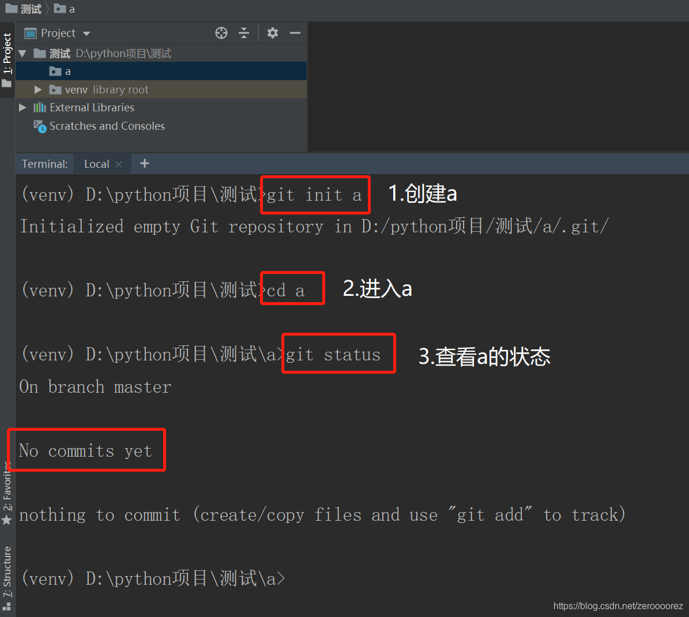
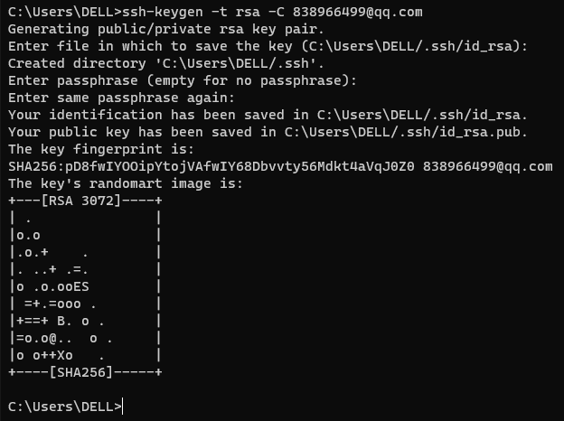
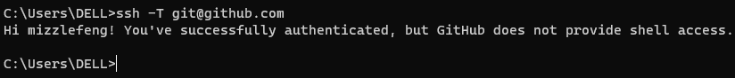

# Git安装

教程：[Git教程 - 廖雪峰的官方网站 (liaoxuefeng.com)](https://www.liaoxuefeng.com/wiki/896043488029600)

下载git，git的官网是：https://git-scm.com/

```cmd
git version # 检查是否安装成功，检查当前版本
```

配置GIT

```cmd
git config --global user.name "mizzle"
git config --global user.email  "838966499@qq.com"
git config --list # 检查是否配置成功
```

# Pycharm中的GIT

注意是在file——>settings中的Git理的cmd文件夹里的git.exe

## git.init

创建仓库

方法一：手动创建目录名 + git init

方法二：git init 目录名

方法三：拷贝一个库，打开GitHub，找到需要的库，点击**clone or download**，复制链接。在pycharm中输入 **git clone + 复制连接 + 目录名**，即可创建库。

```cmd
git init MedFollowUp
git status # 查看库的状态
```



## git add & commit

随便新建一个文件并保存

```cmd
git add .
git add *
git add file,txt
# 上述操作将文件保存至暂存区

git commit -m "备注" # 提交暂存的文件并创建一个新的版本历史记录
```

检查保存记录

```cmd
git log
```

## Tips

**注意：内容未显示完整，jk可以上下移动；**

​     **按q是退出。**

## git checkout

```cmd
git checkout +序列号 # 序列号可以用git log查看，jk翻页

```

## 建立远程仓库提交代码

1.pycharm中登陆Github，在版本控制里

2.Git SSH创建Key：

- [x] 打开Git bash
- [x] 输入 cd ~/.ssh/ 若出现“No such file or directory”,则表示需要创建一个ssh keys

输入下面的内容：

```cmd
git config --global user.name "起个名字"
git config --global user.email "你的邮箱"
ssh-keygen -t rsa -C "你的邮箱"  三个连续回车，设置密码为空
```


- [x] 在C盘.ssh路径下有id_rsa和id_rsa.pub，使用记事本打开id_rsa.pub复制里面的秘钥
- [x] 打开Github，在Settings中有SSH and GPG keys，选择SSH keys新增。
- [x] 使用ssh -T git@github.com来检测是否添加成功。


然后使用pycharm里的Git进行推送就可以了
```
git push -u origin master
git remote -v ：列出当前仓库中已配置的远程仓库，并显示它们的 URL
git remote add <remote_name> <remote_url> ：添加一个新的远程仓库。
git remote remove lufei #删除lufei这个远程地址
```
# 常见问题
## 1 src refspec main
```
error: src refspec main does not match any
```
**mian** 和 **master**

你可能已经注意到了，在我们每次使用git指令时，git都在一直用蓝色的字提示我们当前处在一个叫**master**的分支
这是git为我们创建的默认分支，而在上述过程中我们完全无视了这一点，我们只关心github上的那个**main**分支
所以原因就是github的仓库中没有**master**这个分支，我们本地的仓库没有**main**分支，那好办，我们将本地仓库的**master**分支改名为**main**分支，它们不就统一了？
```
git branch -m master main
```
可以看到**master**已经被成功改为**main**了
! [rejected] main -> main (non-fast-forward)
这个问题解释起来很简单，还记得我们创建仓库时添加到README和license吗？在github仓库的main分支中有这两个文件，而在我们本地的仓库并没有这两个文件，如果我们执行这次commit，那么可能导致这两个文件丢失。

接下来你有以下几个解决方案：下列代码中的example为远程仓库名称

无视警告，README和license我不要了。
```
git push --force
```
试着合并初始提交与你的提交,这也是我**最推荐的方法**：
```
git fetch example
git merge --allow-unrelated-histories example/main
```

## 2 Failed to connect
```
Failed to connect to github.com port 443 after 21052 ms: Couldn't connect to server
```
使用 git clone 下载 Github 等网站的仓库时，可能会遇到类似 "Recv failure: Connection was reset" 或 "Failed to connect to http://github.com port 443 after 21114 ms: Couldn't connect to server" 的报错。即使打开了全局代理，也会报错。此时，需要为 Git 单独配置代理，可以使用以下命令：

```bash
git config --global http.proxy http://127.0.0.1:7890
git config --global https.proxy http://127.0.0.1:7890
```
配置完成后，可以使用以下命令查看并修改 Git 的配置：

```bash
git config --global --edit
```
如果仍然报错，可以检查代理端口是否配置正确，并尝试用以下命令设置关闭 SSL 证书验证：

```text
git config --global http.sslVerify false
```

### 如果没有挂着梯子但是还是遇到了以上报错

```python
git config --global --unset http.proxy
git config --global --unset https.proxy
```


## 3 local changes  would be overwritten

```python
error: Your local changes to the following files would be overwritten by merge:
    xxx/xxx/xxx.php
Please, commit your changes or stash them before you can merge.
Aborting
```

出现这个问题的原因是其他人修改了xxx.php并提交到版本库中去了，而你本地也修改了xxx.php，
这时候你进行git pull操作就好出现冲突了，解决方法，在上面的提示中也说的很明确了。

解决方案：

1. 通过git stash

```python
git stash
git pull
git stash pop
```

通过git stash将工作区恢复到上次提交的内容，同时备份本地所做的修改，之后就可以正常git pull了，git pull完成后，执行git stash pop将之前本地做的修改应用到当前工作区。

git stash: 备份当前的工作区的内容，从最近的一次提交中读取相关内容，让工作区保证和上次提交的内容一致。同时，将当前的工作区内容保存到Git栈中。

git stash pop: 从Git栈中读取最近一次保存的内容，恢复工作区的相关内容。由于可能存在多个Stash的内容，所以用栈来管理，pop会从最近的一个stash中读取内容并恢复。

git stash list: 显示Git栈内的所有备份，可以利用这个列表来决定从那个地方恢复。

git stash clear: 清空Git栈。此时使用gitg等图形化工具会发现，原来stash的哪些节点都消失了。

2. 放弃本地修改 的改法 ----这种方法会丢弃本地修改的代码，而且不可找回

```python
git reset --hard
git pull
```

   

# 常用命令

```
#显示当前的Git配置  
git config --list
```

```
#列出所有本地分支  
git branch
# 列出所有本地分支和远程分支  
git branch -a
# 新建一个分支，但依然停留在当前分支  
git branch [branch-name] # 新建一个分支
git checkout -b [branch] # 新建一个分支，指向切换到该分支  
git checkout [branch-name] # 切换到上一个分支  
git branch --set-upstream [branch] [remote-branch] # 合并指定分支到当前分支  
git merge [branch] # 选择一个commit，合并进当前分支
```
```
#显示指定文件是什么人在什么时间修改过  
git diff
git diff [first-branch]...[second-branch] # 显示今天你写了多少行代码
```

远程同步
```
git fetch [remote] # 显示所有远程仓库
git remote -v
git remote add [shortname] [url] # 取回远程仓库的变化，并与本地分支合并
```
版本回退
```
git log #显示从最近到最远的显示日志
git log –pretty=oneline #精简日志
git reset --hard HEAD^ # 回退上个版本
git reset --hard HEAD^^ # 回退上上个版本
git reset --hard HEAD~100 # 回退到前100个版本
git reflog # 回退之后查看回退之前的版本号 eg：git reset --hard 6fcfc89
git checkout --readme.txt # 把readme.txt文件在工作区做的修改全部撤销
```
```
总结创建与合并分支命令如下：

查看分支：git branch

创建分支：git branch name

切换分支：git checkout name

创建+切换分支：git checkout –b name

合并某分支到当前分支：git merge name

删除分支：git branch –d name
```
