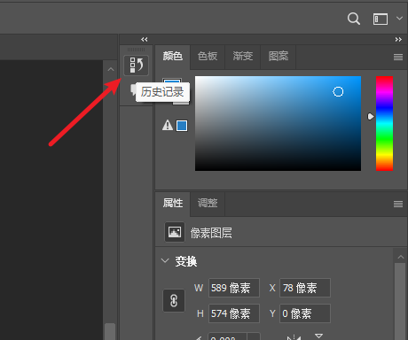

# PS基本认识

## 右侧浮动窗口复位

最上方（“窗口”）——>工作区——>复位基本功能

## 画布大小变更

画布左下角的状态栏直接更改类似100%的数字，然后Enter回车就可以变更比例。

## 预设

**快捷键：Ctrl+K**

文件处理——>自动存储恢复信息的间隔更改(最好5分钟)

# PS基本操作

## 置入图片

如果打开了画布，然后打开图片，会自动另开一个文件并打开。

**直接在当前文件置入图片的方法：**

1. 直接将图片拖动到需要的文件里。置入图片之后会出现叉号，说明这个是一个智能对象文件，可以放大和缩小。确定大小后，使用Enter确认。
2. 左上角“文件”——>“置入嵌入对象”
3. 左上角“文件”——>“置入链接的智能对象”

其中2和3的区别是，2是真的把图片导入到文件中了，比如文件1M，图片10M，发给别人是11M。而3是使用了电脑里的链接，发送给别人是1M，如果别人电脑没有相同的链接的图片话，这个文件里的图片就不会显示。

## 撤销

点击历史记录，可以选择删除哪一步。

**快捷键：Ctrl+Z**

## 放大缩小

**快捷键：Alt+滚轮**

**快捷键：Ctrl+“+-”**

**快捷键：英文状态下，z+鼠标左键**