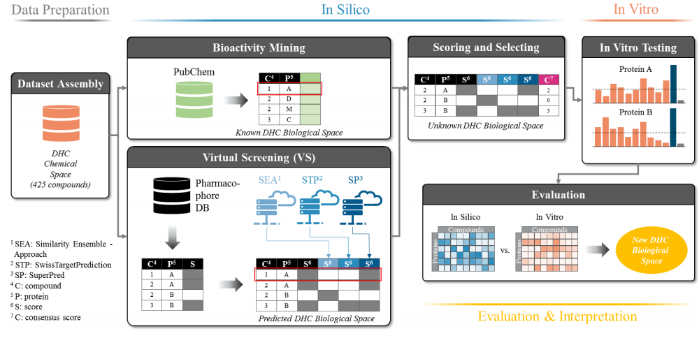

# **全球数智教育大赛**

## **赛题名称**

**天然产物的靶点活性预测**

本赛题旨在**通过整合数智技术和生物技术，推动天然产物药物发现**。参赛者将使用人工智能和计算生物学来预测天然药物分子与免疫细胞靶点的结合亲和力和选择性，开发评估这些相互作用的工作流程或算法。礼达先导将提供实验支持，利用基于探针的自动化药物靶点蛋白质组学平台验证预测结果。


## **赛题背景**

天然产物是指来源于自然界中的化学物质，这些物质通常存在于植物、动物、微生物等生物体内。天然产物具有多样的化学结构和生物活性，许多现代药物都是从天然产物中提取或改造而来的。天然产物在药物研发中具有重要意义，因其独特的化学特性和生物活性，往往能够成为有效的药物分子先导物。

免疫细胞是指参与免疫应答的细胞，包括T细胞、B细胞、自然杀伤细胞等。免疫细胞在保护机体免受病原体侵害、识别和清除癌变细胞等方面起着关键作用。免疫细胞靶点是指可以通过药物或其他手段调控其功能的特定分子结构或蛋白质。这些靶点在治疗癌症、自身免疫疾病、感染性疾病等方面具有重要的潜在应用价值。

本次大赛的核心任务是利用数智技术（如人工智能、计算生物学等），预测天然药物分子与免疫细胞靶点的结合能力和选择性。参赛团队需要设计合理的算法和工作流程，评估上百个天然药物分子与上千个免疫细胞靶点的相互作用，从而预测这些分子对靶点的结合力和选择性。

天然产物的靶点结合活性预测赛题旨在通过数智技术的应用，推动天然药物作用靶点的发现和研究，加速新药研发进程。

  

```
某种刺激的免疫细胞：使用某种特定的刺激物（例如脂多糖LPS）刺激免疫细胞。这种处理通常用来激活免疫细胞，模拟炎症或免疫反应。 

活细胞药物处理组： 用天然产物或感兴趣的药物处理细胞，以观察药物对细胞的影响。
DMSO对照组： 用溶剂（通常是DMSO）处理细胞，作为对照组，确保观察到的效应是由药物本身引起的，而非溶剂。(在活细胞药物处理组中，DMSO常用来溶解那些不易溶于水的药物分子，使其能够均匀地分散在培养基中，便于药物与细胞的接触。此外，由于DMSO本身对细胞也可能有一定的影响，因此在实验设计中，通常会设置DMSO对照组，即用DMSO处理细胞但不加药物，以排除DMSO本身对细胞的影响。)
靶点探针处理： 可能是使用特定的化学探针，能够与细胞中的靶点蛋白结合，以便后续的分析。

自动化样品制备: 使用自动化系统处理和制备样品，保证实验的高通量和一致性。这一步通常包括细胞裂解、蛋白质提取等步骤。

蛋白靶点/位点肽段定量:通过质谱分析或其他蛋白质定量技术，测定靶点蛋白或特定肽段的含量。这一步有助于确定药物与靶点蛋白的相互作用及其影响。
```

## 参考文献

### Artificial intelligence for natural product drug discovery

IF：122.7	日期：2023.9.11

主要介绍当前天然产物领域AI的发展以及面临的挑战

天然产物成为Hit潜在重要来源，基于：

1. 相对较高的三维度（与通常平面合成的化学结构相对），使其可以挑战有一定难度的药物靶点。	**【空间结构-空间卷积-三维方向的算法-针对结构】**
2. 由于其作为自然代谢产物的特性，使其可以有可能成为辅助药物到达靶点的转运系统的相关低物。 

1990-2010，随着组合化学和高通量筛选的崛起，天然产物的热度下降。

但是近年来，在学术界和小型生物初创公司中，天然产物的研究呈现出复兴的趋势。复兴得益于：大规模组学数据研究和使用，使得可以更加深入了解生物体内的化学机制。

#### 背景

AI方法以基于DNA序列预测BGC产物的化学结构。有助于识别具有新的而非已知化学结构的分子，并将分子与其生物合成基因联系起来。识别药物先导物。

两种方法：第一种，统计建模，化学结构和生物活性的相关性，定量结构-活性关系建模QSAR。第二种，将3D化学结构与蛋白质靶点相匹配（对接），并随后在纳米到毫秒的时间尺度上研究他们的行为（分子动力学）

===================================================================

对于天然产物研究，**结构预测是高度相关的**，因为它可以，例如，帮助预测天然产物生物合成酶家族的底物特异性，或通过靶修饰帮助预测耐药性的演变。AlphaFold开创的先例表明，深度学习有可能解决天然产物计算研究中的长期问题，尽管**天然产物数据目前要稀疏得多。** 

由于**天然产品计算研究的深度学习仍处于起步阶段**，**因此应对其预测持谨慎态度** 

1.将**新的深度学习模型的性能与更简单的模型**进行比较，以验证和促进可解释性和预测结果之间的平衡

2.通过定义模型的适用范围并将置信度估计值添加到预测中，阐明模型的**最佳性能范围**。

3.通过**交叉验证和使用真实的保留集（测试集）来评估模型，由于将合成化合物作为具有结构-活性关系的化学类似物发表的做法，验证的随机分裂高估了模型的泛化能力。因此，化学聚类或时间分裂对于真正验证创建的模型至关重要。

**化学聚类**：根据化合物的化学结构将数据分成不同的簇，确保训练集和测试集的化合物在结构上有显著差异。

**时间拆分**：根据数据收集的时间顺序进行拆分，例如使用较早的数据训练模型，较晚的数据进行测试，这模拟了模型在未来数据上的表现。

**前瞻性实验：**设计并进行新的实验，以独立的数据集验证模型的预测能力，进一步确认模型的实际应用效果。

4.理解新模型的结果。如果所选方法允许，将算法学习到的内容映射回输入特征，并提供适当的可视化，以便实验科学家能够解释结果 

==================================================================


AI+天然产物  NLP、DL、CV

#### 方向

1. 大数据环境下，AI可以有效加速天然产物的药物研发，其核心是提供大量（蛋白）靶点和化学结构的生物活性数据的公共数据库。基于**化学相似性**，机器学习可以利用这些数据获得模型并**预测出潜在的Hits**。

2. 分析从分子动力学研究中产生的大型数据集，并识别蛋白质动态变化中的隐藏模式。推动对小分子与蛋白质之间复杂相互作用的理解。例如，de novo设计、药物重定位、修改和优化药物分子结构。

#### 应用

 


##### 方向一：天然产物基因组和代谢组挖掘 

可做！

**背景：**通过从**序列信息**或**光谱数据**中预测生物合成基因和代谢产物结构，从而达到加速天然产物的发现。  基因组挖掘算法可以揭示生物合成的潜力，而代谢组学可以直接检测生物合成的成分，即使它们的精确结构未知。 应该做从天然产物化学结构预测生物合成路线的工作（允许序列和代谢组数据的组合协同预测代谢物结构）。

细菌，真菌（以及一些植物和动物）中的大多数的代谢产物合成途径基因通常在基因组内以簇的形式出现，已经有超过2500个生物合成基因簇（biosynthetic gene clusters，BGC）以及他们的产物被实验验证。而计算基因组可以分析出数百万新分子的BGC，基于AI的方法则被用于预测其化学结构，并且这些数据变的标准化，被存储于公共[数据库](https://cloud.tencent.com/solution/database?from_column=20065&from=20065)中。 

**课题意义：**宏观来说，加速天然产物的发现和开发，促进药物研发、农业改良和生物技术应用。 微观来说，通过鉴定BGC，可以发现新的具有生物活性的化合物，这些化合物有可能发展成为新药物，用于治疗各种疾病。 鉴定BGC有助于揭示微生物或其他生物体内复杂的代谢途径和生物合成机制，理解这些途径如何生成多样的化学物质。通过了解这些机制，**可以设计和改造代谢途径，优化天然产物的生产**。鉴定BGC可以揭示微生物和其他生物体在不同环境中的代谢能力和生态功能。通过研究这些基因簇，可以**发现新型生物活性化合物**，揭示自然界中的化学生态关系。**药物发现起点！**

**现状和算法：**目前，鉴定天然产物的基因簇（BGCs）仍然主要依赖**基于规则**的方法，例如 antiSMASH ，PRISM 。优点和缺点：在检测已知的BGC类别方面很成功，但在识别新型BGC方面效率较低。 

更为复杂的情况下，机器学习算法比基于规则的方法更具有优势，例如，基于隐马尔可夫模型的 ClusterFinder、基于深度学习的DeepBGC、GECCO 和 SanntiS，都使用深度学习或SVM来识别通过传统规则无法捕获的BGC。 这些方法是基于**序列特征**进行训练的，例如**基因家族、蛋白质结构域和氨基酸序列属性**。 优点和缺点：尽管它们的假阳性率仍然高于基于规则的方法，并且在已知类型的BGC中也存在假阴性，但它们已经在识别新型天然产物生物合成途径方面展现出了实用性。 


**文章原话：课题一**

**仅根据DNA序列预测BGC产物的化学结构。数据来自已知生物合成途径和化学产物的数据库。**虽然这有助于识别具有新的而非已知化学结构(去复制)的分子，并将分子与其生物合成基因联系起来，但迫切需要更有效的方法来筛选和优先考虑巨大的预测天然产物生物合成多样性，以识别药物先导物。 

##### 方向二：天然产物的结构特征

**背景：**天然产物药物发现需要能够**明确解析分离出化合物的结构**。由于自然界中的存在的代谢产物的化学复杂性，这项任务颇具挑战性。 结构阐明需要收集、分析和编制多种数据类型，这可能包括核磁共振（NMR）、红外（IR）、紫外（UV）、电子圆二色性（ECD）和X射线光谱、高分辨率质谱（HRMS）、MS/MS，以及对BGC中编码的酶进行实验和计算检查。最近，微晶电子衍射（MicroED）技术可以分析化合物的亚微米晶体来加速结构解析。

**现状和算法：**方法学、仪器学和计算方法，有着大量的**改进天然产物的结构表征**的应用。

例如基于量子化学的理论计算和基于人工智能的从MS和NMR数据预测结构。自1960年以来，人工智能已经被用于在MS数据中补充基于上述规则的方法，以新的方式识别未知化合物。随后，人工智能已被用于**从MS谱中预测分子式**，使用深度神经网络将MS谱与分子数据库中的化合物进行匹配，从MS/MS谱中阐明结构为新型SMILES字符串，以及从MS和 collisional cross section（CCS）数据中预测化学性质和进行小分子识别。同样，人工智能已被用于补充基于NMR的结构注释。 

##### 方向三：靶点预测和生物活性

**背景：**在天然产物药物发现中，人工智能最重要的应用是**预测天然产物的大分子靶点**、它们的**生物活性**和**潜在的毒性**。对这些性质的预测可以直接提供线索，探索出最具前景的化学空间。**目前的BGC列表过于庞大，没有好的方法用于探索实际有潜力的部分**，而AI很好的解决了这个问题。 

新的天然产物在被选为候选药物方面的进展经常受到对其靶标缺乏了解的阻碍，这阻碍了它们的临床前测试和合理优化。鉴于代谢物分离和处理的复杂性，由于所需的成本和努力，对这些分子的作用机制进行大规模实验测定是不可行的。因此，根据分子结构快速预测最可能靶标的计算模型是一个活跃的研究领域。

通过基因组学、代谢组学和表型数据预测生物活性和大分子靶标。从组学数据集中挖掘天然产物生物合成途径的遗传特征，例如抗性基因、转运蛋白以及与主要代谢途径的连接，这些特征可以预测该途径产物的生物活性或大分子靶标。结合对生物合成基因的分析，代谢组学和核磁共振（NMR）可以用于识别代谢产物的化学特征，这些特征可以预测特定的活性或靶标。最后，大规模标准化的表型生物测定至关重要。人工智能方法在结合天然产物及其生物合成途径的遗传和化学特征后，有很大的潜力来预测靶标和活性。 

**组学数据挖掘**：通过基因组学（genomics）、代谢组学（metabolomics）和表型数据（phenotypic data）的分析，可以识别出天然产物生物合成途径中的**遗传特征**。这些特征包括抗性基因、转运蛋白和与主要代谢途径的联系，这些都可以用来预测天然产物的生物活性或它们作用的大分子靶标。

**代谢组学和核磁共振**：结合对生物合成基因的分析，代谢组学数据和核磁共振（NMR）可以帮助识别代谢产物的**化学特征**。这些化学特征可以用来预测代谢产物的特定活性或它们可能的靶标。

**大规模标准化的表型生物测定**：进行大规模且标准化的**表型生物测定**是关键步骤，因为这些数据可以为人工智能模型提供训练和验证的数据基础。

**人工智能的应用**：通过结合天然产物及其生物合成途径的遗传和化学特征，人工智能技术能够有效地预测这些天然产物的靶标和生物活性。这种方法大大提高了天然产物药物研发的效率和准确性。


**基于经典化学信息学和药效团的生物活性预测**

基于ensemble的算法PASS、SEA取得一定成功

考虑到天然产物独特的化学结构和物理化学性质，最成功的应用使用**额外的预处理步骤或依赖化学描述和表示**，这些步骤和表示不知道天然产物和合成化合物的训练数据之间的化学差异。 SPiDER

**分子动力学模拟和基于结构的生物活性预测**

基于结构的方法利用蛋白质靶标的空间信息来预测化合物的结合模式。 这些信息可以从实验确定的结构(例如，使用X射线晶体学)或通过基于深度学习的建模方法(如AlphaFold)获得。然后，潜在的结合模式可以通过策略来列举，例如通过分子动力学方法解释的蛋白质动力学的分子对接。

计算成本高。但是基于结构的方法可以提供丰富的信息。例如自由能微扰(FEP)方法的应用和使用最近在学术和工业药物发现项目中大幅增加 。

分子对接，分子动力学和FEP可以扩展到研究天然产物的亲和力。

**基于序列或BGC的生物活性预测**

基于BGCs的DNA和或蛋白质序列数据的机器学习方法

利用现有小分子知识的一种方法，即预测BGC的最终产物，并直接从预测中推断其活性。如PRISM。

**问题：**预测结构预测不佳的BGC的活性时可能结果不好，就是说这个BGC本来预测的结构就不好了，garbage in，garbage out。最终预测中即使很小的错误也可能导致实际化合物的活性大不相同。

**解决方案：**由于亚结构预测更加稳健，使用离散的亚结构特征，可以为更大范围的BGC产生更准确的结果。

借鉴了NLP领域，使用pfam2vec在BGC中嵌入蛋白质结构域。DeepBGC使用蛋白质结构域的pfam2vec衍生特征来表示和预测BGC，然后将这些特征提供给随机森林分类器来预测天然产物的活性。DeepBGCpred进行了改进。

**注意：**挖掘工具预测的BGC序列边界并不精确，经常遗漏部分BGC或与其他BGC融合在一起。为了使用BGC序列数据作为机器学习的输入，通常需要专家手动更新BGC边界。因此，BGC预测的改进对于这种生物活性预测方法至关重要，并且仍然是需要进一步研究的领域。 

**基于自我抵抗、调节或进化特征的生物活性预测**

为了利用抗性信息，已经创建了各种算法，试图将这些抗性基因与bgc联系起来，因为抗性基因是赋予宿主免疫力所必需的。

调控网络在基因组挖掘方法中很大程度上被忽略了，但它很可能是生物学理解和功能预测的关键决定因素。虽然bgc可以预测可能产生的代谢物类型，但可以利用调控网络来估计bgc是如何控制的，以及对哪些信号做出反应。这些信息可以作为寻找特定目的所需的bgc或代谢物的灯塔，例如对压力或疾病的反应。例如，这可以用来预测哪些基因簇在互利共生的微生物中表达以响应病原体入侵，这可能有助于优先考虑bgc以发现抗生素。 

**天然产物药物发现中的新兴人工智能方法**

数据集不足，缺乏高质量的标准化数据，所以需要开发和使用稀疏或可变训练集数据构建机器学习模型的改进方法。

可能产生重大影响的算法发展：

**分子表征方法**，通过特征化，复杂的分子数据变得机器可读，数据集中最重要的信息能够在多大程度上被简明地捕获。简化是特征化的内在要求。在极少数情况下，这可能会导致冲突，即两个或多个分子由同一个指纹代表。因此，应该仔细选择符合使用目标的特征化技术。 最普遍的方法将分子结构转换为一系列bits或counts。创建这种指纹的算法很容易在化学信息软件包中实现，如**RDKit和Chemistry Development Kit**。当然分子特征也可以手动确定。

**圆形指纹可以最准确地识别结构相关的天然产物。**但是，对于从天然产物到合成模拟物的支架跳跃，圆形指纹被发现不如**基于药效团的描述符**有用。 还有一些例子如**MAP4指纹**，结合了亚结构和原子对概念，可用于区分细菌和真菌天然产物。此外，**短分子动力学模拟产生的特征**可用于准确预测分配系数、溶剂化自由能或配体亲和力。最近的**“k-merize”3D形状的方法**可以从分子构象异构体中取样，也可以为指纹分析提供希望，因为它们可以考虑分子的3D形状。相反，完全不描述化合物结构的化合物特征也可能是有帮助的，例如**生物活性指纹图谱**。

**分子图上分子功能预测的深度学习有时优于圆形指纹上更简单的机器学习模型** 

可解释性深度学习


 

#### 数据来源和标准化

非结构化数据集（例如未注释的质谱数据）可应用于无监督学习，如**降维和生物活性预测**。 监督学习需要标注准确并且足够量的数据。对于天然产物而言，其化学空间的广度较大，但已发布数据集的大多数覆盖范围较小，这是一个挑战。数据增强和数据生成虽然是有价值，但需要谨慎应用，以**避免积累bias**。此外，**数据错误**也是挑战。在许多实验室生成的生物学公共数据中，往往存在多个错误来源，可能会影响高度敏感的深度学习方法。 

**数据的主要挑战：**整合来自不同数据集的数据，并确保注释方法一致，是机器学习训练集开发的一个主要瓶颈。 

**现状：**天然产物数据库的庞大而多样，但也高度分散，目前全面的高质量数据资源较少。 天然产物相关的数据在大多数大型综合数据库（如PubChem、ChEMBL、Reaxys和Scifinder）中往往被忽视或未被注释为天然产物。

 

#### 总结展望

**局限性：**天然产物药物发现领域的人工智能（AI）研究主要受限于**大型高质量数据集短缺**，而并不是创新算法的缺乏。 

**注意：**在选择适合的数据类型和算法时要仔细考虑，天然产物数据集通常比通用计算机视觉相关数据集要小得多，这可能意味着**参数较少的简单模型**可能更成功，也更不容易过拟合。

**算法：**该领域突破往往是跨学科途径，借鉴其他领域算法，如NLP。算法尤其需要从**多输入的异构数据源**（包括**化学光谱、DNA序列、结构和生物活性信息**）中提取有意义的特征。 另一个潜在机遇是**采用“主动学习”方法生成数据集**。 通过这种方式，可以对序列、化学、结构或生物活性空间中尚未开发的领域进行表征。 

同时还需认识到，AI方法通常无法检测到完全Novel的化学实体，作用机制或酶的全新催化活性。需要对基础生化研究加大投资，以用以补充AI。 数据库也是一个方向。

#### 其他知识点

##### 化学空间

通常通过使用多种感兴趣的**化合物性质**来定义，如物理化学性质——是巨大的，并且大部分未被探索。

据估计，仅“类药物”化学空间，即由所有符合Lipinski的“五规则”指南的化合物组成，就包含约10^60种化合物，而用于计算筛选的最大化学文库通常也只包含约10^10种化合物。

Lipinski's "Rule of Five" 是一组经验性指导原则，用于评估化合物的药物性质，特别是口服生物利用度（oral bioavailability）。这些原则由美国化学家克里斯·利平斯基（Chris Lipinski）和他的同事们在1997年提出，旨在帮助筛选和优化具有良好药物特性的化合物。  

然而作为Lipinski规则基础的研究将**天然产物确定为常见的例外**，并且天然产物和制药公司筛选文库中的典型化合物的**化学特征不同**。这些文库化合物通常是平面的，符合Lipinski规则的**合成小分子**，质量<500道尔顿，而**天然产物通常具有更大的尺寸和3D复杂性** 。

**考虑到大多数化学空间尚未被探索，解决多参数优化问题以导航化学空间的挑战被认为是识别新型候选药物的有前途的策略 。**

**应用无监督学习方法(如PCA、t-SNE、UMAP和TMAP)来降低化学空间数据的维数，可以用来推断化合物可能的生物活性，并最终确定新的结构。这种方法在小分子发现领域已被证明是成功的，我们相信它在天然产物中的应用将开辟新的途径来表征和解决生物活性和药物代谢动力学特性等问题。** 

##### 数据库

Papyrus: a large-scale curated dataset aimed at bioactivity predictions

可以参考这个数据库对于分子的标准化流程。也可用于天然产物数据集

##### 深度学习在药物研发中的应用

深度学习的应用包括分子图神经网络方法109–112；例如，对于预测药物-靶标结合亲和力113，基于SMILES的从头生成药物样分子方法114，115，基于图形的从头生成分子方法116，以及性质预测117，118和基于表面网格的蛋白质口袋条件分子表示方法119。此外，编码器-解码器架构用于表征化合物，以便从不同输入格式中进行虚拟筛选120-122。参考文献中提供了**深度学习分子表示的全面概述**，可应用于天然产物研究中的分子结构数据。123. 

123.Atz, K., Grisoni, F. & Schneider, G. Geometric deep learning on molecular 
representations. Nat. Mach. Intell. 3, 1023–1032 (2021).

##### 预训练

深度学习等“数据饥渴型”算法只有在训练数据集足以支持模型复杂性的情况下才能提高性能。减少有效所需数据点数量的一个解决方案是在较大的化学数据集上使用预训练模型的权重。使用预先验证和预先训练的化学模型，如ChemBERTa或MoleculeNet，可以减少从头开始训练新模型所需的计算量。在许多情况下，预训练的模型也会产生更高的预测精度。

##### 主动学习

主动学习技术，通过实验指导选择未标记的数据进行标记，也可以在标记训练数据有限的情况下使用。这已经成功地应用于识别抑制抗癌靶CXC趋化因子受体4与其配体之间蛋白-蛋白相互作用的小分子，通过主动检索信息丰富的活性化合物，不断改进自适应结构-活性模型 。

 随着实验分辨率和自动化程度的提高，我们相信主动学习将在未来的天然产物研究中发挥核心作用。

##### 数据来源-科研文章

**科学出版物仍然是传播新的天然产品信息的主要机制。**不幸的是，从天然产品期刊中自动提取数据通常是不可能的，**因为数据不是机器可读的格式**，尽管存在简单的解决方案，如紧凑标识符。数据库的完整性也受到以天然产物研究为特色的期刊的广泛影响，其中包括许多非天然产物的期刊。 因此，数据库开发人员必须手动管理文章，将其转换为结构化数据格式。管理困难包括图像到结构的转换、缺少核心数据(例如，BGC序列)、名称冲突的解决(具有相同名称的多个结构，或具有多个名称的结构)以及提取用于生物分析的数据和元数据。 

## 比赛思路

### 处理方法

30个天然产物分子在3000个免疫细胞靶点上的活性数据。

说明应该都是做过实验的，也就是说，这3000之外的靶点，是没有活性的。


SDF包含比SMILES更多的信息。可以将SMILES转换为SDF数据。“SDF文件中有比SMILES更丰富的结构信息，如果将SDF文件转化为SMILES必然会引起信息的损失，因此一般我们只有希望提升存储效率等情况下需要用到这一转化。”

感觉三维信息更好啊，原子类型与坐标标注3D-MG（三维分子图）或者形状曲面的形式Shape-mesh是按照形状将分子转换为三维图片, 然后以图片形式来处理分子, 由于图片可以被设置成多通道, 因此可使用不同的通道来代表不同的分子性质, 如疏水
基团、氢键供体、氢键受体等。
感觉3D-grid也行


序列表示模型Multi-Tokenization Transformer model (MTT)表征药物smiles结构和蛋白质氨基酸序列。全面和高质量的序列表示。


SMILES和图结构的多面性互补

### 数据扩充

数据库：结构数据库、活性数据库


ChEMBL   bpe+ecfp

UniProt   k-mers和BPE

### 师弟

找蛋白质的氨基酸序列，一一对应

找高分靶点预测的文章，看数据集  pubmed、wos

用已有方法直接预测看结果

https://github.com/BenderGroup/PIDGINv4

https://pidginv4.readthedocs.io/en/latest/overview.html

### 算法

基于打分函数

基于物理方法

基于深度学习

基于分子对接

几何深度学习

扩散模型

unimol

大模型增加泛化能力

考虑天然产物的特异性质

alphafold3

三维结构出发


传统基于物理的计算方法以来与三维的靶蛋白的结构。这里我们可以用alphafold2来预测，并进一步计算啊！FEP的精度很高，但是需要大量的计算资源，对于大规模应用程序来说负担不起。


NMI 孪生网络  孪生网络用于二分类？

# 基础AI+药物知识

## 背景知识

### 天然产物、小分子药物、大分子药物

#### **天然产物**

天然产物是从自然界中提取的化合物，具有生物活性，可以用于治疗疾病。 

**具体特点：**

- **来源**：植物（如中药材）、动物（如蛇毒）、微生物（如细菌和真菌）。
- **复杂结构**：天然产物往往有独特而复杂的化学结构，这些结构有时难以通过人工合成，但可以提供独特的生物活性。
- **发现历史**：天然产物是最早用于治疗疾病的药物来源。例如，阿司匹林最早是从柳树皮中提取的水杨酸，青霉素则是从青霉菌中提取的。

**应用示例：**

- **抗癌药物**：紫杉醇（从红豆杉中提取）用于治疗多种癌症。
- **抗菌药物**：青霉素（从青霉菌中提取）是第一种广泛使用的抗生素。
- **抗疟药物**：青蒿素（从青蒿中提取）是治疗疟疾的重要药物。

#### **小分子药物**

小分子药物是指分子量较小的有机化合物，通常可以通过口服途径给药。 

**具体特点：**

- **分子量小**：一般小于500道尔顿，这使它们能穿透细胞膜，到达细胞内的靶点。
- **易于合成和修改**：小分子药物可以通过化学合成，并且结构可以较容易地进行修改以优化药效。
- **多种给药途径**：可以口服、注射、吸入等。

**应用示例：**

- **抗炎药**：布洛芬（用于缓解疼痛和炎症）。
- **抗病毒药**：阿昔洛韦（用于治疗疱疹病毒感染）。
- **心血管药物**：阿司匹林（用于预防心脏病和中风）。

#### **大分子药物**

大分子药物是指分子量较大的生物大分子，主要包括蛋白质、抗体和核酸。 

**具体特点：**

- **分子量大**：通常在几千到几百万道尔顿，不能轻易穿透细胞膜，需要通过注射等方式给药。
- **高特异性**：大分子药物往往能高度特异地识别和结合目标分子（如抗原）。
- **生产复杂**：需要通过生物技术手段（如基因工程、细胞培养）生产，成本较高。

**应用示例：**

- **抗体药物**：赫赛汀（用于治疗乳腺癌）。
- **酶替代疗法**：胰岛素（用于糖尿病患者）。
- **基因疗法**：利用腺相关病毒载体传递健康基因，治疗遗传疾病。

### 先导化合物（Lead）是什么？

**定义：** 先导化合物是具有特定生物活性和成药潜力的化合物，经过进一步优化和开发，有可能成为最终的药物。 

**先导化合物的发现过程**

**过程：**

- **高通量筛选（HTS）：** 利用自动化技术对大量化合物库进行快速筛选，找到对目标生物靶点有活性的化合物。
- **结构基础设计（Structure-Based Design）：** 利用生物靶点的三维结构，通过计算机模拟设计具有高亲和力和特异性的化合物。
- **天然产物筛选：** 从植物、微生物、海洋生物等天然来源中提取化合物，筛选出具有生物活性的分子。
- **已知药物改造：** 通过对已有药物或已知活性分子进行结构改造，设计出具有更好活性的先导化合物。

### Hit化合物是什么？

Hit（命中化合物）

**定义：** Hit化合物是指在初步筛选过程中被发现具有某种生物活性或与特定靶点有较高亲和力的化合物。

**特点：**

- **初步筛选结果：** 通常通过高通量筛选（HTS）或虚拟筛选获得的。
- **活性：** 显示出对目标生物靶点的活性，但可能活性较低或选择性不强。
- **数量多：** 初步筛选可能发现大量的Hit化合物，需要进一步验证和优化。

**进一步步骤：**

- **确认和验证：** 需要通过重复实验确认其活性。
- **初步优化：** 对Hit化合物进行结构优化，以提高其活性、选择性和药代动力学特性。

Lead（先导化合物）

**定义：** Lead化合物是指经过优化和验证后的化合物，具有更高的生物活性和选择性，并显示出良好的药代动力学和安全性特性。

**特点：**

- **优化后结果：** 从Hit化合物中筛选和优化而来。
- **高活性和选择性：** 显示出对目标靶点的高活性和高选择性。
- **药代动力学特性：** 具有较好的吸收、分布、代谢和排泄（ADME）特性。
- **数量少：** 通常从多个Hit化合物中优化得到少数几个Lead化合物。

**进一步步骤：**

- **深入优化：** 进一步优化其化学结构，以提高药效和安全性。
- **临床前研究：** 进行毒理学和药代动力学研究，以评估其在动物模型中的效果和安全性。
- **临床试验：** 如果Lead化合物表现出良好的特性，将进入临床试验阶段，进行人体试验。

关键区别

- **发现阶段：**
  - **Hit化合物：** 初步筛选阶段发现的化合物，具有潜在活性。
  - **Lead化合物：** 经过进一步优化和验证，具有较高活性和良好特性的化合物。
- **数量和质量：**
  - **Hit化合物：** 数量较多，质量参差不齐。
  - **Lead化合物：** 数量较少，质量较高。
- **进一步开发：**
  - **Hit化合物：** 需要进一步优化和验证。
  - **Lead化合物：** 经过优化，准备进入临床前和临床试验阶段。

### 高通量筛选HTS

高通量筛选是一种强大的技术，通过自动化和微量化的方式，在短时间内筛选大量化合物或生物样品，快速评估其生物活性或靶点相互作用。 

### 化学相似性

基本假设：通过比较化合物的化学结构，识别出结构相似的化合物。**化学结构相似的化合物往往具有相似的生物活性**。 

基于化学相似性的预测：利用机器学习模型，通过训练数据（包括已知的化学结构和生物活性数据），预测新化合物（或天然产物）可能的生物活性，从而识别出**潜在的Hit化合物**。 

**化学相似性通过以下方式衡量：**

**分子指纹**：

- **分子指纹**是将化学结构转换为二进制编码的一种方式，表示化合物的特定结构特征（如基团、环状结构等）。
- **常用算法**：包括MACCS指纹、ECFP（Extended Connectivity Fingerprints）等。

**Tanimoto系数**：

- **Tanimoto系数**是一种常用的衡量化合物相似性的指标，计算两个化合物指纹之间的相似性。
- **公式**：Tanimoto系数 = (A ∩ B) / (A + B - A ∩ B)，其中A和B分别表示两个化合物的分子指纹。

**结构对接和比对**：

- **结构对接**：比较两个化合物的三维结构，评估它们在空间上的重叠程度。
- **结构比对**：通过比对化合物的化学键和基团，确定它们的相似性。

### 分子动力学研究

分子动力学（Molecular Dynamics，MD）研究是一种计算模拟方法，用于研究**分子系统在时间上的运动和行为**。它通过数值积分牛顿运动方程，模拟分子系统的动力学演化，提供原子或分子水平的详细信息。以下是对分子动力学研究的详细解释： 

定义：分子动力学是一种计算机模拟技术，通过解决分子间作用力和牛顿运动方程，模拟和预测分子系统随时间演化的行为。 

### 质谱分析MS和质谱数据

质谱数据和质谱分析（Mass Spectrometry, MS）是现代化学和生物学研究中的重要工具，用于**分析化合物的组成和结构**。 

质谱数据是通过质谱分析仪（MS）获取的关于**样品分子质量和结构**的信息。质谱数据通常包括质量/电荷比（m/z）和对应的信号强度（丰度）。

质谱分析是一种通过**测量离子质量与电荷比（m/z）**来确定**分子组成和结构**的技术。

### QSAR

**化合物定量构效关系**（Quantitative Structure-Activity Relationship，简称 QSAR）是一种基于**化学化合物结构与其生物活性**之间关系的计算建模方法。QSAR 用于**预测新化合物的生物活性**，帮助科学家在药物设计和开发中筛选和优化潜在的药物候选物。

##### QSAR 的基本概念

1. **结构（Structure）**：
   - 这是指化合物的化学结构，包括其分子式、原子排列方式、化学键、官能团等。结构的变化可能包括分子中的特定基团、分子的几何形状、电子性质等。

2. **活性（Activity）**：
   - 活性通常是指化合物与生物靶点（如酶、受体）的相互作用能力，通常以某种生物学响应来表示，例如抑制率、结合常数、半数抑制浓度（IC50）、生物利用度等。

3. **定量关系（Quantitative Relationship）**：
   - QSAR 建立的模型试图通过数学或统计学方法将化合物的化学结构与其生物活性联系起来。模型的目标是通过已知化合物的结构和活性数据，预测新化合物的活性。

##### QSAR 的工作原理

1. **特征提取**：
   - 将化合物的化学结构转化为可以量化和比较的数值描述符（Descriptors）。这些描述符可能包括分子量、极性表面积、电荷分布、分子轨道能级等。

2. **数据集构建**：
   - 收集已知化合物的结构和相应的生物活性数据，构建一个训练数据集。这些数据用于训练和验证 QSAR 模型。

3. **模型建立**：
   - 使用统计学方法或机器学习算法（如线性回归、支持向量机、神经网络等）建立 QSAR 模型。模型试图找到结构描述符与生物活性之间的最佳关系。

4. **模型验证**：
   - 通过交叉验证、独立测试集或留出验证法评估模型的预测能力和准确性。

5. **预测和应用**：
   - QSAR 模型用于预测新化合物的生物活性。这可以帮助研究人员筛选具有潜力的新化合物，并指导进一步的合成和实验研究。

### InChI和InChI Key

化学界的新的通用语言IUPAC和InChI

由IUPAC倡导，全球化学家参与制定的[国际化合物标识](https://zhida.zhihu.com/search?q=国际化合物标识&zhida_source=entity&is_preview=1)（InChI，International Chemical Identifier，发音“en-chee”）是世界范围 内基于计算机的化学结构表示标准。InChI的格式和算法都是非专有的，同时软件也是开源，化学界正对其进行持续的开发。


精简的 27 个字符的InChIKey是完整InChi（使用SHA-256算法）的散列版本，旨在实现化合物的轻松网络搜索。标准InChIKey是标准 InChi 的散列对应物。

### 注释分数

在科学研究和数据分析中，**注释分数（Annotation Score）**通常用于评估数据（如化合物、基因、蛋白质等）注释的质量或可靠性。这个分数反映了数据注释的完整性、准确性和可信度，对于确定数据的研究价值和可用性非常重要。

### 立体异构体&独特母体结构

立体异构体是具有相同的分子式和原子连接顺序，但不同的空间排列方式的化合物。立体异构体通常包括**顺反异构体（cis-trans isomers）\**和\**手性异构体（chiral isomers）**。这些异构体可能表现出不同的物理、化学或生物学性质。

**例如**：一个分子可能有两个手性中心，形成两种不同的立体异构体，这两种异构体在空间上是镜像的，但不能重叠（类似于左手和右手）。


独特的母体结构指的是化学分子的基本骨架或核心结构，不包含立体化学修饰（如手性中心的特定构型）。

**例如**：对映异构体（enantiomers）具有相同的母体结构，但由于手性中心的不同，它们被认为是不同的立体异构体。


没有化学修饰意味着这些分子是按照其最基本的形式记录的，没有添加立体化学信息或其他化学修饰。例如，在数据库中，这些分子可能是以母体结构的形式存在，没有指定它们的立体化学特性。

**例如**：对某些分子而言，其描述中没有明确指明它是顺式还是反式，或者是哪个手性异构体。

### 官能团、取代基和同位素

**官能团（Functional Group）**
官能团是指分子中一类原子的组合，决定了该分子的化学反应特性。官能团是分子中最具反应性的部分，它们决定了分子的化学行为，例如酸碱性、氧化还原性、亲核或亲电性等。

**常见的官能团**：
- **羟基（–OH）**：如在乙醇（C₂H₅OH）中的 –OH 羟基。
- **羧基（–COOH）**：如在乙酸（CH₃COOH）中的 –COOH 羧基。
- **氨基（–NH₂）**：如在氨基酸中的 –NH₂ 氨基。
- **羰基（–C=O）**：如在丙酮（CH₃COCH₃）中的 –C=O 羰基。

**作用**：
官能团决定了分子如何参与化学反应。例如，羧基使得有机酸表现出酸性，而羟基使得分子具有亲水性。

**取代基（Substituent）**
取代基是指分子中一个或多个氢原子被其他原子或基团替换后的部分。取代基并不独立存在，而是作为分子结构的一部分影响分子的化学性质和反应性。

**常见的取代基**：
- **甲基（–CH₃）**：例如在甲烷（CH₄）中，一个氢原子被甲基取代时，形成乙烷（C₂H₆）。
- **氯原子（–Cl）**：在氯乙烷（C₂H₅Cl）中，氢被氯取代。
- **羟基（–OH）**：如在苯酚（C₆H₅OH）中，苯环上一个氢原子被羟基取代。

**作用**：
取代基的引入会改变分子的物理化学性质，如极性、溶解性、沸点和反应性。例如，羟基作为取代基引入后，分子可能变得更亲水，而卤素（如 –Cl）取代基可能使分子变得更具亲电性。

**同位素（Isotope）**
同位素是指具有相同质子数（即同一个元素），但中子数不同的原子。由于中子数不同，同位素的质量不同，但它们在化学性质上通常是相似的。

**常见的同位素**：
- **氢的同位素**：氢（¹H），氘（²H，D），氚（³H，T）。它们都有一个质子，但中子数不同。氘和氚比氢更重，但在化学反应中的行为相似。
- **碳的同位素**：碳-12（¹²C）和碳-14（¹⁴C），¹⁴C 是放射性同位素，常用于放射性碳定年法。

**作用**：
同位素常用于研究物质的分布、代谢途径、以及放射性同位素在医疗诊断和治疗中的应用。例如，放射性碳（¹⁴C）用于碳年代测定，追踪有机材料的年龄。


- **官能团**：分子中决定其化学反应性质的特定原子或原子团，如羟基、羧基等。
- **取代基**：分子中替换氢原子的原子或基团，如甲基、氯原子等，会改变分子的物理化学性质。
- **同位素**：具有相同质子数但不同中子数的元素原子，如氢、氘和氚，它们的化学性质相似，但质量不同。

这三个概念共同帮助我们理解分子的结构及其在化学反应中的行为。


## 计算机辅助药物研发流程和课题方向

计算机药物发现（Computer-Aided Drug Discovery, CADD）是通过计算机技术辅助药物研发的过程。

### AI在药物研发的应用

https://mp.weixin.qq.com/s/mgT02lunLAi1muWtjfPfrw

下图是药物研发流程，是药物研发人员总结出的一套统一的科学研究规范，正是有了这套规范，人类在新药的研究上就能取得巨大的进步。不能否认传统模式取得的成就，但也必须正视其中的问题：这种**以实验科学为主**的研究方式，高**度依赖于药物研发人员的个人经验与创造力，周期长，成本高，效率低**。


尽管人工智能（Artificial intelligence, AI）对图像识别等领域产生了深远的影响，但在药物发现方面仍处于起步阶段。

**选择**药物研发中什么样的**科学问题**以及要**对哪些成药指标进行建模**将是在药物研发中发挥AI突破的关键。

目前国内的AI制药产业对人工智能技术的应用主要集中在**早期药物发现阶段和临床前的开发阶段**，而且集中在**小分子药物上**的应用较多。


具体到细分环节来说，涉猎**靶点发现、分子生成、活性预测、ADME/T性质预测、化合物合成、药物晶型预测、药物剂型预测**等。其中，**分子生成和分子的活性以及ADME/T性质预测**是药物发现的**核心环节**，关注企业较多。

#### 分子生成

依赖于药化专家的经验，且可成药的分子空间大约在10^23——10^60左右。传统的药物发现方法只能在**极小的化学空间内**进行探索，大大增加了药物发现流程的周期和成本，也**限制了发现分子的多样性**。

分子生成模型通过**给定分子的各种约束**来逆向生成分子为药物发现提供了一种新的解决方案。深度生成模型在nlp、cv等领域已经有很多成熟应用，常见的生成模型有AR、VAE、GAN、Flow以及EBM、diffusion model等。


由于图的优势和图神经网络的发展，**基于图的生成模型**现在在分子设计中占据**主导地位**，但仍然存在一些挑战，如随着节点大小的增加，总计算量至少会增加节点数的平方，导致很难获得精确的似然等。因此，应该更好地解决节点排序问题，有利于生成高质量的分子。

#### 活性预测

在大多传统的化合物活性研究中,通过**动物活体测验**和检测方式对化合物的药物活性进行测定,在海量化合物数据环境下无疑要耗费大量时间及成本。AI的出现提高了效率，但是面对**已知样本和计算单元受到限制**的情况下,其**对复杂问题的泛化能力**难以满足要求,无法学习更有用的特征。


### 1. **靶点识别与验证（Target Identification and Validation）**
   - **流程**：首先，确定疾病相关的生物靶点，即与疾病进展密切相关的蛋白质或基因。通过生物信息学、基因组学和蛋白质组学数据分析，确定潜在的靶点。
   - **研究方向**：基因组学、蛋白质组学、系统生物学、靶标蛋白结构研究、靶标验证技术（如CRISPR/Cas9、RNAi）。

### 2. **虚拟筛选（Virtual Screening）**
   - **流程**：通过计算机模拟将大型化合物库中的化合物与靶点进行相互作用模拟，以筛选出潜在的活性化合物。虚拟筛选可以分为基于结构的筛选（如分子对接）和基于配体的筛选（如药效团建模）。
   - **研究方向**：分子对接（Molecular Docking）、药效团模型（Pharmacophore Modeling）、机器学习在药物筛选中的应用、分子动力学模拟。

### 3. **苗头化合物识别（Hit Identification）**
   - **流程**：从虚拟筛选结果中识别出能够与靶点有较好结合能力的化合物，这些化合物被称为“苗头化合物”（Hits）。
   - **研究方向**：高通量筛选（HTS）、虚拟筛选优化、药物-靶标相互作用预测。

### 4. **苗头化合物优化（Hit-to-Lead Development）**
   - **流程**：对苗头化合物进行结构修饰和优化，增强其活性、选择性和药代动力学特性，最终识别出“先导化合物”（Leads）。
   - **研究方向**：化学修饰与优化、药效团优化、定量构效关系（QSAR）模型、计算化学与分子建模。

### 5. **先导化合物优化（Lead Optimization）**
   - **流程**：对先导化合物进一步优化，提升其药效、安全性和药代动力学特性，最终得到候选药物。
   - **研究方向**：药物代谢与药代动力学研究（DMPK）、分子动力学模拟、自由能计算、ADMET预测（吸收、分布、代谢、排泄、毒性）。

### 6. **候选药物的评估（Candidate Drug Evaluation）**
   - **流程**：对优化后的候选药物进行体外和体内实验评估，包括药效学实验和毒理学实验，以确认其在临床前研究中的可行性。
   - **研究方向**：临床前药效和毒理学研究、动物模型、体外细胞实验、计算毒理学。

### 7. **临床试验设计与实施（Clinical Trial Design and Implementation）**
   - **流程**：在确认候选药物的安全性和有效性后，进入临床试验阶段，分为I期（安全性）、II期（有效性）、III期（大规模验证）和IV期（上市后研究）。
   - **研究方向**：临床试验设计、临床数据分析、药物反应和副作用预测、个体化药物治疗。

### 8. **药物上市与后期监测（Drug Approval and Post-Market Surveillance）**
   - **流程**：在通过临床试验后，候选药物提交给药品监管机构进行审批，获得上市许可。上市后还需进行持续监测，以确保药物的长期安全性。
   - **研究方向**：药物审批流程、药物经济学、药物再评价、药物警戒（Pharmacovigilance）。

### 相关研究方向的总结
- **计算化学与分子模拟**：用于药物靶点识别、虚拟筛选、分子对接和化合物优化。
- **机器学习与人工智能**：在药物发现各个阶段都可以应用，特别是用于预测化合物活性和毒性。
- **生物信息学与系统生物学**：用于靶点识别和验证。
- **药物化学**：重点在于化合物优化和结构修饰。
- **药理学与毒理学**：评估药物的有效性和安全性。

通过上述步骤，计算机药物发现能够更高效地从大量化合物中筛选和优化出潜在的药物，从而加速药物研发的进程。

## 药物发现早期三阶段的本质区别

在药物发现的早期阶段，靶标识别、苗头化合物筛选和先导化合物优化是三个关键步骤。虽然它们都是为了最终开发出有效的药物，但每个阶段的重点和目标有所不同。在引入人工智能的背景下，这些阶段的本质区别可以概括如下：

### 1. **靶标识别（Target Identification）**
   - **本质**：在这个阶段，研究的重点是确定疾病的潜在生物靶标。这些靶标通常是与疾病过程密切相关的蛋白质、基因或分子通路。目标是找到一个可以通过药物干预而影响疾病进展的生物学“开关”。
   - **人工智能的应用**：AI可以通过分析大量的基因组、转录组、蛋白质组等数据，识别出与特定疾病相关的潜在靶标。机器学习算法能够从复杂的生物网络中找出关键的调控因子或信号通路，预测靶标的可药性（druggability）。

### 2. **苗头化合物筛选（Hit Identification/Screening）**
   - **本质**：在确定了靶标之后，研究的重点转向识别能够与靶标发生有效相互作用的化合物，这些化合物被称为“苗头化合物”。筛选的目的是找到能够调节靶标功能的初步候选化合物。
   - **人工智能的应用**：AI可以通过虚拟筛选、分子对接以及深度学习模型预测化合物与靶标之间的结合亲和力。AI算法还能分析化合物库，自动识别可能具有生物活性的分子结构，从而加快筛选速度并提高命中率。

### 3. **先导化合物优化（Lead Optimization）**
   - **本质**：一旦识别出苗头化合物，接下来的阶段是优化这些化合物的结构，以提高它们的药效、安全性和药代动力学（ADME）特性，使之成为更具潜力的“先导化合物”。这一过程可能包括对化合物的化学修饰以及对其生物特性的多次迭代测试。
   - **人工智能的应用**：AI在这一阶段可以帮助预测化合物结构的优化方向，通过生成模型（如生成对抗网络，GAN）来设计新化合物，或者利用QSAR（定量构效关系）模型预测化合物的活性和毒性。此外，AI还可以优化多重属性（如活性、毒性、稳定性）的平衡，以生成最佳的先导化合物候选。

### 总结：
- **靶标识别**：重点在于发现疾病相关的生物靶标。AI的主要作用是数据驱动的靶标发现和靶标特性的预测。
- **苗头化合物筛选**：目标是找到与靶标有效结合的初步化合物。AI在这里通过虚拟筛选和分子建模来加速和提高筛选效率。
- **先导化合物优化**：目标是改进苗头化合物，使其具有更好的药物属性。AI主要用于预测化合物的优化方向，并帮助设计出更为有效的先导化合物。

这三个阶段代表了药物发现的不同层次和步骤，AI在每个阶段的应用能够显著提高效率和成功率，但其关注点和应用策略是不同的。

## AI技术涉及药物研发流程的方向

药物研发及用药安全是 AI 技术在制药环节的主要内容，药物研发包括靶点确认、基于表型的药物发现、分子生成、化学反应设计、化合物筛选、ADMET 性质预测，用药安全则涉及临床试验、药物风险评估及真实世界研究。


靶点发现、化合物合成、化合物筛选、晶型预测、临床试验设计优化、患者精准招募、不良反应监测、药物重定位等


### 靶点发现

AI人工智能可以依托自然语言处理技术，通过学习文献、组学数据、功能实验数据等海量医学相关资料，在短时间内发现药物和疾病之间的千万种作用关系，输出机体细胞上药物能够发挥作用的候选受体结合点（靶点）。


### 化合物合成

目前候选化合物的发现策略包括基于已知活性化合物设计、高通量筛选（HTS）和DNA编码化合物库（DEL）等；基于定量构效关系研究基础和日益提升的机器学习算法和算力，Al技术可参与到靶标三维结构预测、化合物从头设计、成药性预测及优化等过程中，大幅降低新药研发的时间和成本。


### 晶型预测环节

小分子晶型不同，药物稳定性和溶解度就不同，因此，稳定的晶型结构关系到药品质量，特别是对于已上市药品，如果发生转晶现象，将会给药企带来灾难性的损失。而小分子存在多晶型现象，有的晶型稳定性强但溶解度差，有的晶型溶解度好但稳定性差。如果单纯依赖人工去获得稳定性强且溶解度好的晶型，不但需要耗费大量时间进行试验尝试，而且成功的可能性也极低。

Al 结合实验的晶型预测和筛选技术可以在 2~3 周内预测出潜在的最佳药物晶型，有效加速研究和决策过程，大幅降低固体形态在后期应用的风险。晶型预测算法：使用给定分子的结构，预测出一定温度和压力条件下热稳定性最好（势能最低）的晶体结构。

### 药物重定位

药物重定位（也称老药新用）是对已经上市或上市失败的药物重新确定治疗适应症，
可以省去化合物筛选及临床前验证的许多环节，是研发成本最低和研发周期最短的新药研发模式之一。


### 其他

#### 药物发现公开数据库


##### 数据隐私打破壁垒方式-联邦学习


在保证数据隐私安全及合法合规的基础上对 AI 模型进行训练。

## 现成软件

### ADME预测

SwissADME

### 分子对接

AutoDock Vina，可以筛选出与某一活性位点具有较强结合亲和力的活性化合物。

### 分子动力学模拟

GROMACS，模拟可以展示靶点结构的均方根误差和均方根波动

# 文献精读

## 基于深度学习的全新药物设计研究进展


### 全新药物设计方法（de novo drug design，药物从头设计）

#### 重点1

四种算法基本框架：**编码器-解码器、循环神经网络、生成对抗网络、强化学习**。

近五年内开发出近百种基于DL的全新药物设计模型，但是均是在上述四种框架下进行了两个方面的改造：**分子表征和多目标优化策略**。

#### 分子表征

基于DL的全新药物设计模型可以使用不同的分子表征作为输入，如**SMILES（simplified molecule input line entry specification）、分子指纹（molecular fingerprint，MFP）、2D或3D分子图**等。

##### 化合物数据库


##### SMILES字符串

DL框架分子生成模型**最常用的分子表征**。

SMILES字符串**可被看作文本,需要转换为独热(one-hot)编码**之后才能被DL框架处理。**基于化学结构的图形表示使用深度优先遍历生成相应的SMILES结构。**

SMILES具有**单向唯一性**:**虽然每个SMILES字符串只能转换成唯一的分子,但是每个分子可以用多个不同的SMILES字符串表示。**为解决这个问题,可采用分子SMILES的枚举法,也就是在训练之前枚举一个分子的多种不同的SMILES表征作为训练数据,这样就能避免生成的分子骨架和片段的重复,使得结构更加多样。


SMILES的另一个重要特征是，与大多数其他表示结构的方法相比，它能节省存储空间。SMILES占用的空间甚至比二进制表减少50%至70%，此外，SMILES的压缩非常有效。通过Ziv-Lempel压缩，可将相同数据库存储内存减少到其原始大小的27%。

[SMILES:一种简化的分子语言_smiles格式-CSDN博客](https://blog.csdn.net/xk6891/article/details/116380262?spm=1001.2101.3001.6650.3&utm_medium=distribute.pc_relevant.none-task-blog-2~default~CTRLIST~Rate-3-116380262-blog-124738689.pc_relevant_paycolumn_v3&depth_1-utm_source=distribute.pc_relevant.none-task-blog-2~default~CTRLIST~Rate-3-116380262-blog-124738689.pc_relevant_paycolumn_v3&utm_relevant_index=6)

##### 分子指纹图谱MFP

将分子转换为固定长度的比特数据（0和1），可直接用于DL模型的输入。如**MACCS（molecular ACCess system）、ECFP（extended-connectivity fingerprint）**。

使用上述分子指纹作为分子表征时要注意：

1. 将模型生成的MACCS指纹转化为有效分子，即在数据库中（通常采用PubChem数据库）中搜索之后再转换。当数据库内不存在相似分子时，则寻找最为相似的分子。缺点：限制了生成分子只能存在已有的数据库中，偏离了全新药物设计的初中
2. 由于ECFP是将分子结构特征与化学属性结合起来，所以生成模型的隐藏层需要与活性预测器联用。

ECFP，即摩根指纹，扩展连接指纹，属于拓补型指纹。会**将任意大小的分子转换为固定长度的向量**。利用ECFPs编码可以通过Tanimoto距离来计算**分子相似性**。

扩展连通性指纹（Extended Connectivity Fingerprints，ECFP）是当下最广受用于构建化合物定量构效关系（QSAR）模型的分子指纹。

根据Rogers and Hahn的报道，直径如何取值取决于具体需求。**通常直径为4时，可以满足相似性搜索和聚类需求**。**对于活性预测，有大结构片段通常会比较有利，因此可以尝试6或8**。

原理：[ECFP、FCFP和SMILES的内在原理 | AI技术聚合 (aitechtogether.com)](https://aitechtogether.com/article/31017.html)

[[dreadlesss/extended_connectivity_fingerprints: 扩展连通性指纹ECFPs原理及实践 (github.com)](https://github.com/dreadlesss/extended_connectivity_fingerprints/tree/master)](https://docs.chemaxon.com/display/docs/fingerprints_extended-connectivity-fingerprint-ecfp.md)

##### 分子相似性计算

化合物分子之间的相似度计算经常使用到的评价方法是**谷本系数**(tanimoto coefficient)。两个分子A和B之间的谷本系数可使用分子指纹经过如下公式计算:


此处，a是在A分子中显示1的数量，b是B分子中显示1的数量，c是AB分子中同时显示1的数量。例如A分子的分子指纹是010**1**01，而B分子的分子指纹是100**1**00。这里可以算出a=3,b=2, 又由于共通的部分只有一个地方，所以c=1。因此A和B的谷本系数是**1/(3+2-1)=0.25**

与此之，在化学信息学中用的比较多的分子类似度评价系数还有**Dice系数，Tversky系数**等等。

#### 多目标优化策略

使用不同的策略同时优化生成分子的多种属性。（候选分子的结构新颖性、生物活性、靶标选择性、化学可合成性、成药性和安全性等）

## 多模态深度学习能够高效准确地标注酶活性位点

Multi-modal deep learning enables efficient and accurate annotation of enzymatic active sites


### 重点1 PLM

蛋白质语言模型PLMs将氨基酸序列视为自然语言的类比，在大量蛋白质序列数据的**自监督训练框架**下，采用掩码语言建模方法，得出反映蛋白质特性的可学习特征。

当前最先进的PLM，是基于变压器的ESM模型。

### 重点2  表征

酶（氨基酸序列）表征分三个阶段：1.使用ESM-2将氨基酸残基序列转换为蛋白质语言表示。2.每个氨基酸残基的蛋白质语言表示作为酶图节点特征，输入到GearNet中，消息传递机制更新了酶的节点特征。3.将氨基酸残基的蛋白质语言特征表示与更新的酶图特征连接，创建酶图的节点特征，使用BridgeNet将这些特征映射到与反应信息相同的特征大小。

# RDKIT

## smiles2mol

```python
from rdkit import Chem
from rdkit.Chem import Draw

smi = "CCCc1nn(C)c2C(=O)NC(=Nc12)c3cc(ccc3OCC)S(=O)(=O)N4CCN(C)CC4"
# smi = "CC"
m = Chem.MolFromSmiles(smi)
Draw.MolToImageFile(m, "mol.jpg")


```

网址替换后面的smiles就行。http://hulab.rxnfinder.org/smi2img/CCCc1nn(C)c2C(=O)NC(=Nc12)c3cc(ccc3OCC)S(=O)(=O)N4CCN(C)CC4/

## 3D结构SDF文件

```python
# %% 将smiles结构转化为SDF文件
from rdkit import Chem
from rdkit.Chem import AllChem,Draw

smi = "CCCc1nn(C)c2C(=O)NC(=Nc12)c3cc(ccc3OCC)S(=O)(=O)N4CCN(C)CC4"
mol = AllChem.AddHs(Chem.MolFromSmiles(smi)) # 转换3D时，为了得到靠谱的三维构象，一般先加氢：AddHs(mol)
AllChem.EmbedMolecule(mol)
AllChem.MMFFOptimizeMolecule(mol)
Chem.MolToMolFile(mol, "mol.sdf")
Draw.MolToImage(mol,size=(250,250))

```

https://molview.org/  可视化和三维结构

## 将SDF文件转化为SMILES

SDF文件中有比SMILES更丰富的结构信息，如果将SDF文件转化为SMILES必然会引起信息的损失，**因此一般我们只有希望提升存储效率等情况下需要用到这一转化**。

注意：使用上述MolFromMolFile模块时，如果分子结构中包含一些不常见成键信息（比如分子中碳原子成了5根键）时，会导致代码报错，这时我们需要将MolFromMolFile中的**sanitize参数设置为False**，这样RDKit在读取分子文件时就会跳过对成键信息的验证。

```python
mol = Chem.MolFromMolFile('the sdf file path you saved')
smi = Chem.MolToSmiles(mol)
```

# 新颖思路

助力医疗产业升级的多模态AI大模型分为五个类别：1）**图学习大模型（LGMs）可用于预测蛋白质结构、分析基因组学及设计药物，助力制药领域的药物研发和生产工艺提升**；2）语言条件多智能体大模型（LLMMs）可实现远程诊疗、智能导诊和手术机器人，助力医疗器械领域的产品设计和智能化网络升级；3）多模态大模型（LMMs）可用于识别医学数据并挖掘数据价值，助力商业领域分析健康大数据，构建信息化平台；4）大型语言模型（LLMs）可用于回答医学问题、提供医学建议，视觉大模型（LVMs）及视觉-语言大模型（VLMs）可用于识别医学图像、生成图像注释，三类模型均可提供AI辅助诊断、AI辅助治疗的医疗服务。AI大模型的应用将极大提高医药产品质量和医疗服务水平，推动医疗行业的智能化升级。


## 量子化学

# 数据搜集

## 数据库COCOUNT

**背景：**COCONUT(COlleCtion of Open Natural ProdUcTs) 数据库是由德国耶拿大学(Friedrich-Schiller-Universität Jena)的Maria Sorokina 和 Christoph Steinbeck教授从53个不同数据库以及文献中合并整理得到。

**可用性：**COCONUT数据库是免费的，面向所有用户开放，不需要登录即可使用。

**网址：**[Welcome - COCONUT (naturalproducts.net)](https://coconut.naturalproducts.net/)

```shell
# 从官网下载sql数据库，导入到postgreSQL中，其中molecule数据库包含更多的条目（记录），筛选到官网的数量是通过下面的过滤条件：
status = APPROVED
active = true
has_variants = FALSE
# （上面是决定性的三条）

#（下面是完整的过滤，因为除了上面三条外的条件只有一个，所以用下面的过滤条件和上面的三条过滤条件得到的最终结果是一致的）
name_trust_level = 0
variants_count = 0
ticker = 0
status = APPROVED
active = true
has_variants = FALSE
is_placeholder = false
is_duplicate = false
```

## 数据库LOTUS

数据集条目为276518

## 数据库Natural Products Atlas

微生物天然产物

v2024_09条目为36454

## 数据库SuperNatural 3.0

条目为1204148


## 处理步骤

下载COCONUT的数据，一定要包含InChIKey字段。

然后根据InChIKey字段将天然产物映射到生物活性数据库上（ChEMBL、NPASS、BindingDB、PubChem Bioassay）。


处理pipeline：We extensively use the [ChEMBL](https://www.ebi.ac.uk/chembl/) [structure curation pipeline](https://jcheminf.biomedcentral.com/articles/10.1186/s13321-020-00456-1) developed with [RDKit](https://www.rdkit.org/) to clean the data and curate the database.

An open source chemical structure curation pipeline using RDKit

## 数据库的使用

### PostgreSQL

安装postgreSQL[微信公众平台 (qq.com)](https://mp.weixin.qq.com/s?__biz=MzkxOTM1MTczMQ==&mid=2247507809&idx=2&sn=bcf59a6cf2df4d746d3d917f4fc34096&chksm=c0e706a958b1aae3ebb463a169cd9256058679b3c49cc52a566aca59a1f2d79bd805e36a738c&mpshare=1&scene=23&srcid=09032me77cpqVS2FnIpJ9u6v&sharer_shareinfo=df88b9330cb9393ef6a4df64ba36c7c2&sharer_shareinfo_first=df88b9330cb9393ef6a4df64ba36c7c2#rd)

安装Navicat Premium[Navicat Premium 17安装教程 (qq.com)](https://mp.weixin.qq.com/s?__biz=Mzg4ODY4MDU1NQ==&mid=2247506238&idx=1&sn=1ad9c39fc7851c474900b6ed037f1cf9&chksm=ce622dd8bffd1d57775a72f3eb457166aaa8c34967ba44a6f5670636aea2526273add206cf5b&mpshare=1&scene=23&srcid=0903MRQV6lzguoB2LlvRlet1&sharer_shareinfo=c1649cca254c8245d8d9eee06769f035&sharer_shareinfo_first=7437ccde4c36f7093e8d7023b632f14a#rd)

```cmd
# docker运行
docker run --name drugSQL -p 5432:5432 -e POSTGRES_PASSWORD=123... -e POSTGRES_USER=sail -e POSTGRES_DB=coconut -v "/d/NP dataset:/data" -d mcs07/postgres-rdkit 

psql -U sail -h localhost -p 5432 -d coconut

# 已经自动装好了
# create extension rdkit

psql -U sail -d coconut -f "D:\NP dataset\coconut\coconut-09-2024.sql\coconut-09-2024.sql"

psql -U sail -d coconut -f /data/coconut/coconut-09-2024.sql/coconut-09-2024.sql


mcs07/postgres-rdkit:latest
```

```cmd
# 查找被占用端口的进程号
netstat -ano | findstr 5432
# 使用命令删掉6184
taskkill /F /pid 6184

```

创建用户

```cmd
# 打开SQL shell  新建用户 后面一定有单引号和分号
CREATE USER mizzle WITH PASSWORD '123...';

# 查看所有用户
\du
# 查看所有数据库
\l

```

#### 分子描述符

分子描述符（Molecular Descriptors）用于定量描述分子性质的参数，

1. **NP-likeness scores : 3.07**
   
   - **含义**：NP-likeness（Natural Product-likeness）评分是一种用于衡量化合物与天然产物相似程度的指标。分数越高，表明该分子与天然产物的化学结构特征越接近。`3.07` 表示这个分子具有较高的天然产物特征。
   
2. **AlogP : 4.67**
   - **含义**：AlogP 是分子的疏水性（亲脂性）或分配系数（LogP）的一种计算方法。它衡量分子在正辛醇（亲脂相）和水（亲水相）之间的分配比率。数值越高，表明分子越亲脂。`4.67` 表示该分子比较疏水，可能具有良好的细胞膜渗透性。

3. **TopoPSA : 136.68**
   - **含义**：**拓扑极性表面积**（Topological Polar Surface Area, TopoPSA）是指分子表面所有极性原子的表面积之和，尤其是氮、氧及其连接的氢原子。它是衡量分子极性的重要指标，数值较大时，分子的渗透性和吸收性通常较低。`136.68` 表示该分子具有较高的极性表面积，可能影响其吸收性和渗透性。

4. **Fsp3 : 99**
   - **含义**：**Fsp3** 是一种衡量分子中sp³杂化碳原子比例的参数，用于描述分子饱和度和三维结构复杂度。Fsp3越高，表明分子更接近天然产物的复杂性。`99` 表示该分子中的sp³杂化碳原子比例非常高，具有高度饱和的结构特征。

5. **Hydrogen Bond Acceptor Count : 7**
   - **含义**：氢键受体计数（Hydrogen Bond Acceptor Count, HBA）表示分子中能够接受氢键的原子数量，通常是氧或氮原子。`7` 表示该分子具有7个氢键受体位点，表明它具有较强的极性和氢键形成潜力。

6. **Hydrogen Bond Donor Count : 5**
   - **含义**：氢键供体计数（Hydrogen Bond Donor Count, HBD）表示分子中能够提供氢键的原子数量，通常是连接到氧或氮的氢原子。`5` 表示该分子有5个氢键供体位点，表明它能与其他分子形成较多的氢键。

7. **Lipinski Hydrogen Bond Acceptor Count : 7**
   - **含义**：根据Lipinski's Rule of Five（RO5），分子中氢键受体的计数不应超过10个，以提高其药物样性质。`7` 表示该分子符合Lipinski规则的氢键受体计数要求。

8. **Lipinski Hydrogen Bond Donor Count : 5**
   - **含义**：根据Lipinski规则，分子中氢键供体的计数不应超过5个。`5` 表示该分子刚好达到Lipinski规则中氢键供体的上限。

9. **Lipinski RO5 Violations : 1**
   - **含义**：Lipinski规则（RO5）是评估分子药物样性质的一个标准，规定理想药物不应违反以下五条规则：
     - 氢键受体不超过10个。
     - 氢键供体不超过5个。
     - 分子量不超过500 Da。
     - LogP 不超过5。
     - 拓扑极性表面积应保持较低。

     **RO5 Violations** 表示分子违反了其中的一项规则。`1` 表示该分子违反了Lipinski规则的1项标准，可能影响其作为口服药物的开发潜力。

#### 分子属性

分子属性描述了一种化合物的基本结构和性质，主要涵盖其分子式、分子量、原子计数、环结构和糖含量等信息。

1. **Mol. Formula : C35H56O8**
   - **含义**：分子式 `C35H56O8` 表示该分子由35个碳原子（C）、56个氢原子（H）和8个氧原子（O）组成。它说明了该分子的基本组成，但不包含分子中原子的连接方式或几何结构信息。

2. **Mol. Weight : 604.39752**
   - **含义**：这是分子的**分子量**（分子质量），单位为道尔顿（Da）或原子质量单位（amu）。`604.39752` 表示该分子的总质量为604.4 Da。这对分子的物理化学性质、如溶解性和渗透性等有直接影响。分子量越大，通常分子越难通过细胞膜。

3. **Total atom number : 99**
   - **含义**：分子的**总原子数**为99，表示该分子中包含了99个原子（包括所有的碳、氢、氧等元素）。这包括轻原子（如氢）和重原子（如碳、氧等）。

4. **Heavy atom number : 43**
   - **含义**：这是分子中的**重原子数**。重原子通常指除氢（H）以外的其他原子。这里的 `43` 表示该分子中有43个重原子，包括碳（C）和氧（O）等。这一指标通常用于计算分子的复杂性和药物样性质。

5. **Aromatic Ring Count : 0**
   - **含义**：分子中**芳香环的数量**为 `0`，表示该分子不含有任何芳香环结构（如苯环）。芳香环通常与药物的生物活性有关，不含芳香环可能意味着该分子有不同的化学性质和生物活性。

6. **Rotatable Bond Count : 3**
   - **含义**：这是分子中的**可旋转键的数量**，即那些不属于环结构的单键并且两端的原子不是末端原子的键。`3` 表示该分子有3个可旋转键，较少的可旋转键通常意味着分子刚性更强、构象更稳定，适合与生物分子进行精确的结合。

7. **Minimal number of rings : 6**
   - **含义**：这是分子中包含的**最小环的数量**，`6` 表示该分子至少含有6个环。环结构常见于复杂的天然产物和药物分子中，影响分子的刚性和立体结构。

8. **Formal Charge : 99**
   - **含义**：**形式电荷**是分子中所有原子的电荷总和。通常情况下，分子应具有中性电荷（形式电荷为0）。`99` 这个值非常高，可能是数据有误，因为一般分子不会具有如此高的形式电荷。

9. **Contains Sugar : True**
   - **含义**：这表明该分子中含有糖基结构，糖类在分子中可能以单糖、寡糖或多糖的形式存在。这对于天然产物和药物设计尤为重要，因为糖基修饰可以显著改变分子的溶解性和生物活性。

10. **Contains Ring Sugars : True**
   - **含义**：该分子含有**环状糖**。环状糖是糖分子中最常见的形式之一，通常以呋喃糖（五元环）或吡喃糖（六元环）的形式出现。环状糖结构可能参与氢键作用，影响分子的生物活性。

11. **Contains Linear Sugars : False**
   - **含义**：该分子**不含有线性糖**。线性糖是少见的糖结构，通常环状糖更稳定，所以分子中没有以线性形式存在的糖。

```cmd
# 获取分子式
select canonical_smiles from coconut.molecules;
```

### ChEMBL

pg_restore --no-owner -h 127.0.0.1 -p 5432 -U sail -d chembl34 /data/chembl/chembl_34/chembl_34_postgresql/chembl_34_postgresql.dmp


重要表格

```python

COMPOUND_STRUCTURES:
Table storing various structure representations (e.g., Molfile, InChI) for each compound

COMPOUND_PROPERTIES:
Table storing calculated physicochemical properties for compounds, now calculated with RDKit and ChemAxon software (note all but FULL_MWT and FULL_MOLFORMULA are calculated on the parent structure)

COMPONENT_SEQUENCES:
Table storing the sequences for components of molecular targets (e.g., protein sequences), along with other details taken from sequence databases (e.g., names, accessions). Single protein targets will have a single protein component in this table, whereas protein complexes/protein families will have multiple protein components.

ASSAYS:
Table storing a list of the assays that are reported in each document. Similar assays from different publications will appear as distinct assays in this table.
ASSAY_ID（NUMBER，非空）：
说明：每个实验（Assay）的唯一标识符。
作用：用于唯一识别表中的每条实验记录。
TID（NUMBER，可为空）：
说明：指向目标字典（target_dictionary）的外键。
作用：标识实验的具体靶点，每个实验只能有一个靶点。
RELATIONSHIP_TYPE（VARCHAR2(1)，可为空）：
说明：指向 RELATIONSHIP_TYPE 表的外键，标识实验中报告的靶点与数据库中指定靶点的关系。
作用：描述文献中报告的靶点与指定靶点之间的关系。
CONFIDENCE_SCORE（NUMBER，可为空）：
说明：指向 CONFIDENCE_SCORE 表的外键，表示靶点分配的准确性，范围从 0（未分配）到 9（高度可信）。
作用：帮助评估实验靶点分配的可信度。
VARIANT_ID（NUMBER，可为空）：
说明：指向 variant_sequences 表的外键，表示实验中使用的靶标的突变或变体。
作用：帮助标识实验中测试的突变靶标。


ACTIVITY_PROPERTIES:
Table storing parameters and properties of Activity_IDs in the ACTIVITIES table - can be either independent variables that do not apply to the whole assay (e.g., compounds 'DOSE'), or dependent variables/results that are important in interpreting the activity values (e.g., 'HILL_SLOPE')

ACTIVITIES:
Activity 'values' or 'end points'  that are the results of an assay recorded in a scientific document. Each activity is described by a row.
ACTIVITY_ID（NUMBER，非空）：
说明：该字段是唯一的标识符，用于标识每一条活性记录。
作用：确保每条活性记录在表中是唯一的。
ASSAY_ID（NUMBER，非空）：
说明：指向 assays 表中的外键，记录了具体的实验过程。
作用：将每条活性记录关联到相应的实验。
MOLREGNO（NUMBER，可为空）：
说明：指向 compounds 表中的外键，表示化合物的结构信息。
作用：可以通过此字段快速查找化合物的结构信息。


MOLECULE_DICTIONARY:
Table storing a non-redundant list of curated compounds for ChEMBL (includes preclinical compounds, drugs and clinical candidate drugs) and some associated attributes.
表存储了ChEMBL数据库中化合物的非冗余列表，涵盖了已批准药物、临床候选药物和临床前化合物。表中的列记录了化合物的各种属性，包括其开发阶段、是否为天然产物、给药方式、手性、是否为前药等。
主键（PK） MOLREGNO（NUMBER，非空）：
说明：分子在数据库中的唯一标识符。
作用：该字段用于唯一标识表中的每个化合物。
CHEMBL_ID（VARCHAR2(20)，非空）：
说明：该化合物在ChEMBL数据库中的唯一标识符。
作用：ChEMBL标识符，用于在ChEMBL系统中追踪和查询该化合物。
NATURAL_PRODUCT（NUMBER，非空）：
说明：标识该化合物是否为天然产物（1 = 是，0 = 否）。
作用：区分该化合物是否为天然产物，基于COCONUT数据库的定义。


TARGET_DICTIONARY:
Target Dictionary containing all curated targets for ChEMBL. Includes both protein targets and non-protein targets (e.g., organisms, tissues, cell lines)


```

```cmd
ACTIVITIES
ASSAYS
COMPOUND_STRUCTURES
MOLECULE_DICTIONARY (很多重要的字段，包括是否是NP)
TARGET_DICTIONARY (target_type,CHEMBL_ID_LOOKUP,tid)
target_components (tid,component_id)
component_sequences (component_id,accession,sequence)
```

```python

# 数据库中PK是唯一的
assays表中assay_id是主键	记录数1644390
chembl_id_lookup表中chembl_id是主键	记录数4640251
（总）molecule_dictionary表中molregno是主键	记录数2431025
compound_structures表中molregno是主键	记录数2409270
activaties表中activity_id是主键	记录数20772700

```

```python
# 处理MOLECULE_DICTIONARY
1. NATURAL_PRODUCT=1  看是否需要还是用INCHIKEY映射？因为有一大部分可能没被注释为NP 最终没用

# 处理assay
1. ASSAY_TYPE=B，代表是binding （e.g. B=Binding assay, A=ADME assay, F=Functional assay）
2. CONFIDENCE_SCORE是置信分数，表示靶点分配的准确性，范围从 0（未分配）到 9（高度可信）。
3. 检查变体有没有使用作为靶标。VARIANT_ID表示实验中使用的靶标的突变或变体。

# 处理activities
ChEMBL表活动包括一个activity_comment字段。如果activity_comment是“Active”或“Active”，我们认为度量是活动的;如果评论为“无活性”、“无活性”或“无活性(抑制作用< 50% 10 uM，因此未测量剂量-反应曲线)”，我们认为该测量为无活性。在这些情况下，我们没有考虑任何关于测量的进一步细节

                    ACTIVITY_COMMENT    VARCHAR2(4000)                          Previously used to report non-numeric activities i.e. 'Slighty active', 'Not determined'. STANDARD_TEXT_VALUE will be used for this in future, and this will be just for additional comments.


```

### LOTUS mongo

```cmd
docker run -d -p 27017:27017 --name my-mongo-container mongo
# -d: 后台运行容器。
# -p 27017:27017: 将主机的27017端口映射到容器的27017端口。
# --name my-mongo-container: 为容器指定一个名字，这里是my-mongo-container，你可以根据需要更改。

docker run --name drugMongo -p 27017:27017 -v "/d/NP dataset:/data" -e MONGO_INITDB_ROOT_USERNAME=mongo -e MONGO_INITDB_ROOT_PASSWORD=123... -d mongo

# 恢复数据库
mongorestore --port 27017 -u mongo -p 123... --authenticationDatabase admin -d LOTU .

# MongoDB 可能使用了不同的数据库作为认证数据库，通常是 admin 数据库。如果你没有正确指定认证数据库，即使你提供了用户名和密码，身份验证也可能失败。解决方法： 使用 --authenticationDatabase 参数，指定用于身份验证的数据库（通常是 admin），如上面的命令所示
```


# NP靶点亲和力预测研究思路

## 针对数据库

成对元学习（不同的assay能放在一起训练）
孪生网络
K近邻微调
https://mp.weixin.qq.com/s/UUPApsmQruCmm73MGIEnyQ

## 表征

预训练 unimol ESM  
氨基酸残基
几何图神经网络（消息传递更新）
图特征+序列特征

再融合上自注意力和交叉注意力


化学分子可以和其文档一起做多模态的对齐，并表征

https://mp.weixin.qq.com/s/ILYp_wnT2X6OMtfGZdfKrA

### 蛋白质表征

https://mp.weixin.qq.com/s/kj2eQxk6usCgfniknvOAzQ基于结构

https://mp.weixin.qq.com/s/NJOh2oo5ik9VQX_wpsXFTw 几何

https://mp.weixin.qq.com/s/wPFsC8LsLNOvV_uqNnZrtg 多模态MFE 蛋白质结构特征+序列特征+表面特征 ☆

https://mp.weixin.qq.com/s/wg9HDLap7PFGfgCi6gdnzg 序列+结构表征 ESMFOLD+ CHEAP嵌入

多模态融合，使用最新的多模态动态融合框架（基于假设，无法确定蛋白质哪个模态更为重要，最后可以做实验验证）论文：https://arxiv.org/abs/2406.04802

https://mp.weixin.qq.com/s/0u_huzKNKFxC0ZNEMEaaYQ


蛋白质语言模型 **ESMfold**

**三维结构**使用AF2

**对比学习**，来对蛋白质表征后的嵌入特征再进行分析，来提取更有效的特征。（一般假设就是与某一蛋白质和化合物结合的情况下，具有相同结构的蛋白质和化合物能够结合）学习一个酶的嵌入空间，其中欧几里得距离反映了功能相似性。在CLEAN的任务中，具有相同EC数的氨基酸序列欧几里得距离较小，而具有不同EC数的氨基酸序列欧几里得距离较大。对比损失被用来训练有监督的模型。对训练数据集中的每个参考序列(锚点)分别使用具有相同EC数(正)的序列和具有不同EC数(负)的序列进行采样。为了提高训练效率，为模型提供具有挑战性的负样本(而不是随机绘制负样本)，我们优先考虑与锚点具有较小欧氏距离的嵌入的负序列。在训练阶段，使用从语言模型ESM1b(19)获得的蛋白质表示作为前馈神经网络的输入，其输出层对输入蛋白质进行精细的、功能感知的嵌入。学习目标是一个对比损失函数，使锚点与正点之间的距离最小化，同时使锚点与负点之间的距离最大化。在进行预测时，通过对训练集中属于该EC数的所有序列的学习嵌入进行平均，得到EC数聚类中心的表示(图2)。

这里给我了极大的启发，我需要想天然产物和蛋白质中相同和不同的点是什么？成对和元学习是否又能总结到一块去呢？

基于样本位置和组织位置或者地理位置来分组？


人类做化学实验，应该也是先看整体结构，然后再分析其理化性质，然后再进一步观察其结构，也就是说其实这个理化性质（分子指纹）其实也是需要用的一种特征。而不是说，只需要三维表征这个分子就可以了。


他们将蛋白质序列缩减的原因是因为使用了PDBbinding的数据库，这个数据库都是蛋白质-配体复合物。也就是说已知了结合位置。然后根据配体扩增到具体其中心点12埃的部分作为蛋白质结合口袋。取这部分的特征，自然就少了很多氨基酸序列。不过这篇文章的化合物编码器倒是可以利用，是一个2D的编码器。https://mp.weixin.qq.com/s/PM_JFiMgFwHG5n880M-uZQ

### 分子表征

https://mp.weixin.qq.com/s/z-JVcK7H8rz-0dG2f14n8A UniCorn，2D和3D分子图重构对齐  对比学习


https://mp.weixin.qq.com/s/PM_JFiMgFwHG5n880M-uZQ 化合物2D图

重原子图节点特征

### 蛋白质和分子统一表征

https://mp.weixin.qq.com/s/13xM-4LspF4a4_zs16bmyw 等变GET ☆


### 编码类型

在构建和训练机器学习模型之前，正确选择输入表示（也称为特征）是关键步骤。输入表示应包含与目标属性（抗菌肽）相关的信息，以提高机器学习模型的准确性和效率。以下是几种可用于计算编码肽类信息的表示类型：

**全局描述符（0D）**：输入表示通常是固定大小的向量，其值总结了相应肽类的一般（“全局”）属性。这些属性可能包括序列组成（如氨基酸组成和子串频率）、结构特征（如α-螺旋和β-折叠排列）和物理化学属性（如净电荷、疏水性和两亲性）。在抗菌肽研究中，全局描述符如总体疏水性、电荷和分子质量被用来预测肽的抗菌活性。常用的模型如逻辑回归或支持向量机（SVM）被应用于这些固定大小的向量表示，强调肽的固有物理化学属性，并简化与其生物功能相关的分类或回归任务。

**基于序列的表示（1D）**：这种输入表示类型捕获了原始氨基酸序列。给定长度为L的肽序列，可以使用n×L的矩阵来存储肽序列的顺序信息，其中n是每个字母（即氨基酸）的特征数量。

基于序列的表示可通过深度学习模型，如卷积神经网络（CNN），Transformer模型等常用架构来处理氨基酸序列以提取序列中的局部模式和上下文信息。这种方法可以帮助预测抗菌肽的活性及其可能的作用机制，为进一步的生物活性研究提供数据支持。

**基于图的表示（2D）**：在基于图的表示中，输入是包含节点和节点连接性（“边”）的图。节点可以是原子或残基，边可以是化学键或原子或残基之间的几何距离。

在抗菌肽设计中，分子可以通过图表示，其中节点代表氨基酸残基，边代表残基间的相互作用。利用图卷积网络（GCN），可以从结构的视角预测抗菌肽的功能特性，从而指导合成具有特定活性的肽。

**三维（3D）表示**：除了使用基于图的表示外，具有可用3D结构的肽类可以使用体素化表示。

具体来说，肽类的3D结构可以被视为3D图像，并被离散化为固定大小的体素。对于已知三维结构的抗菌肽，可通过三维卷积神经网络（3D-CNN）来分析其空间构型。这种体素化的表示方法可以用于识别肽分子内部潜在的活性位点，进而预测其与目标细菌细胞间的相互作用模式。

**数据驱动的表示**：特征或表示学习自动从数据中学习特征，为肽类提供了另一种输入表示。

最新的表示学习方法利用了自监督的概念——从输入数据本身 学习“监督信号”或标签，然后使用这些标签来理解剩余的未标记数据。

在抗菌肽的研究中，可通过使用自编码器等非监督学习技术从大规模未标记的肽序列中自动提取特征，可以无需事先定义特征的情况下发现新的、具有生物活性的抗菌肽。

这种数据驱动的表示学习方法能够揭示新的生物活性规律，为抗菌肽的设计和优化提供支持。

## 成熟思路

对比学习+元学习（孪生网络）+多模态表征+多模态动态融合+几何图神经网络GNN（消息传递交替更新）+自注意力和交叉注意力

# 其他数据库

## 药物相互作用

更新版药物相互作用数据库正式上线（DDInter 2.0）

https://mp.weixin.qq.com/s/AUep1R90RB4noQH77ADP9Q   

# 文献关注点

一共51篇，以nature product target predict进行检索

## 数据

COCONUT（最大，去重，高频率维护）1

Natural Products Atlas（微生物，抗菌药物、抗肿瘤药物研究）

SuperNatural III（NP和NP衍生物）

Dictionary of Natural Products（比较大型，商业化？）

GNPS（质谱数据）

PubChem（生物活性数据）

ChEMBL（生物活性数据）1


## 方法（对比）

### 挖掘BGC

**antiSMASH**（基于规则和已知特征，特异性检测如肠道微生物，植物等基因组）对基因组数据分析，识别特定的生物合成基因簇，基因簇类型，以及给出基因簇中基因的功能注释。**弊端**：对于一些全新的或未被充分研究的基因簇，可能存在识别率低的问题。

机器学习工具：**GECCO**和**SanntiS**挖掘出更多以前未知或不常见的基因簇


### 靶点活性预测

A deep learning approach to antibiotic discovery. Cell 2020

Deep learning-guided discovery of an antibiotic targeting Acinetobacter baumannii. Nat. Chem. Biol. 2023

A machine learning model trained on a high-throughput antibacterial screen increases the hit rate of drug discovery. PLoS Comput. Biol. 2022

Generative AI for designing and validating easily synthesizable and structurally novel antibiotics. Nat. Mach. Intell. 2024

#### 文献3



通过计算机辅助预测（in silico）天然产物（尤其是二氢查耳酮，DHCs）可能的新分子靶点。研究团队开发了一套由四种独立的靶点预测工具组成的计算工作流程。

研究使用了四种靶点预测工具，包括内部药效团模型数据库（Ph-DB）以及三个开放的靶点预测服务器（SEA、SwissTargetPrediction和SuperPred）。

#### 文献4

与STarFish进行了

## 创新点

### 未来

天然产物研究中通过现有化学结构数据库进行学习。这些数据集被用作图神经网络（GNN）模型的输入，GNN模型将化学结构作为图来读取，其中原子作为节点，原子键作为连接节点的边。

### 已有

文献4：虽然研究人员对天然产物的发现已有几十年的历史，并且发现了大量的天然产物，但天然产物的靶数据还不够。这使得训练深度学习模型具有挑战性；迁移学习可以解决这个问题。将迁移学习方法与深度学习算法多层感知器（MLP）相结合，以预测天然产物的目标。


## 后续实验

### 超参数选择实验

文献4 网格搜索 模型得分越高，背景颜色就越深。分数0.65被定义为透明颜色的基线。


### 数据嵌入变换

文献4 将化合物嵌入到1024维的空间，观察迁移前模型的可视化和迁移后模型的可视化来表示两种化合物的区别。


## 现有问题

### 文献1 

BGC研究——生物合成潜力仍未得到充分探索：

1. **实验验证的可扩展性有限**：
   生物合成途径的**实验性阐明需要大量的时间和资源**，且过程复杂。例如，实验性地确定生物合成基因簇（Biosynthetic Gene Clusters, BGCs）中基因的具体功能，往往需要在实验室中进行一系列的培养、表达、提取和分析步骤，这些步骤的可扩展性受到很大限制。这意味着即便发现了新的基因簇，进一步研究它们的实际功能和代谢产物仍然非常耗时耗力。

2. **天然产物的复杂结构**：
   **天然产物往往具有复杂的分子结构**，包括较高的立体化学复杂性（如多种立体中心）和多样的化学官能团。这些特征使得其生物合成过程难以通过常规化学和生物技术手段进行预测和复制，尤其是在缺乏已知生物合成途径的情况下，这对深入理解和实验验证生物合成路径增加了很大难度。

3. **基因簇的表达困难**：
   许多天然产物的生物合成基因簇**在标准实验室条件下并未被表达或仅低效表达，导致其产物无法获得**，进一步阻碍了对这些途径的研究。特别是某些微生物或植物中的基因簇在通常的实验条件下处于沉默状态，需要特定的环境条件或诱导因子才能激活它们的表达。

4. **数据积累不足**：
   尽管基因组学和生物信息学的发展极大地促进了基因簇的发现，但许多基因簇的功能和产物信息在生化层面仍然未得到系统的实验验证。例如，据估计，**仅有不到3%的基因簇家族（Gene Cluster Families, GCFs）被实验性地表征并以标准化方式记录下来，这也反映了数据积累的严重不足**。缺乏足够的实验数据意味着许多基因簇的功能推断和实际代谢产物之间仍存在较大不确定性。

5. **植物天然产物的复杂性**：
   一些重要的天然产物，例如从植物中提取的**紫杉醇，其生物合成基因并不像某些细菌和真菌中的基因簇那样集中排列，而是分布在基因组的多个不同位置。这种非聚集的基因排列形式使得研究者难以通过常规基因组挖掘工具来直接识别和解析这些途径**，从而延缓了研究进展。

### 文献4

在之前的研究中，天然产物生物活性的预测通常是由同时包含人类合成化合物和天然产物的数据集训练的模型来完成的

Chen等人利用传统简单分子的结构信息来预测天然产物和大环配体的靶标。尽管这些模型在测试集中可以达到相当高的精度，但它们对天然产物的预测结果仍然没有得到证实。

一种专门针对天然产物的预测模型是有需求的，但尚未开发出来。


## 发表期刊

### 文献1 

ACS SYNTHETIC BIOLOGY  中科院: 二区 JCR: Q1  IF 3.7

### 文献2

JOURNAL OF PHARMACEUTICAL AND BIOMEDICAL ANALYSIS  中科院: 三区 JCR: Q2  IF 3.1

### 文献3

bioRxiv

### 文献4

International Journal of Molecular Sciences 中科院: 二区 JCR: Q1  IF 4.9


## 学到了什么

通过文献1，学到了**数据库**、**识别BGC的方法**以及**发现NP的典型途径**。

通过文献2，学到了**背景**（天然产物可被认为是进化上优化的药物分子）、**发现有效NP的困难性**（可被认为是用AI方法好处/出发点）。

通过文献3，学到了**共识方法**（多种方法集成）、**方法流程图**。


# 天然产物背景

## 文献1

天然产物（Natural Products, NPs），也称为次生代谢产物，一直以来是生物技术中诸如抗菌剂、化疗药物和杀虫剂等产品的基础。在现代医学中，天然产物具有重要地位，从1981年到2019年间，64%的抗菌剂（不包括疫苗）是天然产物衍生的、包含天然产物药效基团，或是其人工合成的类似物。

在20世纪中期的“抗生素黄金时代”后，新的抗生素发现数量显著减少，但由于抗菌药物耐药性问题的日益严重，开发新型抗生素的需求依然十分迫切。近年来，基因组学的进步使得天然产物的研究得以重新活跃，通过基因组挖掘等技术，人们可以更为有效地发现天然产物的生物合成基因簇（Biosynthetic Gene Clusters, BGCs），这些基因簇作为功能进化单位，能够实现生物合成能力的水平转移，从而大大提高天然产物发现的效率。

目前，研究者们利用先进的基因组挖掘工具，例如antiSMASH、SanntiS等，来识别和注释来自不同生物体的BGCs。许多天然产物的合成基因通常集中在基因组的一个区域，使得基因和产物之间的关联相对明确，从而促进了天然产物的快速发现和工程化

### 发现NP的典型途径

通过基因组挖掘+实验验证

步骤如下：

1. **基因组挖掘（Genome Mining）**：
   天然产物的发现常常以基因组挖掘为起点，**利用先进的生物信息学工具在基因组中识别与天然产物生物合成相关的基因簇**（Biosynthetic Gene Clusters, BGCs）。这些基因簇通常是编码某种天然产物生物合成的**相关酶类基因**集合。例如，常用的工具包括**antiSMASH**、**GECCO**和**SanntiS**等，它们可以自动识别不同生物体中与天然产物相关的BGC，并预测这些基因簇可能的产物类型。
2. **基因簇的表达与验证**：
   在基因组中识别出有趣的基因簇后，研究者通常会将这些基因簇进行表达，以进一步研究其对应的天然产物。**基因簇可以在原宿主中表达，也可以在异源宿主中表达**（即将基因簇转移到一个更容易控制的生物体中，如**Streptomyces**菌株或酵母中）。这些异源表达可以帮助克服原宿主可能难以培养或基因簇在自然条件下不活跃的问题，从而确保天然产物的顺利获得。
3. **天然产物的纯化与表征**：
   基因簇表达后，研究者会通过一系列的化学和生物化学方法来**提取和纯化**目标天然产物。这通常包括使用**液相色谱-质谱联用（LC-MS）**或**核磁共振（NMR）**等工具来对产物**进行鉴定和结构解析**。这一步骤的关键是确认提取到的物质是否为基因簇预期合成的天然产物，以及确认其结构和活性是否符合推测。
5. **环境诱导与共培养技术**：
   为了激活沉默的基因簇或进一步提高产量，研究者们还可能采用**环境诱导**（如改变温度、pH值或添加特定的诱导因子）或**共培养**技术（例如将两种不同的微生物共同培养）来诱导基因簇的表达和天然产物的生成。共培养可以模拟微生物在自然环境中的交互，从而触发一些通常在实验室条件下不会被激活的代谢途径。


### 基因簇

**基因簇**（Biosynthetic Gene Clusters, BGCs）是基因组中一组紧密排列的、编码某种特定化合物生物合成路径的基因，这些基因往往具有协同作用，共同负责合成一个复杂的天然产物。

基因簇中包含的基因可能编码多种功能的酶，例如合成酶、修饰酶、调控因子等，这些酶相互配合来完成天然产物的合成。根据合成的化合物种类，基因簇可以分为多种类型，例如多酮类、非核糖体肽、萜类等。

1. 多酮类基因簇（Polyketides）**多酮类**是由一组称为多酮合酶（Polyketide Synthases, PKS）的酶催化合成的天然产物。多酮合酶通过模块化合成机制，将简单的小分子（如乙酰辅酶A）逐步连接，形成复杂的多酮类化合物。多酮类天然产物具有丰富的结构多样性，广泛应用于抗生素（如红霉素）、免疫抑制剂（如他克莫司）和抗肿瘤药物等的开发。根据合成途径的不同，多酮合酶可以分为三类：PKS I、PKS II和PKS III。每一类的合成机制和酶结构都不一样，产生的化合物类型也各有不同。
2. 非核糖体肽基因簇（Non-Ribosomal Peptides, NRPs）**非核糖体肽**是通过非核糖体肽合成酶（Non-Ribosomal Peptide Synthetases, NRPS）催化合成的，它们与核糖体翻译过程无关，因此得名。NRPS可以合成一系列具有生物活性的复杂肽类化合物，如抗生素（如万古霉素）、铁载体、免疫抑制剂等。它们的合成途径不受常规蛋白质合成的限制，可以合成含有多种非标准氨基酸的多肽，产生多样的化学结构和生物活性。-非核糖体肽合成酶具有模块化特征，每个模块负责加入一个特定的氨基酸，通过模块之间的重复组合，产生结构复杂、多样的化合物
3. 萜类基因簇（Terpenes）**萜类**是一大类由异戊二烯单元聚合而成的天然产物，常见于植物、真菌和某些细菌中。萜类化合物广泛存在于植物的精油中，如柠檬烯和薄荷醇，还包括许多生物活性化合物，例如类固醇和维生素A等。萜类合成涉及萜类合酶（Terpene Synthases, TPS）的催化，将简单的前体如异戊二烯焦磷酸（IPP）和二甲基烯丙基焦磷酸（DMAPP）聚合成结构多样的环状或直链化合物。### 4. 聚酮化合物（Polyketide and NRPS Hybrids）

## 文献2

天然产物一直以来是新药发现的宝贵来源。植物、细菌和真菌等生物体是生物活性化合物的重要来源，许多当前已批准的药物最初都源于自然界中发现的化合物。天然化合物具有复杂多样的化学结构，这种化学多样性是人造合成的化学分子库所无法比拟的。

许多天然产物被认为是通过进化优化的类药分子，因为它们能够与特定的蛋白质靶点相互作用并调节这些靶点的活性。例如，像阿司匹林、他汀类药物、吗啡、紫杉醇和青霉素等，都是从天然物质中提取并用于治疗各种疾病。

然而，尽管天然产物在新药开发中展示了巨大的潜力，但在过去的二十年里，许多制药公司减少或取消了他们的天然产物发现项目。这主要是因为从天然产物中筛选药理活性化合物需要大量资源投入，特别是在化学成分复杂的情况下，识别和分离出具备生物活性的特定成分非常具有挑战性。这也导致了很多研究只评估了整个提取物的活性，而没有进一步识别其中起作用的具体化合物。

## 文献3

天然产物作为药物开发的重要来源，因其复杂多样的化学结构以及进化过程中形成的“类药物”特性而备受关注。天然产物提供了丰富的活性化合物储备，这些化合物被视为新药研发的起点，尤其在新靶点的发现和药物重新利用方面。

随着化学信息学和生物信息学工具的整合以及大数据处理能力的提升，药物发现的流程得到了极大的改善。在90年代初引入的虚拟筛选（VS）方法，例如2D和3D相似性搜索，以及基于药效团的虚拟筛选，已经帮助发现了许多新药靶点。天然产物往往具有多靶点药理特性，这意味着它们能够同时与多个生物靶点相互作用，进而产生多样的生物学效应。这种多靶点特性使得天然产物在药物发现中表现出比合成化合物更大的潜力和灵活性。

利用现代计算机辅助方法为新的或已知的天然产物寻找药理学靶点是当前药物发现的一个努力方向。然而，用于大规模预测天然产物靶标的可靠pipeline仍然很少。

基于这些特性，论文中提出了一种新的计算工作流程，通过整合四个独立的靶点预测工具，专门用于已知化合物的新蛋白质靶点的预测。这些工具包括药效团数据库、相似性集成方法等，并结合虚拟筛选和体外评估，对天然产物的潜在新靶点进行了深入探索。这不仅为天然产物的药物研发提供了新的策略，还展示了如何高效地预测和验证天然产物的新靶点，进而扩展其在药物开发中的应用前景。

## 文献4

